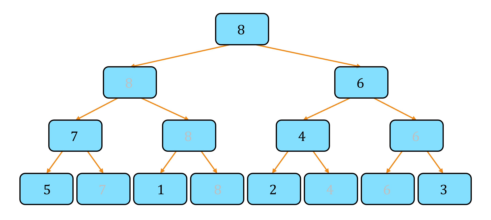
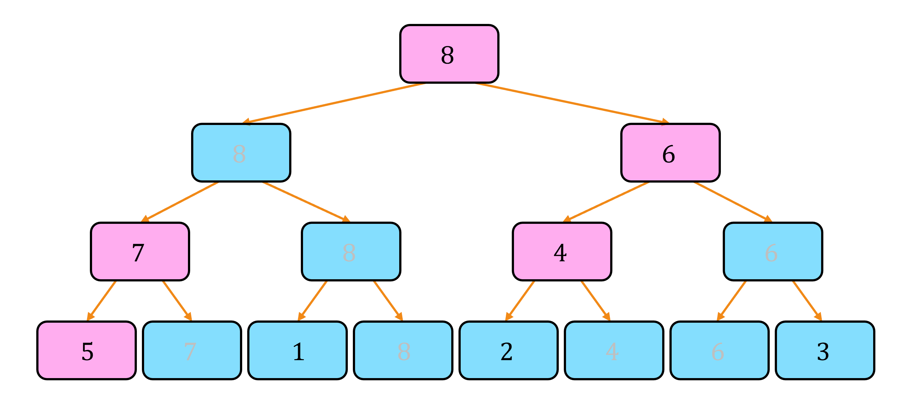
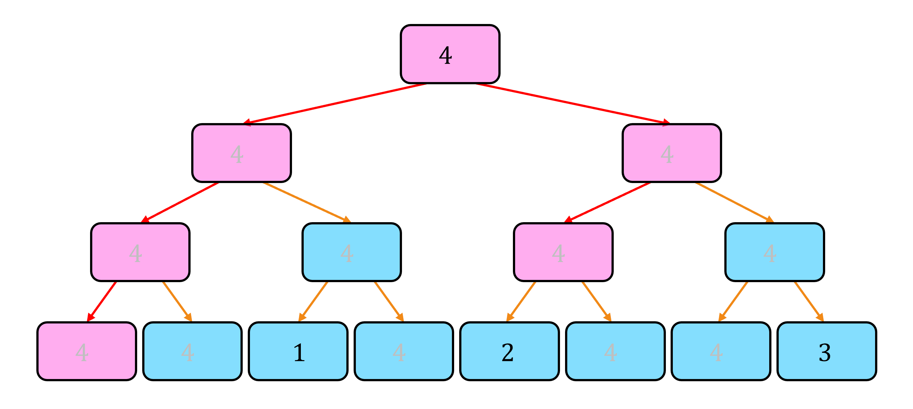

# Segment Tree Beats

## Algorithm

다음 문제를 해결하자.
([https://www.acmicpc.net/problem/17474](https://www.acmicpc.net/problem/17474))

!!! question "Problem 1"
    길이가 $N$인 수열 $A$가 주어질 때, 다음 쿼리와 업데이트를 수행하여라.

    1. $l \le i \le r$에 대하여 $A_i = \min(A_i, X)$로 바꾼다.
    2. $\max(A_l, A_{l+1}, ..., A_r)$을 출력한다.
    3. $A_l+A_{l+1}+...+A_r$을 출력한다.

우선, 일반적인 segment tree에서의 lazy propagation의 `update` 함수는 다음과 같은 형태로 구현할 수 있다.

``` cpp linenums="1"
void update(int node, int tl, int tr, int l, int r, int k)
{
    pushdown(node, tl, tr); // lazy propagation
    if(r<tl || tr<l) return; // break_condition
    if(l<=tl && tr<=r) // tag_condition
    {
        putlazy(node, tl, tr, k); // put lazy tag on node
        pushdown(node, tl, tr);
        return;
    }
    int mid=tl+tr>>1;
    update(node*2, tl, mid, l, r, k);
    update(node*2+1, mid+1, tr, l, r, k);
    pull(node); // pull values from child node
}
```

위 구현에서 `break_condition`과 `tag_condition`에 집중해보자.
Lazy propagation의 기본 아이디어는, 더 이상 업데이트가 필요 없을 때는 바로 종료하고, 업데이트를 lazy tag를 하나 붙임으로서 해결할 수 있을 때 또한 바로 종료하는 것이다.
만약 업데이트할 구간 $[l, r]$과 현재 노드의 구간 $[tl, tr]$이 겹치지 않는다면, 더 이상 업데이트가 필요 없으니 `break_condition`은 `r<tl || tr<l`가 된다.
반대로, 만약 업데이트할 구간 $[l, r]$이 현재 노드의 구간 $[tl, tr]$을 완전히 포함한다면 더 이상 재귀 없이 이 구간에 전체적으로 값을 업데이트해야 한다는 의미이니, `tag_condition`은 `l<=tl && tr<=r`이 된다.

!!! algorithm "Algorithm 1"
    일반적인 segment tree에서의 lazy propagation의 `update` 함수는 다음과 같이 작동한다.

    업데이트할 구간 밖의 노드인 경우 재귀를 종료 (`break_condition`), 구간에 걸쳐 있는 노드인 경우 재귀를 반복하며, 구간 안에 완전히 포함되는 노드인 경우 lazy tag를 붙이고 재귀를 종료 (`tag_condition`) 한다.

    ``` cpp linenums="1"
    void update(int node, int tl, int tr, int l, int r, int k)
    {
        pushdown(node, tl, tr); // lazy propagation
        if(r<tl || tr<l) return; // break_condition
        if(l<=tl && tr<=r) // tag_condition
        {
            putlazy(node, tl, tr, k); // put lazy tag on node
            pushdown(node, tl, tr);
            return;
        }
        int mid=tl+tr>>1;
        update(node*2, tl, mid, l, r, k);
        update(node*2+1, mid+1, tr, l, r, k);
        pull(node); // pull values from child node
    }
    ```
---

하지만, 일반적인 lazy propagation으로는 이 문제에서 요구하는 업데이트와 쿼리를 모두 처리할 수 없다.
Segment tree beats에서는, `break_condition`과 `tag_condition`를 적당히 정하여, lazy propagation보다 깊은 위치까지 재귀를 반복하여도, 시간복잡도가 바뀌지 않음을 이용한다.

각 노드는 `maxv`(최댓값), `smax`(최댓값보다 작은 원소들의 최댓값), `sum`(합), `maxc`(최댓값의 개수)를 관리한다.
`break_condition`은 `r<tl || tr<l || tree[node].maxv<=k`, 즉 구간이 겹치지 않거나, 구간의 최댓값이 $k$보다 작거나 같을 때이다.
구간의 최댓값이 $k$보다 작거나 같다면 업데이트를 해도 아무 값들이 변하지 않기 때문에 바로 종료해도 된다.
`tag_condition`은 `l<=tl && tr<=r && tree[node].smax<k`, 즉 구간 안에 완전히 포함되며, 두 번째 최댓값보다 $k$가 클 때이다.
구간의 두 번째 최댓값이 $k$보다 크니, `maxc`는 변하지 않고 `sum`은 `maxv`와 `maxc`를 이용하여 계산해줄 수 있다.

따라서, 업데이트할 구간 밖의 노드에서는 재귀를 종료, 구간에 걸쳐 있는 노드에 대해서는 재귀를 반복하고, 구간 안에 완전히 포함되는 경우 다음과 같이 작동한다.

- **(Case 1)** $maxv \le k$ : 재귀를 종료한다. (`break_condition`)
- **(Case 2)** $smax < k < maxv$ : lazy tag를 붙인 후, $sum$을 갱신한 후 재귀를 종료한다. (`tag_condition`)
- **(Case 3)** $k \le smax$ : 자식 노드들로 재귀를 계속한다.

``` cpp linenums="1"
void update(int node, int tl, int tr, int l, int r, int k)
{
    pushdown(node, tl, tr); // lazy propagation
    if(r<tl || tr<l || tree[node].maxv<=k) return; // break_condition
    if(l<=tl && tr<=r && tree[node].smax<k) // tag_condition
    {
        putlazy(node, tl, tr, k); // put lazy tag on node
        pushdown(node, tl, tr);
        return;
    }
    int mid=tl+tr>>1;
    update(node*2, tl, mid, l, r, k);
    update(node*2+1, mid+1, tr, l, r, k);
    pull(node); // pull values from child node
}
```

!!! algorithm "Algorithm 2"
    Segment tree beats에서의 lazy propagation의 `update` 함수는 다음과 같이 작동한다.

    업데이트할 구간 밖의 노드에서는 재귀를 종료 (`break_condition`), 구간에 걸쳐 있는 노드에 대해서는 재귀를 반복하고, 구간 안에 완전히 포함되는 경우 다음과 같이 작동한다.

    - **(Case 1)** $maxv \le k$ : 재귀를 종료한다. (`break_condition`)
    - **(Case 2)** $smax < k < maxv$ : lazy tag를 붙인 후, $sum$을 갱신한 후 재귀를 종료한다. (`tag_condition`)
    - **(Case 3)** $k \le smax$ : 자식 노드들로 재귀를 계속한다.

    ``` cpp linenums="1"
    void update(int node, int tl, int tr, int l, int r, int k)
    {
        pushdown(node, tl, tr); // lazy propagation
        if(r<tl || tr<l || tree[node].maxv<=k) return; // break_condition
        if(l<=tl && tr<=r && tree[node].smax<k) // tag_condition
        {
            putlazy(node, tl, tr, k); // put lazy tag on node
            pushdown(node, tl, tr);
            return;
        }
        int mid=tl+tr>>1;
        update(node*2, tl, mid, l, r, k);
        update(node*2+1, mid+1, tr, l, r, k);
        pull(node); // pull values from child node
    }
    ```

## Complexity

시간복잡도 증명을 위하여 maximum segment tree에서 각 노드에 대해서 **노드의 값과 부모의 값이 다른 정점들**에만 tag를 붙이고, 나머지 정점의 값을 모두 지웠다고 생각하자.

!!! property "Property 1"
    Maximum segment tree에서 각 노드에 대해서 **노드의 값과 부모의 값이 다른 정점들**에만 tag를 붙이고, 나머지 정점의 값을 모두 지우면, 다음이 성립한다.

    - 노드 $v$가 나타내는 구간의 $maxv$(최댓값)을 구하기 위해서는, $v, par[v], par[par[v]], ...$를 차례대로 보며 tag가 있는 첫 번째 정점의 값을 읽으면 된다.
    - 노드 $v$가 나타내는 구간의 $smax$(최댓값보다 작은 원소들의 최댓값)을 구하기 위해서는 $v$의 proper subtree의 tag 중 최대값을 읽으면 된다.

<center>

</center>

이제, update 함수를 실행할 때 tag의 입장에서 어떤 변화가 일어나는지 관찰해보자.

**Algorithm 2**에서 현재 노드의 구간이 업데이트할 구간에 완전히 포함되는 경우, 재귀를 계속하는 조건은 $k \le smax$이다.
tag의 입장에서, 이는 **Property 1**에 의해, 노드의 proper subtree의 tag 중 $k$ 이상인 tag가 있을 때만 재귀를 계속한다는 의미이다.
따라서, update 함수는 루트에서 시작하여 구간 안에 완전히 포함된 tag들 중 $k$ 이상인 tag에 모두 도달할 때까지 재귀를 반복한다.
이후, update 함수가 종료된 후에는 구간 안의 값들에 대해서 $A_i = \min(A_i, k)$를 적용하였기 때문에, 구간 안의 tag들 중 $k$ 이상인 tag가 모두 삭제되고 구간의 루트에 $k$라는 새로운 tag를 붙여준다.

아래 그림은 전체 구간에 대한 $k=4$의 update 함수가 실행될 때의 예시이다.

<center>


</center>

!!! property "Property 2"
    Segment tree beats의 update 함수는 구간 안에 완전히 포함되는 노드들에 대하여 루트에서 시작하여 구간 안에 완전히 포함된 tag들 중 $k$ 이상인 tag에 모두 도달할 때까지 재귀를 반복한다.
    이후, update 함수가 종료된 후에는 구간 안의 tag들 중 $k$ 이상인 tag가 모두 삭제되고 구간의 루트에 $k$라는 새로운 tag를 붙여준다.

---

**Property 2**에서 실제로 방문하는 정점들의 개수의 ammortized complexity를 [Potential Method](../../../ideas/Potential Method/idea.md)를 이용하여 구하자.
현재 segment tree의 상태를 $S$라 할 때 potential function $\Phi(S)$를 정의하자.

!!! definition "Definition 1"
    $\Phi(S):=$ maximum segment tree에서 **Property 1**과 같이 tag를 붙였을 때, 각 tag의 깊이의 합

이제, update 함수를 실행할 때의 ammortized 시간복잡도를 분석해보자.
구간 안에 완전히 포함된 tag들 중 $k$ 이상인 tag의 개수를 $P$개라 하자.

업데이트할 구간 밖의 노드에서는 재귀를 종료, 구간에 걸쳐 있는 노드에 대해서는 재귀를 반복한다.
이 과정에서 방문하는 노드의 수는 일반적인 segment tree와 똑같이 쿼리당 최대 $O(\log N)$이다.
구간 안에 완전히 포함되는 노드 $node$를 만나면, 임시로 $node$의 실제 값(maximum segment tree에서 $node$의 값)에 해당하는 tag를 붙이고 시작한다.
이후, 아래로 내려가 $P$개의 tag에 모두 도달할 때까지 재귀를 반복한다.
이 때 추가로 방문하는 노드의 수는 $O(P\log N)$개이다.
재귀를 종료한 후 다시 올라오면서, $P$개의 tag를 모두 삭제한 후 이전에 붙였던 불필요한 tag들까지 모두 정리하며 올라온다.
이 때 삭제되는 tag의 수는 $P$개로, $\Phi(S)$는 $O(P\log N)$만큼 감소한다.

위 과정을 정리하면, 일반적인 segment tree와 똑같이 쿼리당 최대 $O(\log N)$개의 노드를 방문하며, 추가로 방문하는 노드들은 $T_{actual}(o)=P\log N$, $\varDelta \Phi(S)=-P\log N$이니, $T_{ammortized}(o)=\log N$이다.
따라서, segment tree beats의 update 함수는 각 쿼리당 ammortized $O(\log N)$에 작동한다.

!!! property "Property 3"
    update 함수를 실행할 때 구간 안에 완전히 포함된 tag들 중 $k$ 이상인 tag의 개수를 $P$개라 하자.

    update 함수에서는 segment tree와 똑같이 쿼리당 최대 $O(\log N)$개의 노드를 방문하며, 추가로 방문하는 노드들은 $T_{actual}(o)=P\log N$, $\varDelta \Phi(S)=-P\log N$이니, $T_{ammortized}(o)=\log N$이다.
    따라서, segment tree beats의 update 함수는 각 쿼리당 ammortized $O(\log N)$에 작동한다.

!!! complexity
    Time Complexity : $O(Q\log N)$

꼭 이와 같은 segment tree beats가 아니더라도, segment tree 위에 특정 조건을 만족하는 여러 tag들이 있고, update 함수에서 특정 tag들의 집합 $S$를 모두 포함하는 가장 작은 subtree를 방문하며, 방문 후 $S$의 모든 tag들이 삭제된다면 segment tree beats와 같은 논리로 ammortized $O(Q\log N)$의 시간에 문제를 해결할 수 있다.

!!! property "Property 4"
    꼭 이와 같은 segment tree beats가 아니더라도, segment tree 위에 특정 조건을 만족하는 여러 tag들이 있고, update 함수에서 특정 tag들의 집합 $S$를 모두 포함하는 가장 작은 subtree를 방문하며, 방문 후 $S$의 모든 tag들이 삭제된다면 segment tree beats와 같은 논리로 ammortized $O(Q\log N)$의 시간에 문제를 해결할 수 있다.

## Reference

- [https://codeforces.com/blog/entry/57319](https://codeforces.com/blog/entry/57319)
- [https://koosaga.com/307](https://koosaga.com/307)