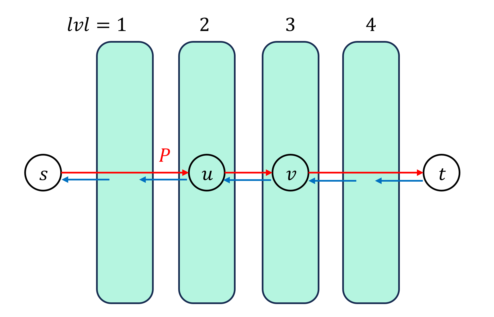
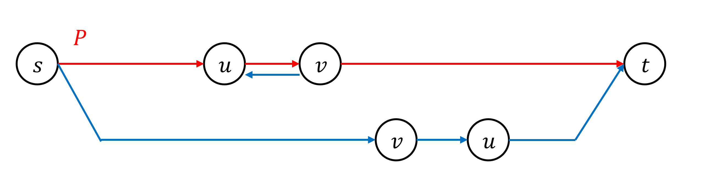

# Edmond-Karp algorithm

## Algorithm

Ford-Fulkerson method는 가능할 때까지 $s$에서 $t$로 가는 임의의 경로를 찾고, 해당 경로를 따라 flow를 흘리는 형태로 진행한다.
하지만 시간복잡도가 $O(EF)$로, pseudopolynomial 하다는 단점이 있다.

Edmond-Karp algorithm은 $s$에서 $t$로 가는 경로를 **BFS**를 이용하여 간선을 최소한으로 사용하는 경로로 한정하여 시간복잡도를 polynomial 하도록 만들어준다.

!!! algorithm "Algorithm 1"
    Flow network $(G, c, s, t)$가 주어진다.  
    flow $f$를 $0$으로 초기화한 후, $G_f$에서 $s \rightarrow t$ 경로가 존재하지 않을 때까지 $s \rightarrow t$의 최단경로를 BFS를 사용하여 구하고, 최단경로를 따라 capcity의 최솟값에 해당하는 flow $f'$를 찾고, $f \leftarrow f+f'$로 업데이트한다.  
    $f$가 Maximum Flow이다.

    ``` linenums="1"
    Let (G, c, s, t) be a flow network
    Initialize f <- 0
    While t is not reachable from s in G_f :
        Find the shortest path P from s to t in G_f using BFS
        Let flow f' be flow with all edges in P with the lowest capacity
        f <- f + f'
    return f
    ```

## Complexity

Edmond-Karp algorithm에서 **BFS**는 $O(E)$의 시간이 걸리고, BFS의 실행 횟수 (**Algorithm 1**의 3번째 while문의 실행 횟수)가 $O(VE)$로 제한됨을 보일 수 있다.

!!! property "Property 1"
    **Algorithm 1**의 실행과정 중 $G_f$에서 $s$에서 임의의 정점 $v$로 가는 최단경로의 길이 $lvl[v]$는 단조증가한다.

!!! proof
    임의의 시점에서 $G_f$의 BFS spanning tree와  $s \rightarrow t$의 최단경로를 $P$라 하자.

    $P$에 capcity의 최솟값에 해당하는 flow $f'$를 흘려주고 난 후 $G_f$가 어떻게 변하는지 관찰하자.
    $P$에 속하는 모든 간선 $(u, v)$에 대하여 역간선 $(v, u)$가 $G_f$에 추가되고, saturated 된 정방향 간선들은 모두 제거된다.
    정의에 의해, $lvl[u]+1=lvl[v]$를 만족한다.
    간선들이 삭제되면 임의의 정점으로의 최단경로는 단조증가하니, 추가된 간선들로 인하여 최단경로가 감소할 수 없음만 보이면 된다.
    하지만 추가된 모든 역간선 $(v, u)$는 더 큰 $lvl[v]$에서 더 작은 $lvl[u]$로 이어지는 간선이니, 최단경로가 감소할 수 없다.
    따라서, 임의의 정점 $v$로 가는 최단경로의 길이 $lvl[v]$는 단조증가한다.

    <center>
    {width=70%}
    </center>

!!! property "Property 2"
    $G_f$에서 어떤 간선 $(u, v)$가 saturated 되어 삭제된 후, 다시 $(u, v)$가 추가되기 위해서는 $lvl[u]$가 적어도 $2$ 증가한다.

!!! proof
    임의의 시점에서 $G_f$의 BFS spanning tree와  $s \rightarrow t$의 최단경로를 $P$라 하자.
    이제, $P$에 capcity의 최솟값에 해당하는 flow $f'$를 흘리면 $P$의 적어도 한 개의 간선은 saturated 된다.
    이 간선을 $(u, v)$라 하면, 정의에 의해 $lvl[u]+1=lvl[v]$를 만족하며, 이후 $G_f$에서 $(u, v)$는 삭제되고 역간선 $(v, u)$가 추가된다.

    다시 $(u, v)$가 추가되기 위해서는, 어떤 시점에서 새로 찾는 최단경로 $P'$에 $(v, u)$가 포함되어 있어야 한다.
    $(v, u)$가 $P'$에 포함되기 위해서는 $lvl'[u]=lvl'[v]+1$을 만족해야 하고, **Property 1**에 의해 $lvl[u] \le lvl'[u]$, $lvl[v] \le lvl'[v]$가 성립한다.

    $$lvl[u]+2=lvl[v]+1 \le lvl'[v]+1 = lvl'[u]$$

    위 식에 의해 $lvl[u]$는 적어도 $2$ 증가한다.

    <center>
    
    </center>

!!! property "Property 3"
    BFS의 실행 횟수 (**Algorithm 1**의 3번째 while문의 실행 횟수)는 최대 $O(VE)$회이다.

!!! proof
    각 간선 $(u, v)$에 대하여 이 간선이 삭제되어 다시 등장할 때마다 $lvl[u]$는 적어도 $2$ 증가한다.
    하지만, 최단경로의 길이는 최대 $O(V)$이니 각 간선의 삭제 횟수는 최대 $O(V)$회만 가능하다.

    한번 BFS가 실행될 때 적어도 $1$개의 간선이 삭제되고, 총 삭제 횟수는 각 간선당 $O(V)$, 총 간선이 $O(E)$이니 최대 $O(VE)$회 BFS가 실행될 수 있다.

!!! complexity "Time Complexity"
    $O(VE^2)$

## Implementation

``` cpp linenums="1"
const int INF = 1e9+7;

struct Edge
{
	int v, w, f, r;
	// v : vertex number, w : capacity, f : flow, r : reverse edge number
};
vector<Edge> adj[MAXN+10];

void addEdge(int u, int v, int w)
{
	adj[u].push_back({v, w, 0, adj[v].size()});
	adj[v].push_back({u, 0, 0, adj[u].size()-1});
}

ll bfs(int N, int S, int E)
{
	vector<int> dist(N+1), par(N+1);
	for(int i=1; i<=N; i++) par[i]=-1, dist[i]=-1;;

	queue<int> Q;
	dist[S]=0; Q.push(S);
	while(!Q.empty())
	{
		int now=Q.front(); Q.pop();

		for(int i=0; i<adj[now].size(); i++)
		{
			Edge &nxt = adj[now][i];
			if(nxt.f==nxt.w) continue;
			if(dist[nxt.v]!=-1) continue;

			dist[nxt.v]=dist[now]+1;
			par[nxt.v]=nxt.r;
			Q.push(nxt.v);
		}
	}

	if(dist[E]==-1) return 0;

	int flow=INF;

	int now=E;
	while(par[now]!=-1)
	{
		Edge &nxt = adj[now][par[now]];
		flow=min(flow, adj[nxt.v][nxt.r].w-adj[nxt.v][nxt.r].f);
		now=nxt.v;
	}

	now=E;
	while(par[now]!=-1)
	{
		Edge &nxt = adj[now][par[now]];
		adj[nxt.v][nxt.r].f+=flow;
		adj[now][par[now]].f-=flow;
		now=nxt.v;
	}

	return flow;
}

ll EdmondKarp(int N, int S, int E)
{
	ll ans=0;
	while(1)
	{
		ll t=bfs(N, S, E);
		if(!t) break;
		ans+=t;
	}
	return ans;
}
```

## Reference

- [https://cp-algorithms.com/graph/edmonds_karp.html#edmonds-karp-algorithm](https://cp-algorithms.com/graph/edmonds_karp.html#edmonds-karp-algorithm)
- [https://www.cs.cornell.edu/courses/cs4820/2012sp/handouts/edmondskarp.pdf](https://www.cs.cornell.edu/courses/cs4820/2012sp/handouts/edmondskarp.pdf)
