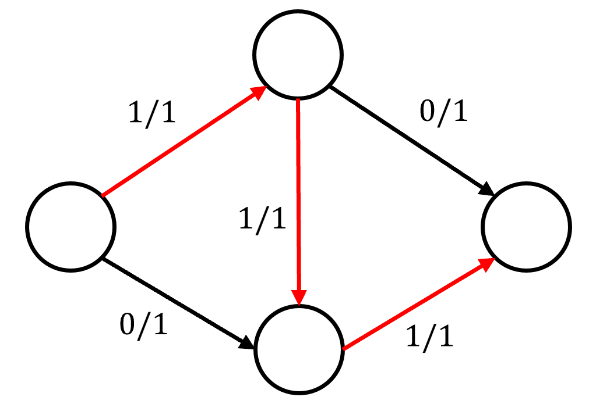
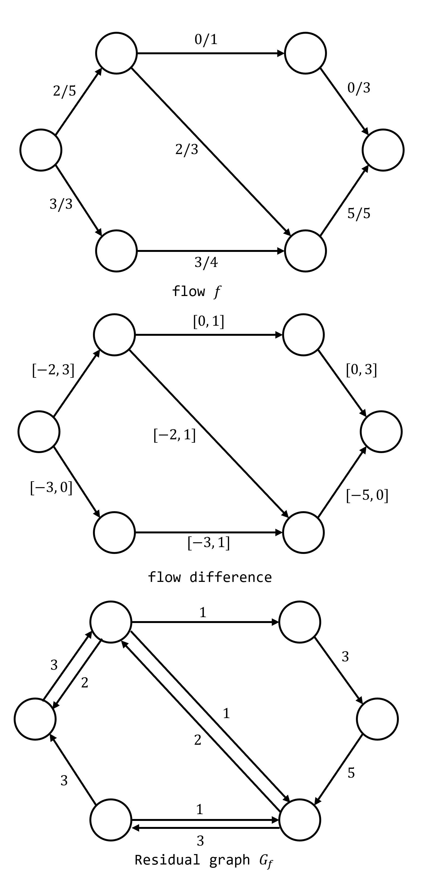
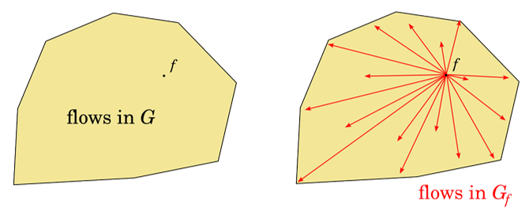

# Ford–Fulkerson method

## Flow Network

Flow Network는 각 간선이 음이 아닌 capacity를 갖는 방향 그래프이다.

!!! definition "Definition 1"
    방향 그래프 $G=(V, E)$의 모든 간선이 음이 아닌 **capacity** $c$ ($c : E \rightarrow \mathbb{R}_{\ge 0}$)를 가질 때 $(G, c)$를 **Flow Network**라고 정의한다.  
    정점 $v \in V$에 대하여 $\delta_{out}(v)$는 $v$에서 나가는 간선의 집합, $\delta_{in}(v)$는 $v$로 들어오는 간선의 집합이라 정의한다.

이제, flow network에 유량을 흘리기 위하여, 다음과 같이 flow가 만족해야 할 성질들을 정의하자.
우선, 유량을 흘릴 정점 source와 유량을 받을 정점 sink를 정의하고, 각 간선의 flow는 $0$ 이상, capcity 이하의 가중치로 생각한다.
source와 sink를 제외한 다른 정점들에서는 flow를 생산할 수 없기 때문에, 들어오는 flow의 합과 나가는 flow의 합이 0이 되어야 한다.

!!! definition "Definition 2"
    서로 다른 두 정점 $s, t \in V$를 $s$는 **source**, $t$는 **sink**라 정의하자.  
    **Flow** $f$ ($f: E \rightarrow \mathbb{R}$)는 다음을 만족하는 가중치이다.

    1. **Edge Rule** : $\forall e \in E$, $0 \le f(e) \le c(e)$  
    모든 간선의 flow는 $0$보다 크거나 같으며, 그 간선의 capcity를 넘지 않는다.
    2. **Vertex Rule** : $\forall v \in V$, $v \ne s, t$, $\displaystyle \sum_{e \in \delta_{in}(v)} f(e)= \sum_{e \in \delta_{out}(v)} f(e)$  
    각 정점에서 나가는 flow와 들어오는 flow의 총합은 같다.

위 정의의 Edge Rule과 Vertex Rule을 만족시키기만 하면 모두 valid flow이며, 일부 flow가 source나 sink에서 나온 것이 아닌, 사이클을 따라 돌고 있어도 valid flow임에 유의하자.

이제 Maximum Flow 문제를 정의하기 위하여, flow network의 전체 flow 양을 source에서 나오는 flow의 양에서 들어오는 flow의 양을 뺀, 즉 source가 발생시킨 flow의 양으로 정의하자.
Vertex Rule에 의하여 source에서 발생시킨 flow의 양은 sink가 소모한 flow의 양과 같음을 알 수 있다.

!!! definition "Definition 3"
    Flow network $(G, c, s, t)$와 flow $f$가 주어질 때, 전체 flow를 다음과 같이 정의한다.

    $$\displaystyle val(f) = \sum_{e \in \delta_{out}(s)} f(e) - \sum_{e \in \delta_{in}(s)} f(e) = - \left ( \sum_{e \in \delta_{out}(t)} f(e) - \sum_{e \in \delta_{in}(t)} f(e) \right)$$

Flow network의 전체 flow 양은 음수가 될수도 있음에 주의하자.

이제, Maximum flow 문제는 전체 flow의 최댓값을 구하는 문제로 정의할 수 있다.

!!! definition "Definition 4"
    Maximum flow 문제는 Flow network $(G, c, s, t)$가 주어질 때, $val(f)$를 최대화시키는 flow $f$를 찾는 것이다.

## Residual Flow Network

대부분의 maximum flow를 구하는 알고리즘들은 greedy 알고리즘이다.
기존의 flow에 **Definition 2**의 조건을 만족시키며 $val(f)$를 증가시킬수 있는 새로운 flow를 찾아 흘려 보낸다.
하지만, 이전에 한 선택이 결국 나중에 최적해를 찾을 수 없도록 만들 수 있다는 문제가 있다.

{: .center style="width:50%;" }

위 그림과 같은 예시에서, 실제 maximum flow는 $2$이지만, 색칠된 부분과 같은 유량을 흘리고 시작하였을 때 더 이상 flow를 찾지 못한다.
따라서 greedy 알고리즘을 적용하기 위해서는, 이전에 한 선택을 취소할 수 있어야 한다.

---

어떤 valid flow $f$를 다른 valid flow $f'$으로 변경하려 할 때, 각 간선에 추가되는 flow의 양 $f'-f$이 만족하는 성질들을 $f$의 입장에서 관찰하자.

!!! definition "Definition 5"
    Flow network $(G, c, s, t)$와 flow $f$, $f'$가 주어질 때 **flow difference of $f$ and $f'$**, $f'-f$ ($f'-f : E \rightarrow \mathbb{R}$)를 $(f'-f)(e) = f'(e)-f(e)$로 정의한다.

!!! property "Property 1"
    1. $\forall e \in E$, $-f(e) \le (f'-f)(e) \le c(e)-f(e)$
    2. $\forall v \in V$, $v \ne s, t$, $\displaystyle \sum_{e \in \delta_{in}(v)} (f'-f)(e)= \sum_{e \in \delta_{out}(v)} (f'-f)(e)$

$f'-f$가 일반적인 flow와 매우 비슷한 성질들을 갖고 있음을 알 수 있다.
이제, 거꾸로 valid flow $f$에 어떤 flow difference $g$를 더해 valid flow로 만들고자 한다.
**Property 1**을 만족시키는 $g=f'-f$를 찾을 수 있다면, $f+g$는 임의의 valid flow가 됨을 알 수 있다.

!!! definition "Definition 6"
    Flow network $(G, c, s, t)$와 flow $f$가 주어질 때 **$f$의 flow difference**, $g$ ($g : E \rightarrow \mathbb{R}$)를 다음을 만족하는 가중치로 정의한다.

    1. $\forall e \in E$, $-f(e) \le g(e) \le c(e)-f(e)$
    2. $\forall v \in V$, $v \ne s, t$, $\displaystyle \sum_{e \in \delta_{in}(v)} g(e)= \sum_{e \in \delta_{out}(v)} g(e)$

일반적인 flow와는 다르게, $f$의 flow difference는 capacity가 아닌, 가중치가 $[-f(e), c(e)-f(e)]$ 구간의 형태로 나타남을 알 수 있다.

!!! property "Property 2"
    Flow network $(G, c, s, t)$와 flow $f$가 주어질 때, 임의의 flow $f'$와 $f$의 flow difference $g$는 일대일 대응된다.

    $$ f'-f \leftrightarrow g $$

    즉, 임의의 $f$의 flow difference $g$가 있을 때, 이를 $f$에 더해 새로운 flow $f'$를 만들어낼 수 있다.

flow difference의 문제는, 음의 가중치를 가질 수 있다는 점이다.
이 점 이외에는 일반적인 flow와 모두 똑같으니, flow difference를 음 아닌 가중치만을 이용하여 표현하기 위하여 residual flow network를 정의하자.
음의 flow는 반대 방향의 flow로 생각할 수 있다.

!!! definition "Definition 7"
    Flow network $(G, c, s, t)$와 flow $f$가 있을 때, **residual flow network** $G_f$를 다음과 같이 정의한다.

    $G_f$의 정점 집합은 $G$와 같으며, 각 간선 $e=(u, v) \in E$에 대하여 $(u, v)$ 방향으로 $c(e)-f(e)$, $(v, u)$ 방향으로 $-f(e)$의 가중치의 간선을 $G_f$에 추가한다.
    가중치 $0$의 간선은 무시할 수 있다.

$G_f$는 flow network 이고, $G_f$의 임의의 flow $g$는 $f$에 더해 다른 valid flow $f+g$를 만들 수 있다.
따라서, 어떤 flow $f$가 정해졌을 때, 임의의 다른 valid flow $f'$와, $f$의 flow difference, $G_f$의 임의의 flow $g$는 모두 일대일 대응된다는 것을 알 수 있다.

!!! property "Property 3"
    Flow network $(G, c, s, t)$와 flow $f$가 주어질 때
    
    1. 임의의 valid flow $f'$
    2. $f$의 flow difference
    3. $G_f$의 임의의 flow $g$

    는 일대일 대응된다.

{: .center style="width=70%;" }

---

$G$의 flow $f$와 $G_f$의 임의의 flow $g$의 일대일 대응 관계는 다음과 같이 설명할 수 있다.  
$G$의 flow는 간선 가중치들의 선형 결합이 특정 값 이하로 제한되는, Linear Programming의 형태를 띄고 있기 때문에, 임의의 flow를 $|E|$차원의 벡터로 표현한다면, $f$는 convex polyhedron에서의 임의의 점으로 생각할 수 있다.
$G_f$의 flow $g$는 같은 도형을 $f$의 점을 원점으로 평행이동한 모양과 같다.

{: .center }

!!! property "Property 4"
    $G$의 임의의 flow는 Linear Programming의 조건에 부합하니, $|E|$차원 convex polyhedron으로 생각할 수 있다.  
    $G_f$의 flow $g$는 같은 도형을 $f$의 점을 원점으로 평행이동한 모양과 같다.

## Universal Algorithm for Maximum Flow

Flow $f$가 maximum flow인지 여부를 $G_f$에서 $s$에서 $t$로 가는 경로가 존재하는지 여부로 확인할 수 있다.

!!! property "Property 5"
    다음 두 명제는 동치이다.  

    - Flow $f$가 maximum flow이다.  
    - $G_f$에서 $s$에서 $t$로 가는 경로가 존재하지 않는다.  

!!! proof "Proof"
    $f$가 maximum flow가 아니라고 하면, 다른 maximum flow $f'$이 존재한다.
    $f'-f$는 **Property 2**와 **Property 3**에 의해 flow difference로 일대일 대응 가능하고, 따라서 $G_f$의 임의의 flow $g$와 일대일 대응 가능하다.
    $val(g)>0$이어야 하니, $G_f$에서 $s$에서 $t$로 가는 경로가 존재해야 한다.

    $G_f$에서 $s$에서 $t$로 가는 경로가 존재한다면, 해당 경로를 따라 경로의 capcity의 최솟값에 해당하는 flow를 흘릴 수 있다.
    $G_f$의 valid flow인 이 경로를 $g$라 하면, **Property 2**와 **Property 3**에 의해 flow difference로 일대일 대응 가능하고, 따라서 $f$의 다른 flow $f'$로 일대일 대응 가능하다.
    $val(g)>0$이니, $val(f')=val(f)+val(g)>val(f)$, $f$는 maximum flow가 아니다.

따라서 다음과 같은 일반적인 알고리즘으로 Maximum Flow 문제를 해결할 수 있다.

!!! algorithm "Algorithm 1"
    Flow network $(G, c, s, t)$가 주어진다.  
    flow $f$를 $0$으로 초기화한 후, $G_f$에서 $s \rightarrow t$ 경로가 존재하지 않을 때까지 $G_f$의 임의의 flow $f'$을 찾은 후, $f \leftarrow f+f'$로 업데이트한다.  
    $f$가 Maximum Flow이다.

    ``` linenums="1"
    Let (G, c, s, t) be a flow network
    Initialize f <- 0
    While t is not reachable from s in G_f :
        Find some flow f' in G_f
        f <- f + f'
    return f
    ```

Maximum Flow 문제를 해결하는 여러 알고리즘은 위 풀이에서 $G_f$의 임의의 양의 flow $f'$를 찾는 방법을 제시한다.
각 방법에 대하여, 반복문이 언젠가는 종료한다는 사실, 즉 $G_f$에서 $s \rightarrow t$ 경로가 언젠가는 끊긴다는 것을 증명해야 한다.

## Ford - Fulkerson Method

Ford-Fulkerson Method는 $f'$를 찾기 위하여, $s$에서 $t$로 가는 경로가 존재한다는 것을 알고 있으니, 해당 경로를 따라 경로의 capcity의 최솟값에 해당하는 flow를 흘리고 이를 $f'$이라 한다.
$G_f$에서는 모든 가중치가 양수이니, 경로의 capcity의 최솟값에 해당하는 flow 또한 양수임을 알 수 있고, 가중치가 정수, 혹은 유리수 등의 countable(isomorphic to $\mathbb{N}$)이면 반복문이 종료한다는 것을 알 수 있다.
이 때, 추가 flow를 흘리기 위하여 발견한 경로를 augmenting path라 한다.

!!! algorithm "Algorithm 2"
    Flow network $(G, c, s, t)$가 주어진다.  
    flow $f$를 $0$으로 초기화한 후, $G_f$에서 $s \rightarrow t$ 경로가 존재하지 않을 때까지 $s \rightarrow t$ 경로를 따라 capcity의 최솟값에 해당하는 flow $f'$를 찾고, $f \leftarrow f+f'$로 업데이트한다.  
    $f$가 Maximum Flow이다.

    ``` linenums="1"
    Let (G, c, s, t) be a flow network
    Initialize f <- 0
    While t is not reachable from s in G_f :
        Find a path P from s to t in G_f
        Let flow f' be flow with all edges in P with the lowest capacity
        f <- f + f'
    return f
    ```

!!! definition "Definition 8"
    새로운 flow $f'$를 흘리기 위하여 $s \rightarrow t$ 경로를 찾고, capcity의 최솟값에 해당하는 flow를 흘리는데, 이 때 경로를 **augmenting path**라 한다.

시간 복잡도는 최악의 경우에는 각 반복문이 크기 $1$의 flow를 찾으며, 한번 flow를 찾기 위하여 DFS를 돌아야 하니 $O(EF)$ ($F$는 maximum flow의 양)의 시간이 걸린다.

!!! complexity "Time Complexity"
    Time Complexity : $O(EF)$

## Reference
- [https://codeforces.com/blog/entry/104960](https://codeforces.com/blog/entry/104960)
- [https://cp-algorithms.com/graph/edmonds_karp.html](https://cp-algorithms.com/graph/edmonds_karp.html)
- [https://en.wikipedia.org/wiki/Ford%E2%80%93Fulkerson_algorithm](https://en.wikipedia.org/wiki/Ford%E2%80%93Fulkerson_algorithm)