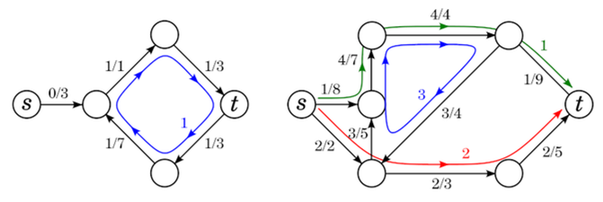
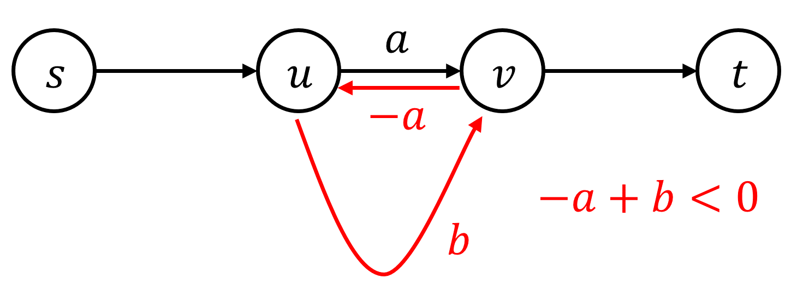
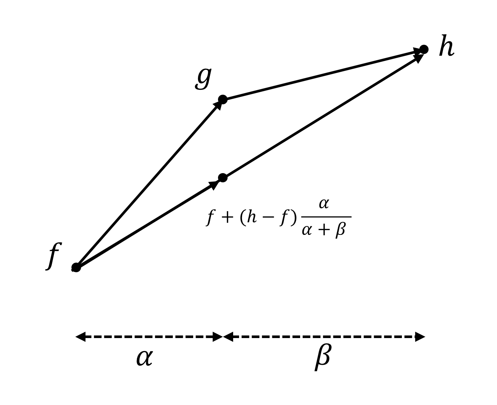
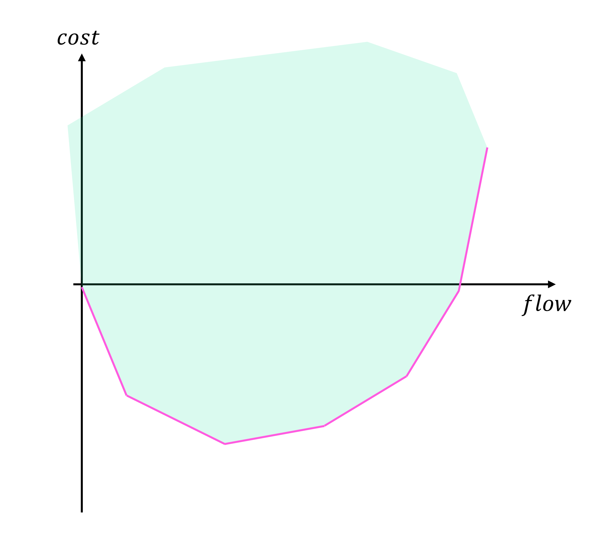

# Minimum Cost Maximum Flow

## Definition

Minimum cost maximum flow 문제를 정의하기 위하여, flow network에 다음과 같이 cost의 개념을 정의하자.

!!! definition "Definition 1"
    Flow network $(G, c, s, t)$와 **cost function** $a$ ($a : E \rightarrow \mathbb{R}$)가 주어질 때, flow $f$의 비용 cost를 다음과 같이 정의한다.

    $$cost(f) = \sum_{e \in E} f(e)a(e)$$

새로 추가된 cost의 개념에도 전과 같이 residual flow network $G_f$를 구할 수 있다.
반대 방향 간선의 경우, 이미 만들어진 flow를 취소할 수 있어야 하니, 이미 사용한 가중치를 돌려받기 위하여 해당 가중치의 부호를 뒤집어 설정한다.

!!! definition "Definition 2"
    Flow network $(G, c, a, s, t)$와 flow $f$가 있을 때, **residual flow network** $G_f$를 다음과 같이 정의한다.

    $G_f$의 정점 집합은 $G$와 같으며, 각 간선 $e=(u, v) \in E$에 대하여  
    $(u, v)$ 방향으로 $c_f(e)=c(e)-f(e)$, $a_f(e)=a(e)$,  
    $(v, u)$ 방향으로 $c_f(e)=-f(e)$, $a_f(e)=-a(e)$  
    의 capacity와 cost의 간선을 $G_f$에 추가한다.
    가중치 $0$의 간선은 무시할 수 있다.

Minimum cost maximum flow 문제는 Maximum Flow를 갖는 flow들 중, cost의 최솟값을 구하는 것이다.

!!! definition "Definition 3"
    Minimum Cost Maximum Flow 문제는 Maximum Flow를 갖는 flow들 중, cost의 최솟값을 구하는 것이다.

---

!!! property "Property 1"
    Flow network $(G, c, s, t)$와 flow $f$가 있을 때, $f$는 유한 개의 path와 cycle로 분해 가능하다.
    각 Path와 Cycle들은 양의 가중치를 갖고 있으며, 각 간선의 가중치는 간선이 포함되는 Path와 Cycle의 가중치 합과 같다.

    만약 $val(f)=0$이라면, path는 없고 cycle들로만 분해된다.

<center>

</center>

## Successive Shortest Path Algorithm

우선, 우리가 문제를 해결할 flow network $(G, c, a, s, t)$는 negative cycle이 존재하지 않는다고 생각한다.

기본적인 알고리즘의 틀은 Ford-Fulkerson과 Edmond-Karp와 같이 $G_f$에서 어떤 경로를 찾는데, 이 경로를 최단경로로 반복하여 탐색한다.

!!! algorithm "Algorithm 1"
    Flow network $(G, c, a, s, t)$가 주어진다.  
    flow $f$를 $0$으로 초기화한 후, $G_f$에서 $s \rightarrow t$ 경로가 존재하지 않을 때까지 $s \rightarrow t$의 cost에 대한 최단경로를 구하고, 최단경로를 따라 capcity의 최솟값에 해당하는 flow $f'$를 찾고, $f \leftarrow f+f'$로 업데이트한다.  
    $f$가 Minimum Cost Maximum Flow이다.

    ``` linenums="1"
    Let (G, c, s, t) be a flow network
    Initialize f <- 0
    While t is not reachable from s in G_f :
        Find the shortest path P of costs from s to t in G_f
        Let flow f' be flow with all edges in P with the lowest capacity
        f <- f + f'
    return f
    ```

위 알고리즘의 정당성을 보이기 위하여 다음 2가지 성질을 이용하자.

!!! property "Property 2"
    Negative cycle이 없는 flow network $(G, c, a, s, t)$가 주어지고, $G$에서 $s \rightarrow t$의 cost에 대한 최단경로를 $P$라 하자.
    $P$에 어떤 가중치 $\gamma$를 흘려보낸 flow를 $f$라 할 때, $G_f$ 또한 negative cycle이 존재하지 않는다.

!!! proof "Proof"
    원래 negative cycle이 없던 그래프에 $f$를 흘리고 나니 negative cycle이 생기기 위해서는 $P$에 flow를 흘림으로서 $G_f$에 생성된 새로운 간선들을 포함하는 negative cycle이 생겨야 한다.

    <center>
    {width=60%}
    </center>

    하지만 위 그림처럼 $P$에 포함되는 $(u, v)$가 있고, $G_f$에서 $(v, u)$를 포함하는 negative cycle이 생겼다고 하면, $-a+b<0$이 성립하며, $b<a$가 된다.
    하지만 이는 $P$가 최단경로임에 모순이다.
    이러한 논리는 negative cycle이 하나의 간선만 포함하지 않을 때도 성립하며, 엄밀한 증명은 **Property 1**의 decomposition을 이용하여 할 수 있다.

!!! property "Property 3"
    Flow network $(G, c, a, s, t)$와 flow $f$가 주어질 때 다음 명제는 동치이다.

    - $G_f$에는 negative cycle이 존재하지 않는다.
    - $f$는 value $val(f)$를 갖는 flow 중 cost가 최소이다.

!!! proof "Proof"
    $f$가 value $val(f)$를 갖는 flow 중 cost가 최소라 가정하자.
    만약 $G_f$에 negative cycle $C$가 존재한다면 $C$에 양의 flow를 흘리면 같은 value이지만, cost가 더 작은 flow를 만들 수 있다.
    이는 $f$가 cost가 최소임에 모순이다.

    $G_f$에 negative cycle이 존재하지 않는다고 가정하자.
    만약 $f$가 value $val(f)$를 갖는 flow 중 cost가 최소가 아니라면, 같은 $val(f)$를 갖는 최소 flow $f'$가 존재한다.
    $f'-f$는 $val(f'-f)=0$이고, $cost(f'-f)<0$이다.
    **Property 1**에 의해 $f'-f$는 여러 개의 cycle들로 분해되어야 하는데, $cost(f'-f)<0$이니 적어도 하나의 negative cycle이 존재해야 한다.

Flow network $(G, c, a, s, t)$에 negative cycle가 존재하지 않는다면, **Property 2**에 의해 계속하여 augmenting path를 최단경로로 선택하면 $G_f$에도 negative cycle이 존재하지 않으며, **Property 3**에 의해 이는 해당 value에서의 minimum cost flow임이 보장된다.
**Algorithm 1**은 universal algorithm for maximum flow의 일종이니, maximum flow를 찾을 수 있음을 보장할 수 있다.
따라서, Maximum Flow를 갖는 flow들 중, cost의 최솟값을 성공적으로 구할 수 있다.

최단경로를 **Bellman-Ford** 알고리즘을 이용하여 구해주면 augmenting path를 한번 탐색하는데 $O(VE)$의 시간이 걸리고, maximum flow의 크기를 $F$라 하면 전체 $O(FVE)$이다.
하지만 실제 구현에서는 **SPFA**를 이용하면 평균 시간복잡도 $O(FE)$에 문제를 해결할 수 있다.

!!! complexity "Complexity"
    Time Complexity : $O(FVE)$ (average : $O(FE)$)

### Implementation

``` cpp linenums="1"
const int INF = 1e9+7;

struct Edge
{
	int v, w, c, f, r;
	// v : vertex number, w : capacity, c : cost, f : flow, r : reverse edge number
};
vector<Edge> adj[MAXN+10];

void addEdge(int u, int v, int w, int c)
{
	adj[u].push_back({v, w, c, 0, adj[v].size()});
	adj[v].push_back({u, 0, -c, 0, adj[u].size()-1});
}

ll spfa(int N, int S, int E)
{
	vector<int> dist(N+1), par(N+1);
	vector<bool> inque(N+1);

	for(int i=1; i<=N; i++) dist[i]=INF, par[i]=-1, inque[i]=0;
	queue<int> Q;
	dist[S]=0; Q.push(S); inque[S]=true;
	while(!Q.empty())
	{
		int now=Q.front(); Q.pop();
		inque[now]=false;

		for(int i=0; i<adj[now].size(); i++)
		{
			Edge &nxt = adj[now][i];
			if(nxt.f==nxt.w) continue;
			if(dist[now]+nxt.c<dist[nxt.v])
			{
				dist[nxt.v]=dist[now]+nxt.c;
				par[nxt.v]=nxt.r;
				if(!inque[nxt.v])
				{
					inque[nxt.v]=true;
					Q.push(nxt.v);
				}
			}
		}
	}

	if(dist[E]==INF) return 0;

	int flow=INF;

	int now=E;
	while(par[now]!=-1)
	{
		Edge &nxt = adj[now][par[now]];
		flow=min(flow, adj[nxt.v][nxt.r].w-adj[nxt.v][nxt.r].f);
		now=nxt.v;
	}

	now=E;
	while(par[now]!=-1)
	{
		Edge &nxt = adj[now][par[now]];
		adj[nxt.v][nxt.r].f+=flow;
		adj[now][par[now]].f-=flow;
		now=nxt.v;
	}

	return (ll)flow*dist[E];
}

ll mcmf(int N, int S, int E)
{
	ll ans=0;
	while(1)
	{
		ll t=spfa(N, S, E);
		if(!t) break;
		ans+=t;
	}
	return ans;
}
```

## Convexity

MCMF의 가장 중요한 정리는 흐르는 value에 대한 min cost의 함수 $f$가 convex 한 함수라는 것이다.
이를 증명하기 위해 다음 성질을 이용하자.

!!! property "Property 4"
    **Algorithm 1**의 실행 과정에서 $s \rightarrow t$의 cost에 대한 최단경로는 단조증가한다.

!!! proof "Proof"
    **Algorithm 1**에서 flow $f$, $g$, $h$가 연속적으로 등장하는 flow라고 가정하자.

    - $G_f$에서 최단경로 $P$를 찾고, $\alpha$의 flow를 $P$를 따라 흘려 flow $g$를 얻었다.
    - $G_g$에서 최단경로 $Q$를 찾고, $\beta$의 flow를 $Q$를 따라 흘려 flow $h$를 얻었다.

    <center>
    {width=70%}
    </center>

    최단경로 $P$보다 최단경로 $Q$가 더 짧다면, 위 그림과 같이 (flow, cost) 그래프에서 $f$와 $g$를 잇는 직선의 기울기보다 $g$와 $h$를 잇는 직선의 기울기가 더 작아야 한다.
    하지만 이렇다면 $g$보다 $f$에 $h-f$를 $g$와 같은 value를 가지도록 $\frac{\alpha}{\alpha+\beta}$를 곱하여 더한, $f+(h-f)\frac{\alpha}{\alpha+\beta}$가 더 작은 비용을 가진다는 것을 알 수 있다.
    따라서 $g$가 최소 cost flow임에 모순이다.

위 정리로 인하여 (flow, cost) 그래프를 그리면 기울기가 단조증가하는, convex 한 그래프를 확인할 수 있다.

!!! property "Property 5"
    각 value에 대한 minimum cost를 (flow, cost) 그래프로 표현하면 그래프는 기울기가 단조증가하는 convex한 모양이다.

Flow의 조건과 cost의 식이 모두 linear programming의 조건이라 생각할 수 있으니, flow와 cost를 포함한 모든 변수들은 convex polyhedron을 구성한다.
Minimum cost flow 문제는 convex polyhedron을 (flow, cost)의 좌표평면에 사영한 모습이니, 이 또한 convex하다는 사실을 다르게 증명할 수도 있다.

!!! property "Property 6"
    Flow의 조건과 cost의 식이 모두 linear programming의 조건이라 생각할 수 있으니, flow와 cost를 포함한 모든 변수들은 convex polyhedron을 구성한다.
    Minimum cost flow 문제는 convex polyhedron을 (flow, cost)의 좌표평면에 사영한 모습이니, 도형은 convex하고 y좌표의 최솟값을 따라 직선을 이어도 convex하다.

<center>

</center>

## Reference

- [https://codeforces.com/blog/entry/105330](https://codeforces.com/blog/entry/105330)
- [https://cp-algorithms.com/graph/min_cost_flow.html](https://cp-algorithms.com/graph/min_cost_flow.html)