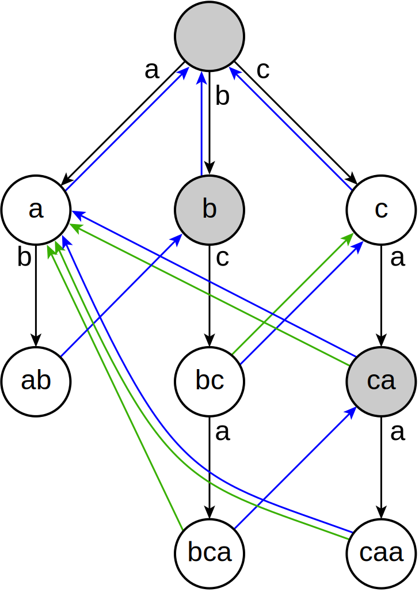

# Aho-Corasick algorithm

Aho-Corasick 알고리즘은 문자열 $S$에서 문자열 $T_1$, $T_2$, $…$, $T_k$ 의 등장을 한 번에 검색하는 알고리즘이다.

KMP Algorithm의 문자열 $T$에 대한 Prefix Function (Failure Function)과 비슷하게, Aho-Corasick Algorithm에서는 문자열 $T_1, T_2, \cdots, T_k$ 들의 Trie를 구성하고, 이 Trie 위에서의 Suffix Link (Failure Link)를 연결한다.

## Algorithm

우선, 문자열 $T_1, T_2, \cdots, T_k$ 들을 하나씩 Trie에 삽입한다.
완성된 Trie의 간선에는 문자가 적혀 있고, 각 정점은 $T_1, T_2, \cdots, T_k$들의 prefix를 의미한다.
문자열의 알파벳이 $O(C)$개 있을 때, Trie를 생성하는 시간 복잡도는 $O(|T_1|+|T_2|+\cdots+|T_k|)=O(M)$, 공간 복잡도는 $O(MC)$이다.

이제, Trie의 각 노드에서 **Suffix Link (Failure Link)** 를 결정한다.

!!! definition "Definition 1"
    각 노드의 **suffix link (failure link)**를 다음과 같이 정의한다.

    $fail[v]:=$ $v$의 노드가 의미하는 prefix의 proper suffix 중, Trie에 존재하는 prefix와 동일한 것 중 최대 길이의 prefix로의 링크 

    Trie의 루트 노드와 루트 노드의 자식 노드들의 fail 링크는 루트 노드로 정의한다.

$fail[v]$를 구하기 위하여, $fail[par[v]]$, $fail[fail[par[v]]]$, $…$의 자식 간선에 $v$가 의미하는 prefix의 마지막 문자 $c$가 존재하는지 확인하고, 자식 문자 $c$가 존재하는 가장 첫 번째 노드의 $c$에 해당하는 자식 노드가 $fail[v]$의 값이 된다.

이를 이미 계산한 값들을 활용하여 구하기 위해서, Trie의 각 노드들을 BFS를 통해 루트에서 가까운 정점부터 하나씩 $fail[v]$를 계산한다. 
$fail[par[v]]$, $fail[fail[par[v]]]$, $…$는 모두 $v$보다 깊이가 작은 정점들이기 때문에 BFS 과정에서 이미 그 값들이 구해진 정점들이다.

Prefix Function 의 시간 복잡도와 동일하게, 실패 함수 노드의 전이의 깊이를 생각하면 루트에서 리프 노드까지 내려갈 때 $fail[v]$의 깊이는 최대 $|T_k|$번 증가, 최대 $|T_k|$번 감소하니, 전체 시간복잡도 $O(|T_1|+|T_2|+...+|T_k|)=O(M)$에 구할 수 있다.

!!! algorithm "Algorithm 1"
    문자열 $T_1, T_2, \cdots, T_k$ 들을 하나씩 Trie에 삽입한다.

    이후, BFS를 하며 루트에서 가까운 노드부터 보며 $fail[v]$를 결정한다.
    $fail[v]$를 구하기 위하여, $fail[par[v]]$, $fail[fail[par[v]]]$, $…$의 자식 간선에 $v$가 의미하는 prefix의 마지막 문자 $c$가 존재하는지 확인하고, 자식 문자 $c$가 존재하는 가장 첫 번째 노드의 $c$에 해당하는 자식 노드를 $fail[v]$로 결정한다.

이후, 위에서 구한 Trie와 Suffix Link (Failure Link)를 바탕으로, 비교하려고 하는 문자열 $S$의 각 문자를 하나씩 보며 탐색한다.
시작 노드는 루트에서 시작하며, $S$의 문자를 하나씩 보며, 현재 노드의 자식 문자 간선이 존재하면, 그 노드로 이동하고, 존재하지 않으면, 존재할 때까지 Suffix Link를 타고 이동하며 비교를 반복한다.
즉, Trie에서 자식 간선이 존재하면 자식으로 이동하고, 간선이 존재하지 않으면 Suffix Link를 타고 이동하는 Automaton을 생성하고, 이 Automaton 위에서 $S$의 문자들을 하나씩 보며 상태를 전이한다.

$S$의 특정 문자까지 진행한 후, 현재 Trie에서 보고 있는 노드 $v$가 갖는 의미는, $v$에 해당하는 prefix가 현재 보고 있는 $S$의 prefix의 proper suffix 중 Trie에 존재하는 prefix와 동일한 것들 중 최대 길이를 갖는 것이다.

!!! algorithm "Algorithm 2"
    완성된 Trie와 Suffix Link (Failure Link)를 바탕으로, 비교하려고 하는 문자열 $S$의 각 문자를 하나씩 보며 탐색한다.

    시작 노드는 루트에서 시작하며, $S$의 문자를 하나씩 보며, 현재 노드의 자식 문자 간선이 존재하면, 그 노드로 이동하고, 존재하지 않으면, 존재할 때까지 Suffix Link를 타고 이동하며 비교를 반복한다.

시간 복잡도는 KMP 알고리즘과 동일하게, Automaton 위에서의 탐색은 $O(N+M)$의 시간복잡도로 상태를 전이할 수 있다.

하지만 특정 위치 $i$에서 끝나는 prefix의 suffix와 매칭되는 $T_i$가 여러 개 있을 수 있음에 주의하자.
조건을 만족하는 모든 $T_i$들은 suffix link를 타고 올라가면서, terminal node 인지 확인해주면 된다.
이 과정은 Automaton 위에서의 탐색에 포함되지 않기 때문에 시간복잡도를 $O(N+M)$에서 $O(Nmax|T_i|+M)$으로 증가시킨다.
이를 방지하기 위해서는, suffix link를 따라 올라가면서 만나는 첫 번째 terminal node를 저장하면 되는데, 이를 terminal link에 저장한다.
위 최적화를 통하여 실제 매칭되는 경우의 수에 대해서만 탐색할 수 있도록 jump할 수 있고, $O(N+M+ans)$의 시간복잡도에 문제를 해결할 수 있다.

!!! definition "Definition 2"
    각 노드 $v$에서 suffix link를 타고 올라가면서 만나는 첫 번째 terminal node를 **terminal link**로 연결한다.

전체 시간복잡도는 $O(N+M+ans)$, 공간복잡도는 $O(N+MK)$이다.

!!! complexity
    Time Complexity : $O(N+M+ans)$  
    Space Complexity : $O(N+MK)$

---


<center>
{width=60%}

“a”, “ab”, “bc”, “bca”, “c”, “caa”가 문자열 $T_1$, $T_2$, $…$, $T_k$일 때 Trie를 나타낸 그림이다.  
파란색 간선이 Suffix Link, 초록색 간선이 Terminal Link를 의미한다.
</center>

## Implementation

``` cpp linenums="1"
struct Node
{
	int fail, par, c;
	int chd[26];
	bool flag;
	Node(int _par, int _c)
	{
		fail=-1; par=_par; c=_c;
		for(int i=0; i<26; i++) chd[i]=-1;
		flag=false;
	}
};

int root;
vector<Node> NS;

int newNode(int par, int c)
{
	NS.push_back(Node(par, c));
	return NS.size()-1;
}

void makeTrie(vector<string> &SV)
{
	root = newNode(-1, -1);
	NS[root].par=root;
	NS[root].fail=root;

	for(auto &S : SV)
	{
		int now=root;
		for(int j=0; j<S.size(); j++)
		{
			if(NS[now].chd[S[j]-'a']==-1) NS[now].chd[S[j]-'a']=newNode(now, S[j]-'a');
			now=NS[now].chd[S[j]-'a'];
		}
		NS[now].flag=true;
	}
}

void bfs()
{
	queue<int> Q;
	Q.push(root);
	while(!Q.empty())
	{
		int now=Q.front(); Q.pop();
		Node &node = NS[now];

		if(now==root || node.par==root)
		{
			node.fail=root;
		}
		else
		{
			int nxt=NS[node.par].fail;
			while(nxt!=root && NS[nxt].chd[node.c]==-1) nxt=NS[nxt].fail;
			if(NS[nxt].chd[node.c]!=-1) node.fail=NS[nxt].chd[node.c];
			else node.fail=root;

			node.flag|=NS[node.fail].flag;
		}

		for(int nxt=0; nxt<26; nxt++)
		{
			if(node.chd[nxt]==-1) continue;
			Q.push(node.chd[nxt]);
		}
	}
}

vector<int> AhoCorasick(string &S, vector<string> &TV)
{
	//Find occurences of TV[0], TV[1], ... in S
	vector<int> ans;

	makeTrie(TV);
	bfs();

	int now=root;
	bool ans=false;
	for(int i=0; i<S.size(); i++)
	{
		if(NS[now].chd[S[i]-'a']!=-1) now=NS[now].chd[S[i]-'a'];
		else
		{
			while(now!=root && NS[now].chd[S[i]-'a']==-1) now=NS[now].fail;
			if(NS[now].chd[S[i]-'a']!=-1)
			{
				now=NS[now].chd[S[i]-'a'];
			}
		}
		if(NS[now].flag) ans.push_back(i); // ending position of occurences in S
		ans|=NS[now].flag;
	}
	return ans;
}
```

## Reference

- [https://cp-algorithms.com/string/aho_corasick.html#construction-of-an-automaton](https://cp-algorithms.com/string/aho_corasick.html#construction-of-an-automaton)