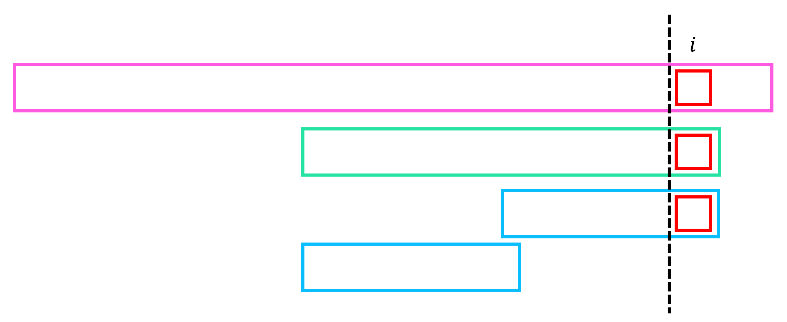

# Eertree (Palindrome Tree)

**Eertree (Palindrome Tree)**는 문자열 $S$의 모든 palindrome인 부분문자열들을 효율적으로 관리하기 위한 자료구조이다.
기본적인 구조는 suffix automaton과 비슷하고, KMP의 failure tree와도 유사한 부분이 있다.

## Property

!!! property "Property 1"
    길이 $N$의 문자열 $S$의 서로 다른 모든 palindrome인 부분문자열들은 최대 $N$개이다.  
    앞에서부터 문자를 하나씩 추가해 나갈 때, $i$번째 문자의 추가로 인해 새로 생길 수 있는 palindrome은 최대 $1$개이며 이는 $S[1...i]$의 suffix 중 가장 긴 palindrome이다.

!!! proof
    앞에서부터 문자를 하나씩 추가해 나갈 때, $i$번째 문자의 추가로 인해 $2$개의 서로 다른 palindrome인 부분문자열이 새로 생겼다고 가정하자.
    아래 그림과 같이 palindrome의 성질에 의해 다른 부분문자열들은 가장 긴 길이의 palindrome에 의해 $i$번째 문자를 추가하기 전 이미 등장했던 부분문자열이다.  
    따라서, $i$번째 문자를 추가하였을 때 최대 $1$개의 새로운 palindrome인 부분문자열이 등장할 수 있고, 전체 문자열 $S$의 서로 다른 모든 palindrome인 부분문자열들은 최대 $N$개이다.

## Structure

Eertree는 다음 기본 성질들을 만족한다.

!!! property "Property 1"

    - Eertree는 정점 (state)와 
    Eertree의 각 노드는 문자열 $S$의 각 palindrome인 부분문자열에 하나씩 대응된다.

!!! definition "Definition 

