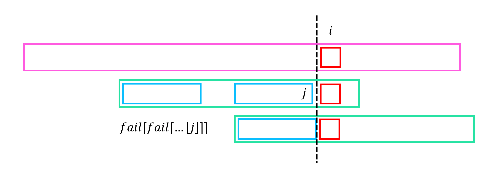

# KMP (Knuth-Morris-Pratt Algorithm)

KMP 알고리즘은 길이 $N$의 문자열 $S$에서 길이 $M$의 문자열 $T$의 모든 등장 위치를 $O(N+M)$에 찾는 알고리즘이다.
문자열 매칭을 하기 위하여 $T$의 failure function을 먼저 계산하였다고 가정한다.

## Algorithm

<center>

</center>

문자열 $S$를 앞에서부터 보며, $i$번째 prefix의 suffix를 $S$와 최대한 매칭시킨 $T$의 위치를 $j=match[i]$라 하자.

$i-1$번째 칸에서 최대로 매칭한 위치를 $j=match[i-1]$라 할 때, $i$번째 칸에서 매칭한 위치 $match[i]$를 구하자.
우선, $S[i]=T[j+1]$이면, $match[i]=j+1$이다.
만약 그렇지 않다면 $j$를 옮겨 조건을 만족하도록 해야하는데, $fail$의 정의에 의해 옮길 수 있는 가장 큰 $j=fail[j]$이다.
이와 같이 $j, fail[j], fail[fail[j]], \cdots$를 하나씩 확인하며 $S[i]=T[j+1]$인 최초 위치를 발견하여 옮겨주면 된다.

!!! algorithm "Algorithm 1"
    길이 $N$의 문자열 $S$에서 길이 $M$의 문자열 $T$의 모든 등장 위치를 찾는다.
    $i$를 증가시키며 각 위치에서의 $match[i]$를 구한다.
    $j=match[i-1]$에서 시작하여, $j$, $j=fail[j]$, $j=fail[fail[j]]$를 하나씩 확인하며 $S[i]=T[j+1]$인 $j$가 등장하는 순간 $match[i]=j+1$이다.
    만약 만족하는 $j$가 없다면 $match[i]=0$이다.

    만약 $match[i]=M$이면 $S$의 등장을 하나 발견하였고 그 위치는 $[i-M+1, i]$이다.
    이후, $j$를 $fail[j]$로 바꾸어준다.

전체 탐색 과정에서 $i$는 단조증가하고, 탐색하는 문자열 $T$를 오른쪽으로 이동시키니 전체 시간복잡도는 $O(N+M)$이다.

!!! complexity
    Time Complexity : $O(N+M)$

## Implementation

``` cpp linenums="1"
vector<int> getFail(int N, string &S)
{
    vector<int> fail(N+1);

    fail[0]=-1;
    for(int i=1; i<=N; i++)
    {
    	int j=fail[i-1];
        for(; j>=0; j=fail[j]) if(S[j+1]==S[i]) break;
        fail[i]=j+1;
    }
    return fail;
}

vector<int> KMP(int N, int M, string &S, string &T)
{
	//Find occurences of T in S
	vector<int> fail = getFail(M, T);
	vector<int> ans;

	for(int i=1, j=0; i<=N; i++)
	{
		for(; j>=0; j=fail[j]) if(T[j+1]==S[i]) break;
		j++;
		if(j==M) ans.push_back(i-M+1), j=fail[j];
	}
	return ans;
}
```

## Reference

- [https://cp-algorithms.com/string/prefix-function.html](https://cp-algorithms.com/string/prefix-function.html)
- [https://m.blog.naver.com/kks227/220917078260](https://m.blog.naver.com/kks227/220917078260)