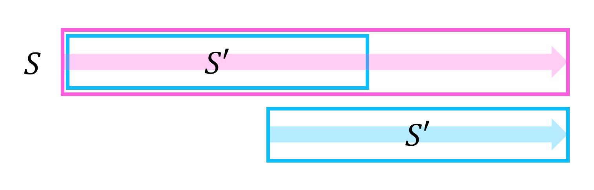
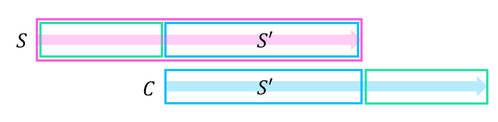
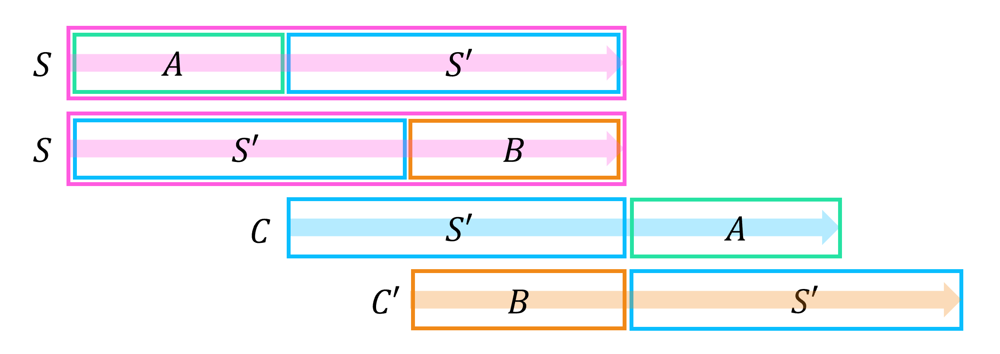
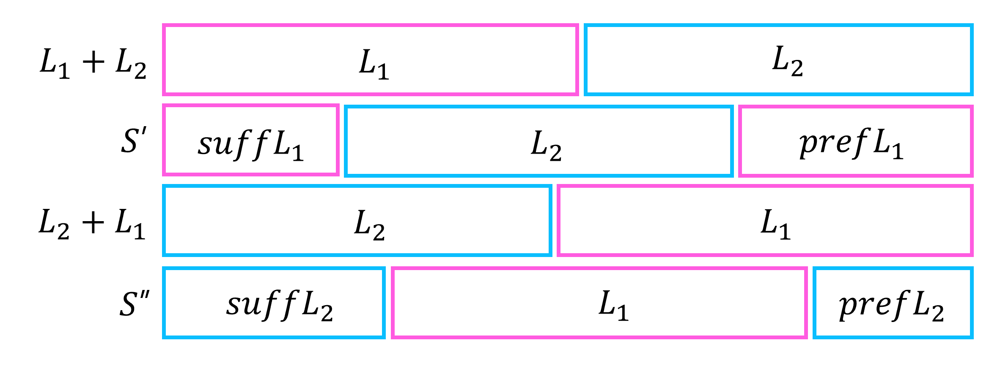
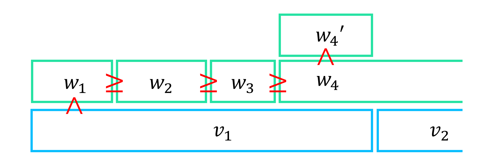

# Lyndon Decomposition

## Lyndon Word

!!! definition "Definition 1"
    문자열 $S$가 **lyndon word (simple word)**라는 것은 $S$가 $S$의 모든 proper suffix보다 사전순으로 작다는 의미이다.  
    즉, $S$의 suffix array를 구했을 때, 첫 번째 칸이 $1$($S$ 전체)이다.

Lyndon word의 예로는 **"a"**, **"ab"**, **"aab"**, **"abb"**, **"abcd"**, **"abac"**가 있다.

---

!!! property "Property 1"
    $S$가 lyndon word일 때, $fail[S]=0$이다.  
    즉, $S$의 어떤 prefix와 suffix도 동일하지 않다.

!!! proof
    $S$의 prefix와 suffix가 같은 proper suffix $S'$이 존재한다고 가정하자.
    $S$와 $S'$을 비교하면, 앞부분은 $S'$으로 동일하고, $S$는 뒤에 문자열이 이어지니 사전순으로 비교했을 때 $S$가 더 크다.
    따라서, $S$가 lyndon word임에 모순이다.

    {: .center style="width:70%"}

<br>

!!! property "Property 2"
    다음 두 명제는 동치이다.

    - $S$가 lyndon word이다.
    - $S$는 $S$의 모든 cyclic shift보다 사전순으로 작다. (같을 수도 없다.)

!!! proof
    ($\Rightarrow$)  
    $S$가 lyndon word라고 하고, $S$의 proper suffix $S'$에서 시작하는 cyclic shift $C$를 생각하자.
    $S<S'$이고, **Property 1**에 의해 $S$와 $C$을 앞에서부터 비교하였을 때 최초로 다른 문자는 $S'$이 끝나기 전에 등장한다.
    따라서, $S$와 $C$의 대소관계는 $S$와 $S'$의 대소관계와 동일하며, $S<C$이다.
    
    {: .center style="width:90%"}

    ($\Leftarrow$)  
    $S$는 $S$의 모든 cyclic shift보다 사전순으로 작다고 하자.
    $S$의 임의의 cyclic shift $C$를 생각하면, $C$는 $S$의 suffix $S'$에서 시작한다.
    $C$과 $S$를 앞에서부터 비교하였을 때 최초로 다른 문자가 $S'$이 끝난 후에 등장하였다고 **가정하자**.
    그렇다면 $S'$은 $S$의 prefix이기도 하고, $S=A+S'=S'+B$로 표현할 수 있다.
    또한, cyclic shift $B+S'$을 $C'$이라 표현하면 다음 식이 성립한다.

    $$S<C \Rightarrow S=S'+B<C=S'+A \Rightarrow B<A \Rightarrow B+S'<A+S' \Rightarrow C'<S$$

    하지만, 위 식에 의해 $C'<S$이고, 이는 $S$가 $S$의 모든 cyclic shift보다 사전순으로 작음에 모순이다.
    따라서 $C$과 $S$를 앞에서부터 비교하였을 때 최초로 다른 문자는 $S'$이 끝나기 전에 등장하고, $S<C$이니 $S<S'$이 성립한다.
    따라서 $S$는 lyndon word이다.

    {: .center style="width:90%"}

**Property 2**에 의해, lyndon word는 "$S$가 $S$의 모든 proper suffix보다 사전순으로 작다"는 조건이나 "$S$는 $S$의 모든 cyclic shift보다 사전순으로 작다"는 조건을 만족시키면 된다.

---

!!! property "Property 3"
    $L_1, L_2$가 lyndon word라 하자.
    다음 두 명제는 동치이다.  

    - $L_1+L_2 < L_2+L_1$
    - $L_1+L_2$는 lyndon word이다.

!!! proof
    ($\Rightarrow$)  
    $L_1+L_2$가 lyndon word임을 보이기 위하여 $L_1+L_2$의 모든 cyclic shift와 $L_1+L_2$를 비교하자.  
    $L_1$의 suffix로 시작하는 cyclic shift $S'$의 경우, lyndon word의 정의에 의해 $L_1<\text{suff} L_1$이니 $L_1+L_2<S'$이다.
    $L_2$로 시작하는 cyclic shift $L_2+L_1$의 경우, 가정에 의해서 $L_1+L_2 < L_2+L_1$이다.  
    $L_2$의 suffix로 시작하는 cyclic shift $S''$의 경우, lyndon word의 정의에 의해 $L_2<\text{suff} L_2$이니 $L_1+L_2<L_2+L_1<S''$이다.

    {: .center style="width:80%"}

    ($\Leftarrow$)  
    $L_2+L_1$은 $L_1+L_2$의 cyclic shift이고, 따라서 **Property 2**에 의해 $L_1+L_2<L_2+L_1$이다.

<br>

!!! property "Property 4"
    $L_1, L_2$가 lyndon word라 하자.
    다음 두 명제는 동치이다.  

    - $L_1<L_2$
    - $L_1+L_2<L_2+L_1$

!!! proof
    ($\Rightarrow$)  
    만약 $L_1$이 $L_2$의 prefix가 아니라면, 앞에서부터 비교할 때 $L_1$와 $L_2$가 달라지는 점은 $L_1$이 끝나기 전이니, $L_1+L_2<L_2+L_1$도 당연히 성립한다.  
    이제, $L_1$이 $L_2$가 prefix, $L_2=L_1+S$라고 가정하자.
    $L_1+L_2=L_1+L_1+S$, $L_2+L_1=L_1+S+L_1$을 비교하면, $L_1+S$, $S+L_1$을 비교한 것과 같고 $S+L_1$은 $L_2$의 cyclic shift이기 때문에 **Property 2**에 의해 $L_1+S<S+L_1$가 성립한다.
    따라서 $L_1+L_2<L_2+L_1$가 성립한다.
    
    {: .center style="width:90%"}

    ($\Leftarrow$)  
    $L_1+L_2<L_2+L_1$가 성립한다면 **Property 4**에 의해 $L_1+L_2$는 lyndon word이다.
    당연히 $L_1<L_1+L_2$가 성립하며, lyndon word에 정의에 의해 $L_1+L_2<L_2$가 성립한다.
    따라서 $L_1<L_1+L_2<L_2$, $L_1<L_2$이다.

<br>

따라서, **Property 3**과 **Property 4**에 의해 다음이 성립한다.

!!! property "Property 5"
    $L_1, L_2$가 lyndon word라 하자.  
    $L_1<L_2$라면 $L_1+L_2$는 lyndon word이다.

**Property 5**는 다음 문단에서 다룰 lyndon decomposition이 문자열 $S$를 lyndon word들로 쪼개는 minimal decomposition임을 증명할 수 있게 해준다.


## Lyndon Decomposition

!!! definition "Definition 2"
    문자열 $S$에 대하여 $S$의 **lyndon decomposition**은 $S$를 $S=w_1 w_2 \cdots w_k$로 쪼개, $w_1, w_2, \cdots, w_k$가 모두 lyndon word이며, $w_1 \ge w_2 \ge \cdots \ge w_k$를 만족하게 하는 분할이다.

---

!!! property "Property 6"
    임의의 문자열 $S$의 lyndon decomposition은 유일하게 존재한다.

!!! proof
    **(Existence)**  
    문자열 $S$의 각 문자를 하나씩 lyndon word들로 생각할 수 있다. (한 문자로 구성된 문자열 또한 lyndon word이다.)
    이제, **Property 5**를 이용하여 인접한 lyndon word들 중 $L_1<L_2$를 만족하는 두 문자열을 골라 $L_1+L_2$로 합쳐주는 과정을 반복하자.
    $L_1+L_2$ 또한 lyndon word 이기 때문에 병합 과정에서 등장하는 모든 문자열들은 lyndon word이다.
    더 이상 이 과정을 실행하지 못할 때 쪼개진 lyndon word들은 $w_1 \ge w_2 \ge \cdots \ge w_k$를 만족하니, lyndon decomposition은 존재한다.

    **(Uniqueness)**  
    $S$의 lyndon decomposition이 유일하게 존재함을, $S$의 길이 $len(S)$에 대한 귀납법을 사용하여 증명하자.
    만약 $S$의 서로 다른 두 lyndon decomposition $S=w_1 w_2 \cdots w_k$, $S=v_1 v_2 \cdots v_m$이 존재하고, 일반성을 잃지 않고 $len(w_1) \le len(v_1)$이라 하자.  
    만약 $len(w_1)=len(v_1)$이면 $w_1=v_1$이고 귀납적으로 $S=w_1+S'$에서 $S'$의 lyndon decomposition이 unique하니 증명이 종료된다.  
    $len(w_1)<len(v_1)$라면 아래 그림과 같이 $len(w_1)+len(w_2)+\cdots+len(w_p) \ge len(v_1)$인 최소의 $1 < p \le k$가 존재한다.
    $w_p$의 길이 $len(v_1)-(len(w_1)+len(w_2)+\cdots+len(w_{p-1}))$인 prefix를 $w_p'$이라 하면 $w_p' < w_p \le w_{p-1} \le \cdots \le w_1 < v_1$이 성립한다.
    $v_1$의 suffix인 $w_p'$에 대해 $w_p' < v_1$인데, 이는 $v_1$이 lyndon word임에 모순이다.
    따라서 lyndon decomposition은 유일하다.


    {: .center style="width:80%"}

## Algorithm

### Algorithm using Suffix Array

$S$가 lyndon word라면, $S$의 suffix array를 구했을 때 첫 번째 칸이 $1$($S$ 전체)임을 생각하자.
문자열 $S$의 suffix array에서 사전순으로 가장 작은 suffix를 선택하면, 해당 suffix는 lyndon word이다.
그렇다면 반복적으로 suffix array에서 사전순으로 가장 작은 suffix를 제거해 나가며 lyndon decomposition을 구할 수 있을까?

!!! property "Property 7"
    반복적으로 suffix array에서 사전순으로 가장 작은 suffix를 제거해 나가면 lyndon decomposition을 구할 수 있다.

    문자열 $S$의 lyndon decomposition의 마지막 lyndon word는 $S$의 suffix array에서 사전순으로 가장 작은 suffix이다.

!!! proof "Proof"
    반복적으로 suffix array에서 사전순으로 가장 작은 suffix $v_1$를 제거해 나가면 각 부분문자열들은 lyndon word임은 자명하다.
    (lyndon word의 정의에 의해 $v_1$의 suffix array를 구했을 때, 첫 번째 칸이 $1$($v_1$ 전체)이다.)

    이제, 올바른 lyndon decomposition임을 보이기 위해서 위 알고리즘으로 제거한 처음 $2$개의 suffix를 순서대로 $v_1, v_2$라 하자.
    Lyndon decomposition의 조건을 만족하려면 $v_2 \ge v_1$여야 하고, 이 사실만 보인다면 귀납적으로 증명이 종료된다.  
    만약 $v_2 < v_1$이라 가정하자.
    **Property 5**에 의해 $v_2+v_1$는 lyndon word이고, $v_2+v_1<v_1$이 성립한다.
    하지만 $v_2+v_1$, $v_1$ 모두 $S$의 suffix이고, $v_1$이 사전순으로 가장 작은 suffix임에 모순이다.
    따라서, $v_2 \ge v_1$이다.

    즉, 위 알고리즘을 실행하여 얻는 부분문자열들은 $w_1, w_2, \cdots w_k$가 lyndon word이며 $w_1 \ge w_2 \ge \cdots \ge w_k$를 만족하며, **Property 6**에 의해 이는 유일한 lyndon decomposition이다.
    또한, 문자열 $S$의 lyndon decomposition의 마지막 lyndon word는 $S$의 suffix array에서 사전순으로 가장 작은 suffix이다.


임의의 suffix를 제거한다고 해서 일반적으로 남은 suffix들의 사전순 순서가 변하지 않는것은 아니다.
예를 들어, **"abac < ac"**이지만, c를 제거한 후 **"aba > a"**이다.
하지만, 현재 상황은 suffix array에서 사전순으로 가장 작은 suffix를 제거해 나가는 상황이다.

!!! property "Property 8"
    문자열 $S$의 suffix array에서 사전순으로 가장 작은 suffix $T$를 제거하면, 남은 문자열 $S'$의 suffix들의 사전순 순서는 변하지 않는다.

!!! proof
    $S'$에서 사전순 위치관계가 뒤바뀐 두 suffix를 $P_1$, $P_2$라 하자.
    즉, $S'$에서는 $P_1<P_2$이지만 $S$에서는 $P_1+T>P_2+T$이다.
    만약 $P_1$이 $P_2$의 prefix가 아니라면 $P_1+T$와 $P_2+T$의 대소관계도 $P_1$과 $P_2$의 대소관계와 같아야 한다.
    즉, $P_1$은 $P_2$의 prefix여야 하는데, $S'$에서 길이 $len(P_2)-len(P_1)$인 suffix를 $P_3$라 하자.
    $P_1$은 $P_2$의 prefix이기 때문에 $P_1+T$와 $P_2+T$의 대소관계는 $T$와 $P_3+T$의 대소관계와 같고, $T$가 사전순으로 가장 suffix이기 때문에 $T<P_3+T$가 성립한다.
    이는 $P_1+T>P_2+T$에 모순이다.  
    따라서, 남은 문자열 $S'$의 suffix들의 사전순 순서는 변하지 않는다.

따라서, 전체 문자열 $S$의 suffix array를 구한 후, 사전순으로 가장 작은 suffix $T$를 제거하고, 현재의 suffix array 위에서 남은 prefix에 대하여 이를 반복하면 $S$의 lyndon decomposition을 구할 수 있다.

시간복잡도는 suffix array를 구하는 시간복잡도 $O(N)$ 혹은 $O(N\log N)$과 같다.

!!! algorithm "Algorithm 1"
    전체 문자열 $S$의 suffix array를 구한 후, 사전순으로 가장 작은 suffix $T$를 제거하고, 현재의 suffix array 위에서 남은 prefix에 대하여 이를 반복하면 $S$의 lyndon decomposition을 구할 수 있다.

!!! complexity
    Time Complexity : $O(N)$ or $O(N\log N)$

### Duval Algorithm

!!! definition "Definition 3"
    문자열 $T$가 **pre-lyndon word**라는 것은 $w$는 lyndon word, $\overline{w}$는 $w$의 prefix일 때 $T=ww \cdots w \overline{w}$의 형태로 표현할 수 있다는 것이다.
    ($\overline{w}$는 빈 문자열일 수 있다.)

Duval algorithm은 lyndon decomposition을 문자를 하나씩 추가하며 incremental 하게 구한다.
문자열 $S$의 상태는 $s_1s_2s_3$로 표현할 수 있고, $s_1$은 이미 lyndon decomposition을 찾았고 확정한 상태, $s_2$는 현재 탐색하고 있는 중인 pre-lyndon word, $s_3$는 아직 탐색하지 않은 상태임을 의미한다.
알고리즘은 반복적으로 아직 탐색하지 않은 $s_3$의 첫 번째 문자를 꺼내 $s_2$에 추가하려고 한다.
$i$는 $s_2$의 첫 번째 위치, $j$는 $s_3$의 첫 번째 위치, $k$는 새로운 문자를 추가할 때 아직 $s_2$가 pre-lyndon word인지 비교하기 위한 $s_2$ 중의 위치를 의미한다.
새로 추가할 문자 $s[j]$와 $s[k]$를 비교하여 결과에 따라 다음과 같이 작동한다.

**(Case 1)** $s[j]=s[k]$  
$s_2$에 $s[j]$를 추가하고 난 후에도 pre-lyndon word이니, $j$와 $k$를 $1$ 증가시킨다.

**(Case 2)** $s[j]>s[k]$  
$s_2$에 $s[j]$를 추가하고 나면 pre-lyndon word이 아닌, lyndon word가 된다.
따라서 $s_2+s[j]$ 전체를 하나의 lyndon word로 취급하고 다음부터는 비교를 $s_2$의 첫 위치부터 다시 한다.
$j$는 $1$ 증가시키고, $k$는 다시 $s_2$의 첫 번째 위치인 $i$로 초기화시킨다.

**(Case 3)** $s[j]<s[k]$  
$s_2$에 $s[j]$를 추가하고 나면 더 이상 pre-lyndon도, lyndon word도 아니게 된다.
이제 지금까지 찾은 $s_2$의 lyndon word들 ($s_2=ww \cdots w \overline{w}$에서 $ww \cdots w$)를 $s_1$에 넣어주고 비교를 계속하면 된다.
$w$의 길이는 $j-k$가 되고, 따라서 $i$에서부터 길이 $j-k$씩 lyndon word들을 $s_1$에 넣어주면 된다.

!!! algorithm "Algorithm 1"
    Lyndon decomposition을 문자를 하나씩 추가하며 incremental 하게 구한다.
    문자열 $S$의 상태는 $s_1s_2s_3$로 표현할 수 있고, $s_1$은 이미 lyndon decomposition을 찾았고 확정한 상태, $s_2$는 현재 탐색하고 있는 중인 pre-lyndon word, $s_3$는 아직 탐색하지 않은 상태임을 의미한다.
    알고리즘은 반복적으로 아직 탐색하지 않은 $s_3$의 첫 번째 문자를 꺼내 $s_2$에 추가하려고 한다.
    $i$는 $s_2$의 첫 번째 위치, $j$는 $s_3$의 첫 번째 위치, $k$는 새로운 문자를 추가할 때 아직 $s_2$가 pre-lyndon word인지 비교하기 위한 $s_2$ 중의 위치를 의미한다.
    새로 추가할 문자 $s[j]$와 $s[k]$를 비교하여 결과에 따라 다음과 같이 작동한다.

    - $s[j]=s[k]$ : $j$와 $k$를 $1$ 증가시킨다.
    - $s[j]>s[k]$ : $j$는 $1$ 증가시키고, $k$는 다시 $s_2$의 첫 번째 위치인 $i$로 초기화시킨다.
    - $s[j]<s[k]$ : $i$에서부터 길이 $j-k$씩 lyndon word들을 $s_1$에 넣어주고, $i$가 $k$보다 커지면 중지한다.

알고리즘의 동작 과정에서 lyndon word를 분할해 내는 과정은 다 합해서 $O(N)$의 시간이 걸린다.
하지만 이 외의 추가 시간이 소모되는 부분은 바로 $s_2=ww \cdots w \overline{w}$에서 $w$들은 $s_1$에 넣어주는데, $\overline{w}$은 탐색은 하지만 다음 반복에서 다시 고려된다는 점이다.
하지만 $len(\overline{w}) \le len(w)$이 성립하니, 매번 추가로 보는 $\overline{w}$의 길이의 합은 $O(N)$을 넘지 않는다.
따라서 전체 $O(N)$의 시간이 걸린다.

!!! complexity
    Time Complexity : $O(N)$

#### Implementation

``` cpp linenums="1"
vector<pii> lyndon(int N, string &S)
{
    vector<pii> lyndon;
    for(int i=1; i<=N; )
	{
		int j=i+1, k=i;
		for(; j<=N; j++)
		{
			if(S[j]==S[k]) k++;
			else if(S[j]>S[k]) k=i;
            else break;
		}
        for(; i<=k; i+=j-k)
        {
            lyndon.push_back({i, i+j-k-1}); // S[i...(i+j-k-1)] is lyndon word
        }
	}
    return lyndon;
}
```

## Application

### Lyndon Decomposition for All Prefixes

모든 prefix에 대한 lyndon decomposition을 다 구하기 위해선 **Property 7**에 의해 모든 prefix $\text{pref}(S)$에 대해 $\text{pref}(S)$의 사전순으로 가장 작은 suffix를 구하면 된다.
이를 구한다면, 트리와 같은 형태로 귀납적으로 남은 prefix의 사전순으로 가장 작은 suffix를 구해나가며 모든 prefix에 대한 lyndon decomposition을 구할 수 있다.

Incremental 하게 lyndon decomposition을 구하는 duval algorithm을 응용하여 모든 prefix $\text{pref}(S)$에 대해 $\text{pref}(S)$의 사전순으로 가장 작은 suffix를 구하자.
$S[1 \cdots j]$에 대해 duval algorithm은 pre-lyndon word $s_2=ww \cdots w \overline{w}$을 관리한다.

**(Case 1)** $\overline{w}$가 비어 있다면, $S[1 \cdots j]$의 사전순으로 가장 작은 suffix는 $w$이다.

**(Case 2)** $\overline{w}$가 비어 있지 않다면 $S[1 \cdots j]$의 사전순으로 가장 작은 suffix는 $\overline{w}$의 사전순으로 가장 작은 suffix이다.
하지만 이 값은 다시 구할 필요 없이, 이는 dp를 이용하여 이미 계산된 값을 재활용할 수 있다.
$j'=j-len(w)$을 계산할 때의 $\overline{w}'$ 또한 $\overline{w}$와 같기 때문에, $j$에서의 사전순으로 가장 작은 suffix는 $j-len(w)$에서의 사전순으로 가장 작은 suffix와 같다.

!!! algorithm "Algorithm 2"
    모든 prefix에 대한 lyndon decomposition을 다 구하기 위해선 **Property 7**에 의해 모든 prefix $\text{pref}(S)$에 대해 $\text{pref}(S)$의 사전순으로 가장 작은 suffix를 구하면 된다.
    이를 구한다면, 트리와 같은 형태로 귀납적으로 남은 prefix의 사전순으로 가장 작은 suffix를 구해나가며 모든 prefix에 대한 lyndon decomposition을 구할 수 있다.

    $S[1 \cdots j]$에 대해 duval algorithm은 pre-lyndon word $s_2=ww \cdots w \overline{w}$을 관리한다.
    알고리즘을 진행하며, 모든 prefix $\text{pref}(S)$에 대해 $\text{pref}(S)$의 사전순으로 가장 작은 suffix를 dp를 이용하여 구한다.
    
    **(Case 1)** $\overline{w}$가 비어 있다면, $S[1 \cdots j]$의 사전순으로 가장 작은 suffix는 $w$이다.

    **(Case 2)** $\overline{w}$가 비어 있지 않다면 $S[1 \cdots j]$의 사전순으로 가장 작은 suffix는 $\overline{w}$의 사전순으로 가장 작은 suffix이다.
    이 값은 $j-len(w)$에서의 사전순으로 가장 작은 suffix와 같다.

시간복잡도는 일반적인 duval algorithm과 동일하게 $O(N)$이다.

!!! complexity
    Time Complexity : $O(N)$

#### Implementation

``` cpp linenums="1"
vector<int> lyndon(int N, string &S)
{
    vector<int> dp(N+1);
    for(int i=1; i<=N; )
	{
        dp[i]=1;
		int j=i+1, k=i;
		for(; j<=N; j++)
		{
			if(S[j]==S[k])
            {
                dp[j]=dp[k];
                k++;
            }
			else if(S[j]>S[k])
            {
                dp[j]=j-i+1;
                k=i;
            }
            else break;
		}
        for(; i<=k; i+=j-k);
	}
    return dp;
}
```

## Reference

- [https://cp-algorithms.com/string/lyndon_factorization.html](https://cp-algorithms.com/string/lyndon_factorization.html)
- [https://codeforces.com/blog/entry/106725](https://codeforces.com/blog/entry/106725)