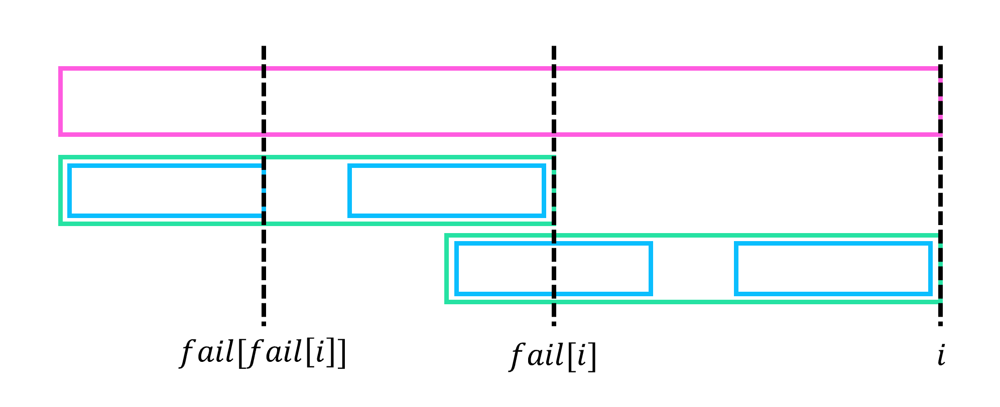

# Prefix Function (Failure Function)

## Definition

!!! definition "Definition 1"
    $fail[i] := S[1 \cdots i]$의 **prefix** 와 **suffix** 가 동일한 **proper prefix**의 최대 길이  
    조건을 만족하는 **proper prefix**가 없으면 $fail[i]=0$, $fail[0]=-1$
정의에 의해, $fail[1]=0$이며 $fail[0]$은 정의되지 않기 때문에, $fail[0]=-1$이라고 생각하자.

예를 들어, **“abcabcd”** 의 실패 함수는 **[0, 0, 0, 1, 2, 3, 0]** 이고, **“aabaaab”**의 실패 함수는 **[0, 1, 0, 1, 2, 2, 3]** 이다.

## Property

### Property 1
!!! property "Property 1"
    $$fail[i]+1≥fail[i+1]$$

!!! proof
    $fail[i+1]$에서 마지막 문자를 제거하면, 즉 길이 $fail[i+1]-1$의 prefix는 $S[1 \cdots i]$의 prefix 이고, 동시에 suffix 이다.
    즉, $fail[i]$의 조건을 모두 만족하니, 최댓값인 $fail[i]$는 $fail[i+1]-1$보다는 크거나 같아야 한다.

<center>

</center>

이는 $i$를 증가시킬 때마다 $fail[i+1]$는 최대 $1$증가할 수 있다는 의미이다.
따라서 $fail[i]$를 $1$부터 $N$까지 계산하면 $fail[i]$는 최대 $N$번 증가, 최대 $N$번 감소함을 알 수 있다.

### Property 2
!!! property "Property 2"
    $fail$의 정의에서 “최대” 조건을 무시한, 즉 $S[1 \cdots i]$의 **prefix** 와 **suffix** 가 동일한 **proper prefix**의 길이들의 집합을 $F[i]$라 하자.
    $F[i]$는 $fail[i], fail[fail[i]], fail[fail[fail[i]]], \cdots$ 의 형태로 구성된다.

<center>
{width=90%}
</center>

!!! proof
    $F[i]$를 귀납적으로 구하기 위하여 $j<i$인 모든 $j$에 대하여 $F[j]$를 구했다고 생각하자.
    $x \in F[i]$라고 하면 $fail$의 정의애 의해 $x \leq fail[i]$이며, 위 그림과 같이 $x=fail[i]$이거나 $x \in F[fail[i]]$가 성립해야 한다.
    따라서 $F[i] = F[fail[i]] \cup {fail[i]}$가 성립하며, 이는 $F[i]={fail[i], fail[fail[i]], \cdots}$과 같은 구조임을 의미한다.

위 성질은 $i$에서 $fail[i]$로 가는 간선을 이었을 때, 만들어지는 구조가 트리이며 $F[i]$를 구하기 위해서는 $i$의 조상들의 집합을 구하면 됨을 의미한다. 앞으로 이 트리를 **Failure Tree**라 부르기로 한다.

## Algorithm

$fail[i]$를 구하기 위하여 $j<i$인 모든 $j$에 대하여 $fail[j]$를 구했다고 생각하자.
$x=fail[i]$라면 $x-1 \in F[i-1]$이니, 거꾸로 $j \in F[i-1]$인 모든 $j$에 대하여 큰 순서대로 $j+1 \in F[i]$인지 확인해주면 된다.
이는 단순히 $S[j+1]=S[i]$인지 확인해주면 된다.

따라서 다음과 같은 방법으로 구할 수 있다.

!!! algorithm "Algorithm 1"
    $i$를 증가시켜가며 $fail[i]$를 구한다.  
    $j=fail[i-1], fail[fail[i-1]], \cdots$를 하나씩 확인하며, $S[j+1]=S[i]$인 $j$가 등장하는 순간 $fail[i]=j+1$이다.  
    만약 만족하는 $j$가 없다면 $fail[i]=0$이다.

**Property 1**과 같이 $fail[i]$는 최대 $N$번 증가, 최대 $N$번 감소하니, 위와 같은 알고리즘으로 $O(N)$ 시간에 모든 $fail[i]$를 구할 수 있다.
이는 $S$에서 $S$를 찾는 KMP 알고리즘을 생각했을 때, 문자열을 최대 $N$칸 밀어가며 탐색하니 $O(N)$이라고 생각해도 된다.

!!! complexity "Time Complexity"
    <center>
    Time Complexity : $O(N)$
    </center>

## Implementation

``` cpp linenums="1"
vector<int> getFail(int N, string &S)
{
    vector<int> fail(N+1);

    fail[0]=-1;
    for(int i=1; i<=N; i++)
    {
    	int j=fail[i-1];
        for(; j>=0; j=fail[j]) if(S[j+1]==S[i]) break;
        fail[i]=j+1;
    }
    return fail;
}
```

## Reference
- [https://cp-algorithms.com/string/prefix-function.html](https://cp-algorithms.com/string/prefix-function.html)