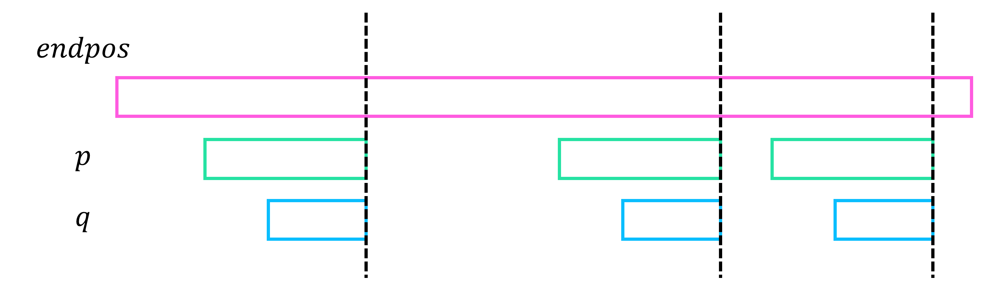
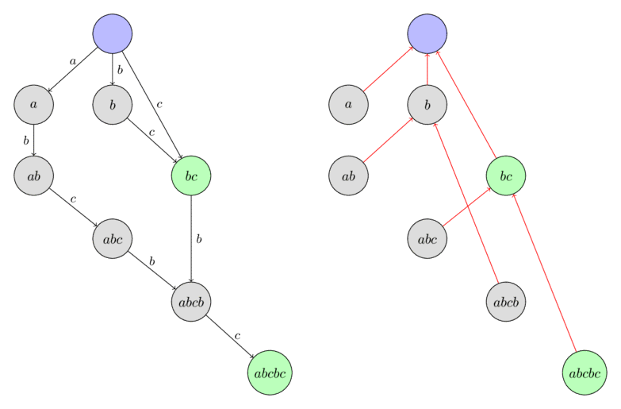
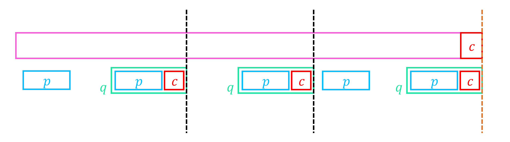
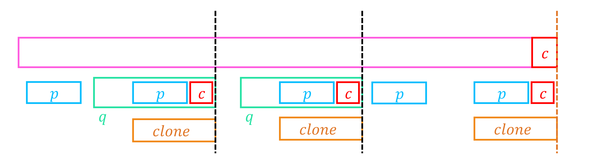
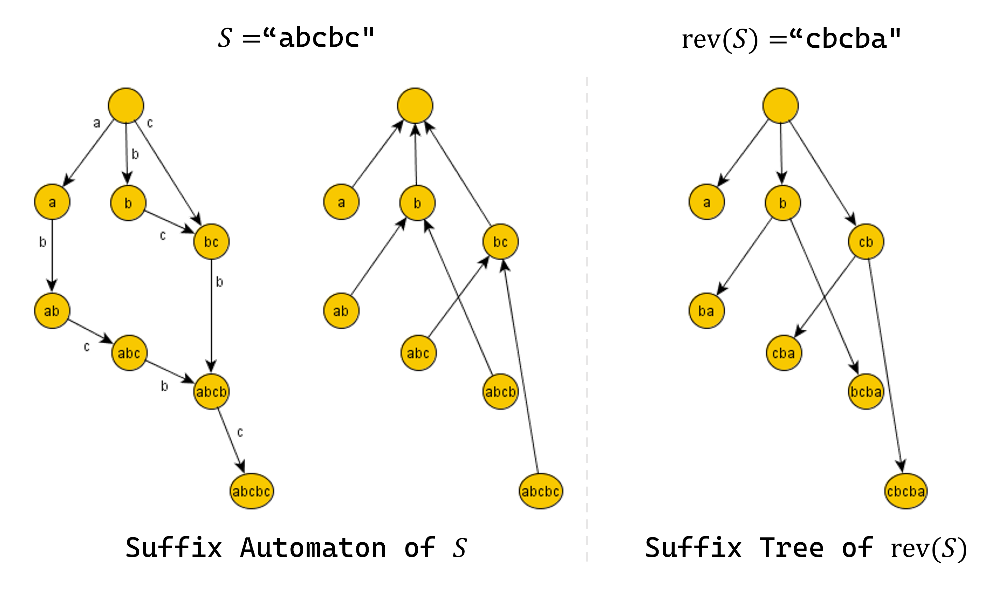

# Suffix Automaton

문자열 $S$의 모든 부분문자열들을 효율적으로 관리하기 위한 자료구조로, suffix array나 suffix tree가 있다.
**Suffix automaton**은 각 간선에 문자가 하나씩 적힌 DAG (Directed Acyclic Graph)를 만들어, DAG 위에서의 임의의 경로가 $S$의 부분문자열과 대응되도록 $S$의 부분문자열들을 압축하여 표현한 자료구조이다.

## Structure

Suffix automaton은 DFA (deterministic finite automaton)로, 다음 기본 성질들을 만족한다.

!!! property "Property 1"
    - Suffix automaton은 **정점 (state)**와 **간선 (transition)**으로 구성된 DAG (Directed Acyclic Graph)이다.
    - 정점들 중 하나의 정점은 **initial state**이며, 모든 다른 정점들은 이 정점으로부터 도달이 가능하다.
    - 각 간선(transition)에는 하나의 문자가 적혀 있고, 한 정점에서 나가는 서로 다른 간선들에는 서로 다른 문자가 적혀 있다.
    - Initial state에서 시작하여 간선을 따라 이동하는 임의의 경로는 모두 서로 다른 $S$의 부분문자열이고, $S$의 모든 부분문자열은 임의의 경로에 정확히 한번 등장한다.
    - 몇 개의 정점들은 **terminal state**이며, initial state에서 terminal state로 가는 임의의 경로는 모두 서로 다른 $S$의 suffix이고, $S$의 모든 suffix는 initial state에서 terminal state로 가는 경로에 정확히 한번 등장한다.

Suffix tree와는 다르게, 각 정점이 하나의 부분문자열을 의미하는 것이 아니라, initial state에서 시작하는 임의의 경로가 하나의 부분문자열을 의미하는 것임에 주의하자.
즉, 한 정점으로 가는 여러 개의 경로가 존재할 수 있으며 모두 서로 다른 부분문자열을 의미한다.

### End Position

!!! definition "Definition 1"
    $endpos(t):=$ $S$에서 부분문자열 $t$를 모두 찾았을 때 가능한 끝점의 위치의 집합  
    $t$가 빈 문자열인 경우 $endpos(\phi)=\{ 0, 1, 2, \cdots, |S| \}$, $t$가 $S$의 부분문자열이 아닌 경우 $endpos(t)=\phi$

예를 들어, $S=$**"abbcdbcbcd"**, $t=$**"bcd"**일 때 $S$에서 $t$를 모두 찾으면 "ab[bcd]bc[bcd]"가 되어 끝 위치는 "abbcd|bcbcd|", $endpos(t)=\{5, 10\}$이 된다.
$t$가 빈 문자열일 경우 끝 위치는 모든 칸이 될 수 있으니 "|a|b|b|c|d|b|c|b|c|d|"에서 $endpos(\phi)=\{ 0, 1, 2, \cdots, 10 \}$임을 알 수 있다.

Suffix automaton에서 각 정점(state)가 의미하는 것은 바로 이 정점으로 대응되는 모든 부분문자열들의 $endpos$ 집합이 같다는 것이다.

!!! property "Property 2"
    Suffix automaton에서 각 정점(state)로 대응되는 모든 부분문자열들의 $endpos$ 집합이 같다.

    즉, $endpos$ 집합의 동일성 여부는 equivalence relation이며, suffix automaton에서 각 정점(state)은 이에 대한 equivalence class이다.

---

다음 관찰들을 통해 $endpos$ 집합들의 equivalence class가 어떻게 구성되어 있는지 알아보자.

!!! property "Property 3"
    $S$의 서로 다른 두 부분문자열 $p$와 $q$가 $endpos(p)=endpos(q)$, $len(p) \ge len(q)$이면 $q$는 $p$의 suffix이다.

!!! proof
    $endpos$ 집합이 같으니, $p$는 $endpos$ 집합의 임의의 위치에서부터 왼쪽으로 $|p|$만큼 이동하여 얻을 수 있고, $q$ 또한 그 위치에서부터 왼쪽으로 $|q|$만큼 이동하여 얻을 수 있다.
    따라서 $p$와 $q$는 끝점을 공유하고 있는 형태이고, $q$는 $p$의 suffix이다.

{: .center}

!!! property "Property 4"
    $S$의 부분문자열 $p$, $q$에 대하여 $endpos(p)$, $endpos(q)$의 관계는 다음과 같다.
    
    - $q$가 $p$의 suffix : $endpos(p) \subseteq endpos(q)$
    - otherwise : $endpos(p) \cap endpos(q) = \phi$

    각 $endpos$ 집합은 완전한 포함관계거나, 교집합이 비어있는 laminar set family의 형태를 이룬다.

!!! proof
    만약 두 부분문자열 $p$, $q$의 $endpos(p)$, $endpos(q)$가 교집합을 갖는다면 위 **Property 3**와 같은 논리로 $p$와 $q$는 서로 suffix 관계이다.
    $q$가 $p$의 suffix라면, 모든 $p$의 등장 위치에 $q$도 등장하니, $endpos(p) \subseteq endpos(q)$라는 것을 알 수 있다.
    따라서, 모든 $endpos$는 완전히 포함되거나, 교집합이 비어있는 laminar set family의 형태를 이룬다.

!!! property "Property 5"
    $S=endpos(p)=endpos(q)$를 만족하는 최대 길이 부분문자열을 $p$, 최소 길이 부분문자열을 $q$라고 할 때, 길이 $p$ 이하 $q$ 이상인 $p$의 suffix $r$ 또한 $S=endpos(r)$을 만족한다.

    즉, 같은 $endpos$ 집합을 갖는 부분문자열들의 길이는 하나의 구간을 이루며, 모두 $endpos$ 집합의 조건을 만족하는 가장 긴 부분문자열 $p$의 suffix의 형태이다.

!!! proof
    **Property 3**에 의해 $q$는 $p$의 suffix이고, 길이 $p$ 이하 $q$ 이상인 $p$의 suffix $r$은 **Property 4**에 의해 $endpos(p) \subseteq endpos(r) \subseteq endpos(q)$가 성립하여 $S=endpos(p)=endpos(q)=endpos(r)$, 즉 $r$ 또한 같은 $endpos$를 갖는다.
    따라서 같은 $endpos$ 집합을 갖는 부분문자열들의 길이는 하나의 구간을 이룬다.

$endpos$ 집합들의 equivalence class의 형태는 **Property 5**와 같이 정리할 수 있다.

편의를 위해 가장 긴 부분문자열과 가장 짧은 부분문자열을 다음과 같은 형태로 정의하자.

!!! definition "Definition 2"
    정점 $v$에 대응되는 부분문자열들 중 가장 긴 것을 $longest(v)$, 그 길이를 $len(v)$,  
    가장 짧은 것을 $shortest(v)$, 그 길이를 $minlen(v)$라 정의한다.

### Suffix Link

!!! definition "Definition 3"
    $link(v):=$ 정점 $v$에 대응되는 부분문자열들 중 가장 긴 것을 $w$라 할 때, $w$의 suffix 중 다른 $endpos$ 집합을 갖는 가장 긴 suffix와 대응되는 정점

    Initial state의 suffix link는 가상의 $-1$번 정점으로 정의한다.

**Property 5**에서 각 정점에 대응되는 부분문자열들은 가장 긴 부분문자열을 $w$라 할 때, 길이 $|w|, |w|-1, |w|-2, \cdots$인 $w$의 suffix의 형태로 나타난다는 사실을 알 수 있었다.
이렇게 길이를 계속 줄여나가면 어느 순간부터는 $endpos$ 집합이 바뀌는데, 구체적으로는 suffix의 길이가 줄어들수록 $endpos$ 집합이 더 커진다.
$endpos$ 집합이 바뀌는 순간 바뀐 정점을 suffix link $link(v)$로 표현한다.

!!! property "Property 6"
    $v$에서 $link(v)$로 간선을 이어주면 initial state를 루트로 하는 트리가 된다.
    
    이 트리는 $endpos$ 집합의 포함관계를 나타내는 트리와 동일하다.

또한, 정의에 의해 다음이 성립한다.

!!! property "Property 7"
    $$len(link(v))+1=minlen(v)$$

다음은 문자열 **"abcbc"**에 대한 suffix automaton과 suffix link의 예시이다.
각 정점에는 $longest(v)$가 적혀 있다.

{: .center}

## Algorithm

지금까지 정의한 $endpos$와 $link(v)$를 이용하면 suffix automaton을 구성하는 느린 알고리즘을 구상할 수 있다.  
처음에 빈 문자열 $p=\phi$, $endpos(p)=\{ 0, 1, 2, \cdots, |S| \}$인 상태로 initial state에서 시작한다.
이후, $endpos$위치 다음에 올 수 있는 문자들이 이 정점에서 나가는 간선들에 적히게 된다.
각 문자 $c$에 대해, 새로운 부분문자열 $p'=p+c$, 새로운 $endpos(p')=$ $endpos(p)$의 끝에 문자 $c$를 붙였을 때 바뀌는 $endpos$로 정의한다.
같은 $endpos$ 집합을 갖는 정점은 한 정점으로 묶어주면 suffix automaton은 완성된다.
완성된 DAG에서 정점 $v$로 가는 최장경로가 $longest(v)$, 최단경로가 $shortest(v)$를 의미하고, 이 정보를 이용하여 $shortest(v)$의 가장 앞 문자를 제거한 부분문자열을 $longest(w)$로 갖는 정점 $w$로 $link(v)$를 이어주면 된다.

---

물론, 위 방법은 시간이 느린 비효율적인 알고리즘이다.
Suffix automaton을 구하는 효율적인 알고리즘은 빈 문자열에서부터 시작하여 문자를 하나씩 추가해 나가는 incremental한 알고리즘의 형태이다.

처음에는 빈 문자열에서 시작하여 그래프에는 initial state $t_0$만 존재하고, $len(t_0)=0$, $link(t_0)=-1$이다.
여기서 새로운 문자 $c$를 추가했을 때 그래프가 어떻게 변할지 생각해보자.
$c$를 추가하기 직전 문자열 전체에 대응되던 정점을 $last$라 하고, 새로운 정점 $cur$을 만들어 이 정점을 $c$를 추가한 이후 전체 문자열에 대응되는 정점이라 하자.
자연스럽게 $len(cur)=len(last)+1$이 된다.

$cur$로 간선 $c$를 이용하여 연결되는 정점들은, $c$를 추가하기 전 전체 문자열의 suffix를 의미하는 정점들이니, $v=last$에서 시작하여 $link(v)$를 타고 올라가면서 구할 수 있다.

**(Case 1)** 만약, $v$에서 나가는 문자 $c$의 간선이 없다면, 이 문자열이 지금까지는 등장한 적이 없다는 뜻이니 바로 $v$에서 $cur$로 문자 $c$의 간선을 이어주면 된다.
이 과정을 $v$에서 나가는 문자 $c$의 간선이 이미 존재할 때까지 $link(v)$를 타고 올라가면서 반복한다.
만약 이 과정을 반복하다가 initial state $t_0$에 도착하면 $cur$이 모든 suffix에 다 대응되니, 알고리즘을 종료하고 $link(cur)=t_0$로 설정해주면 된다.

이제 $v$에서 나가는 문자 $c$의 간선이 이미 있는 경우를 생각하자.
편의를 위해 현재 정점 $v$를 $p$, 문자 $c$의 간선을 타고 이동한 정점을 $q$라 하자.
현재 상황을 정리하자면, 이미 $cur$에는 길이 $len(p)+1$ (suffix=$longest(p)+c$) 초과의 suffix들은 대응이 되어 있고, 정확히 $len(p)+1$ 이하의 suffix들을 대응시켜야 한다.
하지만 만약 $len(q)>len(p)+1$라면 $q$에는 대응시켜야할 suffix보다 더 긴 부분문자열들도 포함하고 있어, $len(q)=len(p)+1$과 $len(q)>len(p)+1$인 경우로 case를 나누어서 생각해야 한다.

**(Case 2)** 만약 $len(p)+1=len(q)$라면, $q$가 우리가 대응시켜야 할 정확한 상태이다.
$q$의 $endpos$ 집합에 마지막 인덱스가 추가되는 형태이니, 그래프에서 바꿔야 할 것은 이제 없고 $link(cur)=q$로 설정해주면 된다.

{: .center}

**(Case 3)** 만약 $len(p)+1<len(q)$라면 우리가 대응시켜야 할 상태는 아직 그래프에 존재하지 않는다.
$q$의 $endpos$ 집합은 길이가 $len(q)$인 부분문자열에 대응되지만, 마지막 인덱스를 포함하는 $endpos$는 길이가 $len(p)+1$이니 $q$와는 $endpos$ 집합이 다르다.
따라서, $q$를 길이 $len(p)+1$를 갖는 새로운 정점 $clone$으로 쪼개자.
$len(clone)=len(p)+1$이 되고, 자연스럽게 $endpos(q) \subseteq endpos(clone)$가 된다.
$link(clone)$은 원래 $link(q)$가 가리키던 정점이 되고, $link(q)$는 $clone$이 된다.
또한, $q$에서 나가는 간선들을 모두 $clone$에서도 나갈 수 있도록 이어주고, $link(cur)=clone$으로 설정해주면 된다.  
마지막으로 $q$로 들어오던 일부 간선들을 $clone$으로 바꾸어줘야 하는데, $p$의 suffix들에서 $c$의 간선을 타고 이동하면 $q$로 오는 간선들을 $clone$으로 옮겨주면 된다.
이는 $v=p$에서부터 $link(v)$를 타고 이동하며 $v$에서 간선 $c$를 타고 이동하였을 때 $q$가 아닌 정점으로 이동하기 전까지 간선을 $q$에서 $clone$으로 바꾸어준다.

{: .center}

마지막으로, 모든 문자를 추가한 후 $last$에서 suffix link를 타고 올라가면서 terminal state들을 모두 구할 수 있다.

!!! algorithm "Algorithm 1"
    처음에, 빈 문자열에서 시작하여 그래프에는 initial state $t_0$만 존재하고, $link(t_0)=-1$이다.

    이제, 새로운 문자 $c$를 추가할 때 다음을 실행한다.  
    $c$를 추가하기 직전 문자열 전체에 대응되던 정점을 $last$라 하고, 새로운 정점 $cur$을 만들어 $len(cur)=len(last)+1$이라 한다.

    $v=last$에서 시작하여 $v$에서 나가는 문자 $c$의 간선이 존재하기 전까지 $link(v)$를 타고 올라가며,  
    **(Case 1)** $v$에서 $cur$로 문자 $c$의 간선을 이어준다.
    만약 이 과정을 반복하다가 initial state $t_0$에 도착하면 $link(cur)=t_0$로 설정해주고 알고리즘을 종료한다.

    $v$에서 문자 $c$의 간선이 이미 있는 경우, 현재 정점 $v$를 $p$, 문자 $c$의 간선을 타고 이동한 정점을 $q$라 하자.  
    **(Case 2)** $len(p)+1=len(q)$라면 $link(cur)=q$로 설정해주고 알고리즘을 종료한다.

    **(Case 3)** $len(p)+1<len(q)$라면 $q$를 길이 $len(p)+1$를 갖는 새로운 정점 $clone$으로 쪼개고, $q$에서 나가는 간선들을 복사하여 $clone$에서도 나갈 수 있도록 이어준다.
    $link(clone)$은 원래 $link(q)$가 가리키던 정점으로, $link(q)$는 $clone$으로, $link(clone)=cur$으로 설정해준다.
    $q$로 들어오던 일부 간선들을 $clone$으로 바꾸어주기 위하여 $v=p$에서부터 $link(v)$를 타고 이동하며 $v$에서 간선 $c$를 타고 이동하였을 때 $q$가 아닌 정점으로 이동하기 전까지 간선을 $q$에서 $clone$으로 바꾸어준다.

    모든 문자를 추가한 후 $last$에서 suffix link를 타고 올라가면서 terminal state들을 모두 구할 수 있다.

## Complexity

!!! property "Property 8"
    길이 $N$의 문자열의 suffix automaton의 정점(state)의 최대 개수는 $2N-1$개이다.

!!! proof
    **Algorithm 1**에서 문자를 $2$개 추가할 때까지는 각각 $1$개의 정점만이 생성되고, 그 이후는 한 문자를 추가할 때마다 최대 $2$개 ($cur$, $clone$)이니, 길이 $N$의 suffix automaton의 정점의 개수는 최대 $2N-1$개이다.

    또한, **Property 4**에 의해 $endpos$ 집합은 tree의 형태로 표현할 수 있고, 정점의 개수는 서로 다른 $endpos$ 집합의 개수와 같다.
    이 트리의 리프는 $\{ 1, 2, \cdots, N \}$의 disjoint한 부분집합들로, 최대 $N$개 가능하니 트리의 노드의 수는 최대 $2N-1$개이다.

$$abbb \cdots bbb$$

위 형태의 문자열이 실제로 $2N-1$개의 정점을 만든다는 것을 알 수 있다.

---

!!! property "Property 9"
    길이 $N$의 문자열의 suffix automaton의 간선(transition)의 최대 개수는 $3N-4$개이다.

!!! proof
    우선 문자 $c$인 간선 $(p, q)$에 대하여 $len(p)+1=len(q)$인 간선들의 개수를 먼저 세자.
    Suffix automaton에서 이 간선들만 이용하면 longest path를 구할 수 있고, longest path spanning tree에 사용되는 간선의 개수는 최대 $V-1$개, 즉 $2N-2$개이다.

    $len(p)+1<len(q)$인 간선에 대해, $u=longest(p)$를 initial state에서 $p$로 가는 최장경로 문자열, $v$를 $q$에서 임의의 terminal state로 가는 최장경로 문자열로 정의하자.
    정의에 의해 $u+c+v$는 $S$의 suffix이고, 이 문자열은 longest path spanning tree 위의 간선들만 사용하니, 모두 다르다.
    하지만 서로 다른 suffix는 최대 $N-1$개 밖에 없으니, 이러한 형태의 간선은 최대 $N-1$개밖에 없다.

    따라서 전체 간선의 개수는 최대 $3N-3$개 이하이고, 정점의 개수를 최대화하는 예시에서 간선이 최대 $3N-4$개 밖에 못 만드니, 전체 간선의 최대 개수는 $3N-4$개이다.
    
$$abbb \cdots bbbc$$

위 형태의 문자열이 실제로 $3N-4$개의 정점을 만든다는 것을 알 수 있다.

---

위와 같이 정점과 간선의 최대 개수가 모두 $O(N)$개이다.
따라서 **Algorithm 1**에서 정점의 생성, 새로운 간선의 생성은 총 $O(N)$개밖에 발생하지 않는다.
간선을 새롭게 생성하지는 않지만 연산을 실행하는 부분은 $clone$을 만든 후 원래 $q$로 향하던 일부 간선들을 $clone$으로 옮기는 부분이다.
하지만 이 과정 또한 $O(N)$번 실행됨을 증명할 수 있고, 따라서 전체 시간복잡도는 $O(N)$이다.

이 시간복잡도는 알파벳의 개수 $\Sigma$를 상수로 취급하여, 각 정점에서 나가는 간선들을 크기 $\Sigma$의 배열에 저장하였을 때의 시간복잡도이다.

!!! complexity
    Time Complexity : $O(N)$  
    Space Complexity : $O(N\Sigma)$  

간선을 map과 같은 자료구조에 저장하면 알파벳의 개수 $\Sigma$가 상수가 아닐 때에도 시간복잡도 $O(Nlog\Sigma)$로 해결할 수 있다.

!!! complexity
    Time Complexity : $O(Nlog\Sigma)$  
    Space Complexity : $O(N)$ 

## Suffix Tree

글의 처음에 언급했듯이, suffix automaton 외에도 suffix array나 suffix tree 등 부분문자열들을 효율적으로 관리할 수 있는 자료구조들이 있다.
Suffix automaton을 활용하면 suffix tree를 Ukkonen's Algorithm이나 suffix array를 활용하여 구하는 것보다 더 쉽고 빠르게 구할 수 있다.

Suffix tree를 다시 엄밀하게 정의하자.

!!! definition "Definition 4"
    Suffix trie는 trie에 $S$의 모든 suffix를 삽입한 자료구조이다.

    Suffix tree는 suffix trie에서 자식 간선이 $1$개 밖에 없는 정점의 부모 간선과 자식 간선을 합쳐 압축한 트리이다.
    따라서 suffix tree의 모든 노드는 리프이거나, 자식이 $2$개 이상이다.

Suffix automaton에서 각 정점 $v$에 대해 대응되는 최대 길이의 문자열 $longest(v)$는 다음을 만족한다.
$longest(v)$의 앞쪽에 하나의 문자를 추가하면 $endpos$ 집합이 $endpos(v)$와는 달라야 하기 때문에, $S$에서 $longest(v)$를 모두 찾으면 그 앞에는 $0$개, 혹은 $2$개 이상의 종류의 문자가 존재해야 한다.
하지만 이 성질은 $rev(S)$의 suffix tree에서 suffix tree에 존재하는 노드 $u$가 $0$개, 혹은 $2$개 이상의 자식 노드를 갖는다는 것과 완전히 동치이다.
따라서 Suffix automaton에서 각 정점 $v$에 대해 $longest(v)$를 뒤집은 문자열 $rev(longest(v))$은 $rev(S)$의 suffix tree에 존재하며, 일대일 대응됨을 알 수 있다.

!!! property "Property 10"
    Suffix automaton에서 각 정점 $v$에 대해, $S$에서 $longest(v)$를 찾았을 때 앞에 추가할 수 있는 문자의 종류는 $0$개, 혹은 $2$개 이상이다.

    $rev(S)$의 suffix tree에서 suffix tree에 존재하는 각 노드 $u$는 $0$개, 혹은 $2$개 이상의 자식 노드를 갖고, 이는 $rev(S)$에서 $u$에 대응되는 부분문자열을 찾았을 때 뒤에 추가할 수 있는 문자의 종류는 $0$개, 혹은 $2$개 이상임을 의미한다.

    위 두 성질은 suffix automaton에서 각 정점 $v$에 대해 $longest(v)$를 뒤집은 문자열 $rev(longest(v))$과 대응되는 정점 $u$가 $rev(S)$의 suffix tree에 존재함을 의미하며, suffix automaton의 정점 $v$와 suffix tree의 정점 $u$가 일대일 대응됨을 의미한다.


따라서, 문자열 $S$의 suffix automaton의 suffix link를 이어 연결한 tree는 $S$를 뒤집은 문자열 $rev(S)$의 suffix tree와 일치한다.

!!! property "Property 11"
    문자열 $S$의 suffix automaton의 suffix link를 이어 연결한 tree는 $S$를 뒤집은 문자열 $rev(S)$의 suffix tree와 일치한다.

    구체적으로, suffix automaton에서 각 정점 $v$에 대응되는 부분문자열 $longest(v)$는 $rev(S)$의 suffix tree에서 $rev(longest(v))$를 의미한다.

{: .center}

## Implementation

``` cpp linenums="1"
// len[v] = longest substring corresponding to v
// link[v] = suffix link of v
// chd[v] = children node of v in suffix automaton ** NOT SUFFIX TREE **
struct Node
{
    int len, link;
    vector<int> chd;
    Node()
    {
        len=0; link=-1;
        chd=vector<int>(26, -1);
    }
};

vector<Node> NS;
// last, root needs to be initialized
int last=-1, root=-1;

// Maximum size of NS is 2|S|
// Maximum number of edge is 3|S|
int newNode()
{
    NS.push_back(Node());
    return NS.size()-1;
}

// Insert c into suffix automaton
// last = last node corresponding to entire string before c
void SA_push(char c)
{
    int cur=newNode();
    NS[cur].len=NS[last].len+1;
    int p=last;
    for(; p!=-1 && NS[p].chd[c-'a']==-1; p=NS[p].link) NS[p].chd[c-'a']=cur;

    if(p==-1) NS[cur].link=0;
    else
    {
        int q=NS[p].chd[c-'a'];
        if(NS[p].len+1==NS[q].len) NS[cur].link=q;
        else
        {
            int clone=newNode();
            NS[clone].len=NS[p].len+1;
            NS[clone].link=NS[q].link;
            NS[clone].chd=NS[q].chd;
            for(; p!=-1 && NS[p].chd[c-'a']==q; p=NS[p].link) NS[p].chd[c-'a']=clone;
            NS[q].link=clone; NS[cur].link=clone;
        }
    }

    last=cur;
}

// Get suffix automaton of S
// root = root node of suffix automaton
void getSA(string S) // S is 1-based (leading "?")
{
    int N=S.size()-1;
    root=last=newNode();
    for(int i=1; i<=N; i++) SA_push(S[i]); // last is current node
}

// Get suffix tree of S
// Return array of nodes corresponding to each suffix
// pos[i] = leaf node of S[i...] in suffix tree of S
// root = root node of suffix tree
vector<int> getST(string S) // S is 1-based (leading "?")
{
    int N=S.size()-1;
    vector<int> pos(N+1);

    root=last=newNode();
    for(int i=N; i>=1; i--)
    {
        SA_push(S[i]);
        pos[i]=last;
    }
    return pos;
}
```

## Reference

- [https://cp-algorithms.com/string/suffix-automaton.html](https://cp-algorithms.com/string/suffix-automaton.html)
- [http://e-maxx.ru/algo/suffix_automata](http://e-maxx.ru/algo/suffix_automata)
- [https://koosaga.com/314](https://koosaga.com/314)
- [https://codeforces.com/blog/entry/20861](https://codeforces.com/blog/entry/20861)