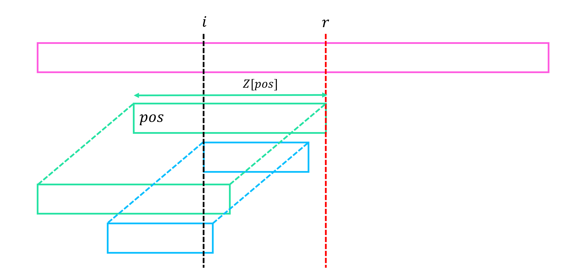

# Z Function

## Definition

!!! definition "Definition 1"
    $Z[i] := i$에서 시작하는 $S$의 suffix와 전체 문자열 $S$의 **longest common prefix**의 길이   
    $Z[i] := LCP(S[1 \cdots ], S[i \cdots])$, $i \ge 2$부터 정의되고, $Z[1]=0$이라 한다.

예를 들어, **"aaaaa"**의 $Z$ 함수는 **[0, 4, 3, 2, 1]**, **"aaabaab"**의 $Z$ 함수는 **[0, 2, 1, 0, 2, 1, 0]**, **"abacaba"**의 $Z$ 함수는 **[0, 0, 1, 0, 3, 0, 1]**이다.

## Algorithm

문자열을 앞에서부터 보면서 $Z$ Function을 구하고, 그 과정에서 이미 구한 값들을 최대한 재활용하자.
이를 위하여 지금까지 계산한 $Z$ 값들 중 가장 뒤쪽 위치에 해당하는 값을 $r=pos+Z[pos]-1$이라 하자.
$r$의 의미는, 지금까지 우리가 계산을 하면서 한번이라도 본 적이 있는 $S$의 최대 위치가 $r$이라는 것이다.  
만약 현재 위치 $i$가 $r$보다 작거나 같은, 이미 스캔이 된 칸이라면 이미 계산된 값들을 이용하여 계산하고, 새로운 칸을 봐야 하는 상황이라면 $r$을 한칸씩 증가시키며 답을 구하자.
이와 같은 방법을 사용하면 결국 모든 칸들은 최대 $O(1)$번 스캔되니, $O(N)$의 시간복잡도에 문제를 해결할 수 있을 것이다.

<center>

</center>

구체적으로, 현재 위치 $i$가 $r$보다 작거나 같은 상황이면, 위 그림과 같이 우리가 $i$에서부터 시작하여 전체 문자열과 LCP를 구하고 싶은 부분문자열이 정확히 $S$의 앞쪽에 이미 존재한다.
따라서 이 때의 $Z$값은 이미 구해 놓았으므로 재활용할 수 있고, 만약 이 값이 $i$의 위치에서 시작하였을 때 $r$을 넘어간다면 그 뒤쪽의 값들은 아직 한번도 확인하지 못했기 때문에 넘어가지 못해주도록 해야 한다.

여기까지가 우리가 알고 있는 정보를 재활용한 부분이고, 이후 $r$을 넘어서 새롭게 스캔하였을 때 추가로 일치하는 문자들이 있을 수 있음으로 방금 구한 재활용값에서 시작하여 탐색을 이어 나가면 된다.

!!! algorithm "Algorithm 1"
    $Z$ Function을 앞에서부터 한 칸씩 계산한다.
    계산 과정에서 지금까지 계산한 $Z$ 값들 중 가장 뒤쪽 위치에 해당하는 값을 $r=pos+Z[pos]-1$이라 하자.

    현재 위치 $i$가 $r$보다 작거나 같은 상황이면, $i$에서부터 $r$까지의 문자열이 이미 $S$의 앞쪽에 위치하고 있으니 이미 구했던 $Z$값을 이용하여 새로운 $Z$값을 구한다.
    이 때 만약 이 값이 $i$의 위치에서 시작하였을 때 $r$을 넘어간다면 $r$을 넘지 못하도록 해준다.
    이후 $r$을 넘어서 새롭게 스캔하였을 때 추가로 일치하는 문자들이 있을 수 있음으로 방금 구한 재활용값에서 시작하여 탐색을 이어 나간다.
    작업 후 $pos$를 갱신한다.

이와 같은 알고리즘의 동작 과정 중 탐색을 할 때마다 $r$이 최소 $1$칸씩 이동하며, $r$의 총 이동횟수는 $O(N)$이므로, 전체 시간복잡도도 $O(N)$이 된다.

!!! complexity "Time Complexity"
    <center>
    Time Complexity : $O(N)$
    </center>


## Implementation

``` cpp linenums="1"
vector<int> getZ(int N, string &S)
{
    vector<int> Z(N+1);

    int pos=1;
	for(int i=2; i<=N; i++)
	{
		if(i<=pos+Z[pos]-1) Z[i]=min(pos+Z[pos]-i, Z[i-pos+1]);
		for(; i+Z[i]<=N && S[i+Z[i]]==S[Z[i]+1]; Z[i]++);
		if(Z[pos]+pos<Z[i]+i) pos=i;
	}
    return Z;
}
```

## Application

Prefix Function는 문자열 $S$의 모든 prefix $S[1 \cdots i]$에 대하여 prefix 와 suffix 가 동일한 proper prefix의 최대 길이를 구하는 함수이다.
이를 응용한 KMP는 문자열 $S$의 모든 prefix $S[1 \cdots i]$에 대하여 $S$의 suffix와 문자열 $T$의 prefix가 동일한 최대 길이를 구하는 알고리즘이다.
그리고, 실제로 구현은 거의 동일하다.

이와 같은 논리로, $Z$ Function은 $S$의 모든 suffix $S[1 \cdots i]$와 전체 문자열 $S$의 longest common prefix의 길이를 구하는 함수이다.
이를 응용하면, 문자열 $S$의 모든 suffix $S[1 \cdots i]$와 문자열 $T$의 longest common prefix의 길이를 구할 수 있다.
이 또한 구현은 거의 동일하며 이미 계산된 $T$의 $Z$ 값을 이용하여 계산해주면 된다.

이 알고리즘을 이용하면 KMP와 동일하게, $S$에서 $T$의 등장 위치를 모두 $O(N+M)$에 찾을 수 있다.

!!! complexity "Time Complexity"
    <center>
    Time Complexity : $O(N+M)$
    </center>

``` cpp linenums="1"
vector<int> match(int N, int M, string &S, string &T)
{
	//Get LCP of all suffixes in S with T
	vector<int> Z = getZ(M, T);
    vector<int> F(N+1);

	pos=0;
	for(int i=1; i<=N; i++)
	{
		if(i<=pos+F[pos]-1) F[i]=min(Z[i-pos+1], pos+F[pos]-i);
		for(; i+F[i]<=N && F[i]+1<=M && S[i+F[i]]==T[F[i]+1]; F[i]++);
		if(pos+F[pos]<i+F[i]) pos=i;
	}
	return F;
}
```

## Reference

- [https://cp-algorithms.com/string/z-function.html](https://cp-algorithms.com/string/z-function.html)
- [https://codeforces.com/blog/entry/3107](https://codeforces.com/blog/entry/3107)