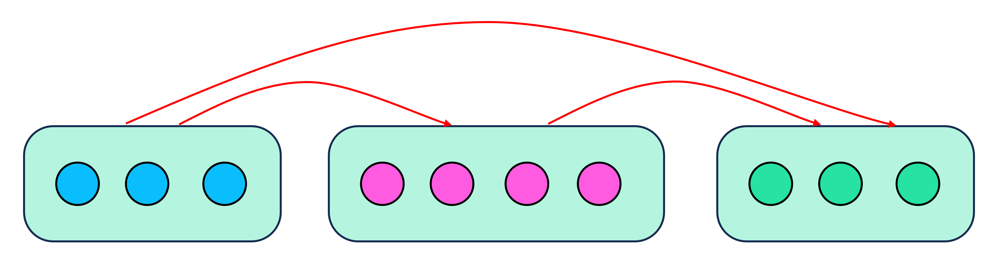
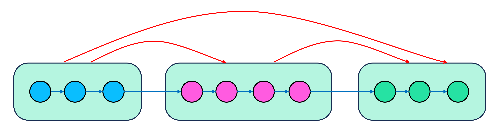
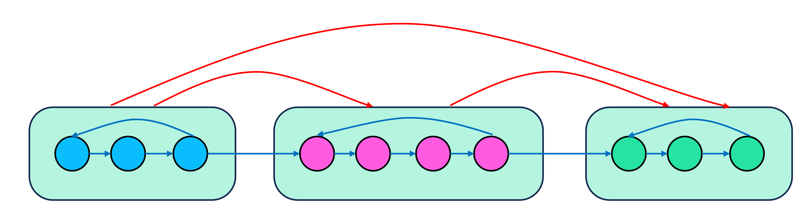

# SCC of Tournament Graph

!!! definition "Definition 1"
    **Tournament graph**는 정점이 $N$개인 무방향 완전그래프의 모든 간선에 방향성을 부여한 방향그래프이다.
    정점 $N$개인 tournament graph의 간선은 총 $\binom{N}{2}$개이다.

Tournament graph는 매우 복잡한 형태이니, 이를 구조화시키기 위하여 그래프를 SCC별로 묶어 정리하자.

## Property 1

!!! property "Property 1"
    Tournament graph $G=(V, E)$를 SCC별로 묶어 위상정렬한 순서대로 나열하자.
    각 SCC 집합을 위상정렬 순서대로 $S_1, S_2, \cdots, S_k$라 하면 다음이 성립한다.
    
    $$\forall 1 \le i < j \le k, \forall u \in S_i, \forall v \in S_j, (u, v) \in E$$

    즉, 서로 다른 두 SCC에 속하는 정점 $(u, v)$에 대하여 $u$가 왼쪽 집합의 정점, $v$가 오른쪽 집합의 정점이면 $(u, v)$ 방향의 간선이 존재한다.

{: .center}

## Property 2

!!! property "Property 2"
    Tournament graph에는 **hamiltonian path**가 적어도 하나 존재한다.

    이 hamiltonian path를 일렬로 나열하면, 인접한 정점들 사이에 오른쪽으로 가는 간선이 존재하는 형태로 배열할 수 있고, 이 때 각 SCC는 인접한 구간을 이룬다.

!!! proof
    정점들을 하나씩 추가하며, 귀납적으로 hamiltonian path를 유지할 수 있음을 보이자.
    현재 새로 추가할 정점을 $v$라 하고, 이미 추가된 정점들로 구성된 hamiltonian path를 순서대로 $u_1, u_2, \cdots, u_k$라 하자.
    만약 $u_i \rightarrow v$, $v \rightarrow u_{i+1}$ 간선이 존재한다면 $u_i$와 $u_{i+1}$ 사이에 $v$를 추가하면 된다.
    만약 위 식을 만족하는 $u_i$가 없다면, 맨 앞이나 맨 뒤에 $v$를 무조건 추가할 수 있다.
    위 과정을 반복하면 귀납적으로 hamiltonian path를 구할 수 있다.

{: .center}

## Property 3

!!! property "Property 3"
    Tournament graph가 $1$개의 SCC로 구성되어 있다면, hamiltonian path 뿐만 아니라 **hamiltonian cycle**이 적어도 하나 존재한다.

    Tournament graph를 SCC별로 분해하고, 각 SCC의 hamiltonian cycle들을 순서대로 일렬로 나열하면, **Property 2**에 추가로 다음이 성립한다.

    - 인접한 정점들 사이에 오른쪽으로 가는 간선이 존재한다.
    - 한 SCC 내에서는 가장 오른쪽 정점에서 가장 왼쪽 정점으로 가는 간선이 존재한다.
    - 각 SCC는 인접한 구간을 이룬다.

!!! proof
    정점들을 하나씩 추가하며, 위와 같이 각 SCC별 hamiltonian cycle을 관리하자.
    이제 새로운 정점 $v$가 추가되면, $u_i \rightarrow v$인 가장 오른쪽 $u_i$와 $v \rightarrow u_j$인 가장 왼쪽 $u_j$가 하나의 SCC로 묶이게 된다.
    만약 묶이는 SCC들이 없다면, 단순히 사이에 $v$를 **Property 2**와 같이 추가해주면 된다.
    $[l, r]$의 SCC들이 하나의 SCC로 묶이게 될 때에는, 구간의 각 hamiltonian cycle들을 순서대로 나열하면 새로운 SCC의 hamiltonian cycle을 구할 수 있다.
    위 과정을 반복하면 전체 그래프를 hamiltonian cycle들로 쪼갤 수 있다.

{: .center}

## Implementation

[https://www.acmicpc.net/problem/26843](https://www.acmicpc.net/problem/26843) 문제를 해결하기 위하여 **Property 3**의 귀납적인 construction을 $O(N^2)$에 구현한 예시이다.

``` cpp linenums="1"
#include <bits/stdc++.h>
using namespace std;

typedef long long ll;
typedef pair<int, int> pii;
typedef pair<ll, ll> pll;

const int MAXN = 2000;

int N, adj[MAXN+10][MAXN+10];
vector<int> ans[MAXN+10];

int main()
{
    scanf("%d", &N); 
    for(int i=2; i<=N; i++)
    {
        for(int j=1; j<i; j++)
        {
            int t;
            scanf("%d", &t);
            if(t) adj[j][i]=1, adj[i][j]=0;
            else adj[j][i]=0, adj[i][j]=1;
        }
    }

    vector<vector<int>> V;
    V.push_back({1});
    for(int i=2; i<=N; i++)
    {
        int l=MAXN+1, r=-1;
        for(int j=0; j<V.size(); j++)
        {
            for(auto it : V[j])
            {
                if(adj[i][it]) l=min(l, j);
                if(adj[it][i]) r=max(r, j);
            }
        }
        if(l>r)
        {
            if(l==MAXN+1) V.insert(V.end(), {i});
            else V.insert(V.begin()+l, {i});
        }
        else if(l==r)
        {
            for(int j=0; j<V[l].size(); j++)
            {
                int k=(j+1)%V[l].size();
                if(adj[V[l][j]][i] && adj[i][V[l][k]])
                {
                    V[l].insert(V[l].begin()+k, i);
                    break;
                }
            }
        }
        else
        {
            vector<int> VV;
            int t=0;
            for(int j=0; j<V[l].size(); j++)
            {
                if(adj[i][V[l][j]])
                {
                    t=j;
                    break;
                }
            }
            for(int j=0; j<V[l].size(); j++) VV.push_back(V[l][(j+t)%V[l].size()]);

            for(int j=l+1; j<r; j++) for(auto it : V[j]) VV.push_back(it);
            
            for(int j=0; j<V[r].size(); j++)
            {
                if(adj[V[r][j]][i])
                {
                    t=j;
                    break;
                }
            }
            for(int j=0; j<V[r].size(); j++) VV.push_back(V[r][(j+t+1)%V[r].size()]);

            VV.push_back(i);
            V.erase(V.begin()+l, V.begin()+r+1);
            V.insert(V.begin()+l, VV);
        }
    }

    for(int i=0; i<V.size(); i++)
    {
        for(int j=0; j+1<V[i].size(); j++) assert(adj[V[i][j]][V[i][j+1]]);
        if(V[i].size()>1) assert(adj[V[i].back()][V[i][0]]);

        for(int j=0; j<V[i].size(); j++)
        {
            int now=V[i][j];
            for(int k=0; k<V[i].size(); k++) ans[now].push_back(V[i][(j+k)%V[i].size()]);
            for(int k=i+1; k<V.size(); k++) for(auto it : V[k]) ans[now].push_back(it);
        }
    }

    for(int i=1; i<=N; i++)
    {
        printf("%d ", ans[i].size());
        for(auto it : ans[i]) printf("%d ", it);
        printf("\n");
    }
}

```