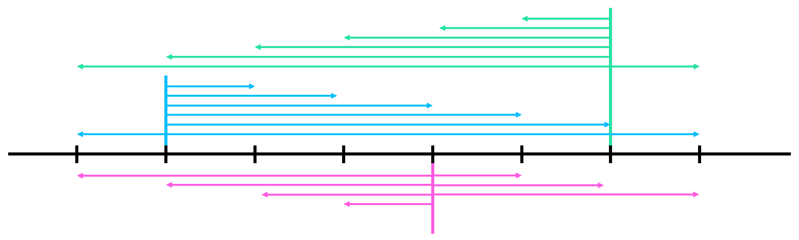
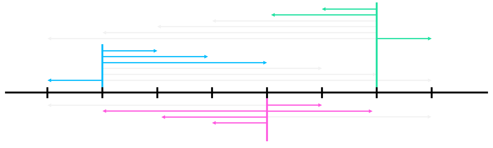

# APIO 15 P2 Jakarta Skyscrapers

## Problem

### Problem Link
[https://www.acmicpc.net/problem/10847](https://www.acmicpc.net/problem/10847)  
[https://oj.uz/problem/view/APIO15_skyscraper](https://oj.uz/problem/view/APIO15_skyscraper)

### Summary
$0, 1, \cdots, N-1$번의 $N$개의 빌딩이 있고, $0, 1, \cdots, M-1$번의 $M$명의 전령들이 있다.  
$i$번째 전령은 처음에 $B_i$번 빌딩에서 시작하고, 한 번의 점프로 정확히 $P_i$개의 빌딩을 건너뛰어 이동할 수 있다.
($x$번 빌딩에서 $x+P_i$ $(x+P_i<N)$번 빌딩으로 이동, $x-P_i$ $(x-P_i \geq 0)$번 빌딩으로 이동)  
$0$번 전령이 $1$번 전령에게 소식을 전달하려고 하며, 소식을 전해 들은 전령은 현재 칸에 있는 다른 전령에게 소식을 전달하거나, 다른 빌딩으로 한번 점프를 할 수 있을 때 필요한 점프의 총 횟수의 최솟값을 구하여라.

### Constraints
+ $1 \leq N \leq 30,000$  
+ $2 \leq M \leq 30,000$  
+ $0 \leq B_i < N$  
+ $1 \leq P_i \leq 30,000$

## Solution

### Subtask 3

+ $N \leq 2,000$, $M \leq 2,000$

$i$번째 전령은 $B_i$번 빌딩에서 시작해서 $B_i+kP_i$ $(0 \leq B_i+kP_i < N)$번 빌딩으로 점프할 수 있으니, $B_i$번 정점에서 $B_i+kP_i$번 정점으로 가중치 $|k|$의 간선을 이어 준다.
이제, 문제는 $B_0$번 정점에서 $B_1$번 정점으로 가는 최단경로를 구하는 것이니 다익스트라 알고리즘을 사용하여 문제를 해결할 수 있다.

정점의 개수는 $O(N)$, 간선의 개수는 최악의 경우에 $O(NM)$개까지 가능하니, $O(ElogV)$ 다익스트라 알고리즘을 사용하면 $O(NM\log N)$, $O(E+V^2)$ 다익스트라 알고리즘을 사용하면 $O(NM+N^2)$에 문제를 해결할 수 있다.

!!! checkpoint "CheckPoint"
    $B_i$번 정점에서 $B_i+kP_i$ $(0 \leq B_i+kP_i < N)$번 정점으로 가중치 $|k|$의 간선을 이어 만든 정점 $O(N)$개, 간선 $O(NM)$인 그래프를 생각하자.
    이 그래프에서 다익스트라 알고리즘으로 $O(N^2+NM)$의 시간에 최단경로를 구하여 문제를 해결할 수 있다.

!!! complexity "Complexity"
    Time Complexity : $O(NM\log N)$ or $O(N^2+NM)$


### Subtask 5 (Full)

위 그래프에서 불필요한 간선이 있는지 살펴보자.  
만약 어떤 두 $i$, $j$가 $P_i=P_j$이며, $B_i \equiv B_j \ (mod \ P_i)$, $B_i < B_j$라고 가정하자.
그렇다면 $i$번 전령은 $j$번 전령의 오른쪽까지 이동할 일이 있을 때, $j$번 전령의 위치까지만 이동하고 $j$번 전령한테 소식을 전해도 된다.
같은 방법으로 $j$번 전령 또한 $i$번 전령을 넘어 왼쪽으로 이동할 필요가 없다.
따라서, $i$번 정점에서 나오는 간선은 $j$번 위치를 오른쪽으로 넘지 못하도록 하고 $j$번 정점에서 나오는 간선은 $i$번 정점을 왼쪽으로 넘지 못하도록 할 수 있다.
위와 같은 압축은 $P_i=P_j$이고 $B_i \equiv B_j \ (mod \ P_i)$인 모든 $i$, $j$들을 하나로 묶어, 같은 수의 간선을 사용해도 표현할 수 있도록 해준다.




!!! observation "Observation 1"
    어떤 두 $i$, $j$가 $P_i=P_j$이며, $B_i \equiv B_j \ (mod \ P_i)$, $B_i < B_j$일 때, $i$번 전령이 오른쪽으로 $j$번 전령을 넘지 않고, $j$번 전령이 왼쪽으로 $i$번 전령을 넘지 않도록 이동하는 최적해가 존재한다.

이러한 압축은 간선의 개수를 얼마나 효과적으로 줄여줄 수 있을까?  
$P$와 $P$로 나눈 나머지인 $k$를 고정하고 나면, $P_i=P$, $B_i \equiv k \ (mod \ P)$인 모든 $i$들을 그래프로 표현하기 위해서는 $O(\frac{N}{P_i})$개의 간선이 필요하다.
또한, $k$는 $P$로 나눈 나머지이므로 서로 다른 $k$는 최대 $P$개 가능함을 알 수 있다.  
이제, 최악의 경우에는 각 전령들이 $P_i=1$인 것이 $1$개, $P_i=2$인 것이 $2$개, ..., $P_i=\sqrt M$인 것이 $\sqrt M$개와 같이 있을 때이다.
$P_i=1$인 것들의 간선의 개수의 합은 $\frac{N}{1} \cdot 1$, $P_i=2$인 것들은 $\frac{N}{2} \cdot 2$, ..., $P_i=\sqrt M$인 것들은 $\frac{N}{\sqrt M} \cdot \sqrt{M}$로, 전체 합은 다음과 같다.

$$
\sum_{1 \leq p \leq \sqrt{M}}{\frac{N}{p} \cdot p} = O(N\sqrt{M})
$$

!!! observation "Observation 2"
    $P_i=P_j$이고 $B_i \equiv B_j \ (mod \ P_i)$인 모든 $i$, $j$들을 하나로 묶어 불필요한 간선들을 제거하면, 압축된 그래프에서 사용되는 전체 간선의 개수는 $O(N\sqrt{M})$개이다.

이제, 위와 같이 만든 압축된 그래프는 $O(N)$개의 정점과 $O(N\sqrt{M})$개의 간선들로 구성되어 있고, 다익스트라 알고리즘을 활용하면 $O(N\sqrt{M}\log N)$에 문제를 해결할 수 있다.

!!! checkpoint "CheckPoint"
    **Observation 1**에 의해 **Observation 2**와 같이 그래프를 압축할 수 있고, 정점 $O(N)$, 간선 $O(N\sqrt{M})$개의 압축된 그래프에서 다익스트라 알고리즘으로 $O(N\sqrt{M}\log N)$의 시간에 최단경로를 구하여 문제를 해결할 수 있다.

구현할 때, 다익스트라의 구현이 충분히 빠르지 않으면 `AC`를 받기 힘드니 빠른 다익스트라의 구현을 사용할 수 있도록 주의하자.

!!! complexity "Complexity"
    Time Complexity : $O(N\sqrt{M}\log N)$

## Code
``` cpp linenums="1"
#include <bits/stdc++.h>
using namespace std;
 
typedef long long ll;
typedef pair<int, int> pii;
typedef pair<ll, ll> pll;
 
const int MAXN = 3e4;
const int INF = 1e9;
 
int N, M, S, E;
vector<int> A[MAXN+10];
vector<pii> adj[MAXN+10];
int dist[MAXN+10];
 
struct Queue
{
    int u, w;
    bool operator < (const Queue &p) const { return w>p.w; }
};
 
int main()
{
    scanf("%d%d", &N, &M);
    for(int i=1; i<=M; i++)
    {
        int b, p;
        scanf("%d%d", &b, &p);
        if(i==1) S=b;
        if(i==2) E=b;
        A[p].push_back(b);
    }
 
    for(int i=1; i<=MAXN; i++)
    {
        if(A[i].empty()) continue;
        vector<vector<int>> V;
        vector<int> comp;
        V.resize(i);
        for(auto it : A[i]) V[it%i].push_back(it);
        for(auto it : A[i]) comp.push_back(it%i);
 
        sort(comp.begin(), comp.end());
        comp.erase(unique(comp.begin(), comp.end()), comp.end());
 
        for(auto it : comp)
        {
            sort(V[it].begin(), V[it].end());
            for(int j=1; j<V[it].size(); j++)
            {
                int now=V[it][j], bef=V[it][j-1];
                for(int k=bef+i; k<=now; k+=i) adj[bef].push_back({k, (k-bef)/i});
                for(int k=now-i; k>=bef; k-=i) adj[now].push_back({k, (now-k)/i});
            }
            for(int k=V[it].back()+i; k<N; k+=i) adj[V[it].back()].push_back({k, (k-V[it].back())/i});
            for(int k=V[it][0]-i; k>=0; k-=i) adj[V[it][0]].push_back({k, (V[it][0]-k)/i});
        }
    }
 
    priority_queue<Queue> PQ;
    for(int i=0; i<N; i++) dist[i]=INF;
    PQ.push({S, 0}); dist[S]=0;
 
    while(!PQ.empty())
    {
        Queue now=PQ.top(); PQ.pop();
        if(dist[now.u]<now.w) continue;
        for(auto nxt : adj[now.u]) if(dist[nxt.first]>now.w+nxt.second) PQ.push({nxt.first, now.w+nxt.second}), dist[nxt.first]=now.w+nxt.second;
    }
    if(dist[E]==INF) dist[E]=-1;
    printf("%d\n", dist[E]);
}
```
