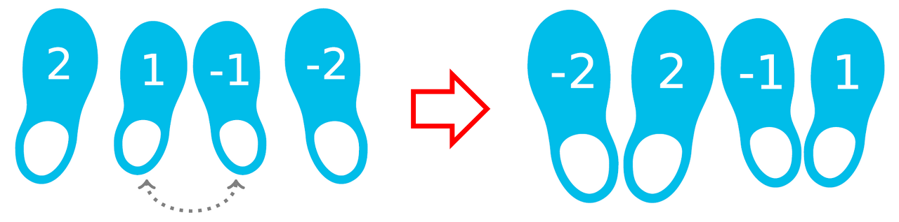

# IOI 2019 D1P1 Arranging Shoes

## Problem

### Problem Link
[https://www.acmicpc.net/problem/19914](https://www.acmicpc.net/problem/19914)  
[https://oj.uz/problem/view/IOI19_shoes](https://oj.uz/problem/view/IOI19_shoes)

### Summary
$N$켤레의 신발이 있고, $i$번째 크기의 신발의 왼쪽 신발의 번호는 $-i$, 오른쪽 신발의 번호는 $i$이다.  
총 $2N$개의 신발들이 섞여 있는 배열 $A$가 주어질 때, 이 신발들을 짝이 맞는 신발들끼리 붙어 있게, 같은 짝에서는 왼쪽 신발, 오른쪽 신발 순서대로 배열해야 한다.  
사용할 수 있는 연산은 인접한 두 신발을 swap하는 연산일 때, 연산의 최소 횟수를 구하여라.

{: .center}

### Constraints

- $N \le 100,000$
- $1 \le |A_i| \le N$ $(1 \le i \le 2N)$
- $A_i \ne A_j$ $(1 \le i < j \le 2N)$


## Solution

이와 같이 인접한 두 수를 swap하는 연산을 하여 수열을 변환하는 문제는, 최종 상태를 결정할 수만 있다면 단순 inversion의 개수를 구하는 문제로 변형된다.
Inversion의 개수는 segment tree나 fenwick tree를 이용하여 $O(N\log N)$에 구할 수 있으니 최적의 최종 상태를 결정하는 것에 집중하자.

우선 $i$번째 신발에 대하여 오른쪽 신발이 왼쪽 신발의 왼쪽에 위치한다면 이 두 신발은 swap해야 한다.
이 두 신발이 swap되는 순간은 어차피 두 신발이 붙어 있어야 하니, 각 신발의 왼쪽, 오른쪽 여부는 크게 중요하지 않고, 만약 오른쪽 신발이 왼쪽 신발의 왼쪽에 위치한다면 답에 $1$을 더해주기만 하면 된다.
이제, 각 신발의 왼쪽, 오른쪽 여부는 무시하고 짝이 맞는 신발들끼리 붙어있도록 배열하자.

가장 왼쪽에 있는 신발 $l$을 잡고, 이 왼쪽 신발이랑 같은 크기의 반대쪽 신발 $r$을 생각하자.
이 두 신발이 만나기 위해서는 그 사이에 있던 모든 신발들은 두 신발의 사이에서 벗어나기 위하여 $l$이나 $r$중 적어도 한번의 swap이 필요하다.
이 때, 사이에 있는 신발을 왼쪽으로 빼는 행동은 앞으로 있을 다른 신발들의 이동에 방해만 된다는 것을 알 수 있다.
따라서, 무조건 $r$을 $l$쪽으로 당겨 오고, 그 사이에 있는 다른 신발들은 오르쪽으로 빼줘야 한다.
이후, 짝을 맞춘 두 신발을 생각하지 않고 나머지 다른 신발들에 대하여 같은 작업을 해주면 된다.

!!! observation "Observation 1"    
    최적해는 다음과 같이 구할 수 있다.  
    가장 왼쪽 신발과 같은 크기의 반대쪽 신발을 왼쪽 위치까지 끌고 온다.
    이후, 가장 왼쪽 신발이 오른쪽 신발일 경우(양수일 경우) 이 두 신발을 swap한다.
    왼쪽 두 신발을 제거했다고 생각하고 이 과정을 반복한다.

!!! proof
    귀납적으로 **Observation 1**이 최적임을 보이자.  
    가장 왼쪽에 있는 신발을 $l$, 이 왼쪽 신발이랑 같은 크기의 반대쪽 신발을 $r$이라 하자.
    이 두 신발이 만나기 위해서는 그 사이에 있던 모든 신발들은 두 신발의 사이에서 벗어나기 위하여 $l$이나 $r$중 적어도 한번의 swap이 필요하다.
    만약 $l$과 $r$을 가장 앞으로 당겨오지 않는 최적해가 존재한다면, 이 최적해에서 다른 신발들의 상대적 위치는 바꾸지 않고 $l$과 $r$을 가장 앞으로 당겨온 해 또한 최적해이다.
    즉, $l$과 $r$을 가장 앞으로 당겨오는 방법은 무조건 필요한 swap의 수만 사용하고, 추가적인 swap은 사용하지 않으니 최적해임을 알 수 있다.

이제, 최적해의 형태를 구했으니 fenwick tree를 이용하여 필요한 swap의 수를 inversion의 개수로 $O(N\log N)$에 세주면 된다.

!!! checkpoint "CheckPoint"
    최적해가 **Observation 1**와 같은 형태이니, fenwick tree를 이용하여 필요한 swap의 수를 inversion의 개수로 $O(N\log N)$에 셀 수 있다.

!!! complexity "Complexity"
    Time Complexity : $O(N\log N)$

## Code
``` cpp linenums="1"
#include "shoes.h"
#include <bits/stdc++.h>
using namespace std;
 
typedef long long ll;
typedef pair<int, int> pii;
typedef pair<ll, ll> pll;
 
const int MAXN = 2e5;
 
int S[MAXN+10], N;
vector<int> pos[MAXN+10];
bool vis[MAXN+10];
ll ans;

struct BIT
{
	int tree[MAXN+10];
	void update(int i) { for(; i<=N*2; i+=(i&-i)) tree[i]++; }
	int query(int i) { int ret=0; for(; i>0; i-=(i&-i)) ret+=tree[i]; return ret; }
	int query(int l, int r) { return query(r)-query(l-1); }
}bit;
 
ll count_swaps(vector<int> _S)
{
	N=_S.size()/2;
	for(int i=1; i<=2*N; i++) S[i]=_S[i-1];
 
	for(int i=2*N; i>=1; i--) pos[S[i]+N].push_back(i);
 
	for(int i=1; i<=2*N; i++)
	{
		if(vis[i]) continue;
		int j=pos[-S[i]+N].back();
		ans+=j-i-1-bit.query(i, j);
		pos[S[i]+N].pop_back(); pos[-S[i]+N].pop_back();
		vis[i]=true; vis[j]=true;
		bit.update(i); bit.update(j);
		if(S[i]>0) ans++;
	}	
	return ans;
}
```