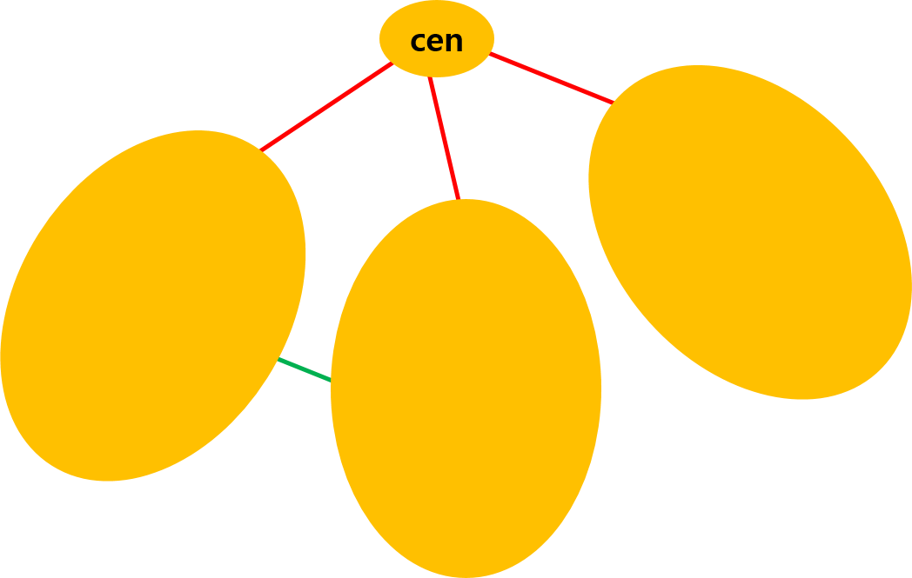

# IOI 2019 D1P2 Split the Attractions

## Problem

### Problem Link
[https://www.acmicpc.net/problem/19915](https://www.acmicpc.net/problem/19915)  
[https://oj.uz/problem/view/IOI19_split](https://oj.uz/problem/view/IOI19_split)

### Summary
정점 $N$개, 간선 $M$개인 단순 연결 그래프가 하나 주어진다.  
$a+b+c=N$인 세 자연수 $a, b, c$가 주어질 때, 정점들을 크기 $a, b, c$인 세 집합 $A, B, C$로 분할하여, 세 집합 중 적어도 두 집합이 연결되어 있도록 하려고 한다.  
어떤 집합이 연결되어 있다는 것은, 집합에 포함된 정점들만 이용하여 서로 이동 가능하다는 것을 의미한다.
분할이 가능한지 불가능한지 판별하고, 가능하면 한 분할을 구하여라.

### Constraints

- $3 \le N \le 100,000$
- $2 \le M \le 200,000$
- $1 \le a, b, c, \le N$
- $a+b+c=N$
- multi edge, self loop 모두 존재하지 않고 그래프는 연결되어 있다.


## Solution

우선 일반성을 잃지 않고 $a \le b \le c$라 가정하자.
세 집합 중 적어도 두 집합이 연결되어 있어야 하니, 가능하면 작은 크기의 집합인 $A, B$가 연결되어 있는 집합인 것이 더 유리해 보인다.  
만약 두 자연수 $p<q$에 대하여 크기 $q$인 연결된 집합 $Q$를 잡을 수 있다면, 크기 $p$인 연결된 집합 $P$ 또한 잡을 수 있다.
$Q$에서 dfs를 하면서, dfs 방문 순서대로 처음 $p$개의 정점을 $P$에 넣어주면 된다.  
따라서, 만약 $A, B$가 아닌, $B, C$ 혹은 $A, C$ 집합이 연결되어 있다면, 큰 집합의 원소를 dfs하면서 순서대로 삽입하면 작은 크기의 집합으로 변환할 수 있기 때문에 무조건 $A, B$ 집합이 연결되어 있도록 할 수 있다.

!!! observation "Observation 1"    
    일반성을 잃지 않고 $a \le b \le c$라 가정하자.  
    조건을 만족하는 분할이 존재한다면, $A, B$ 집합이 연결되어 있는 분할 또한 존재한다.

또한, 정점들을 크기 $a, b, c$인 세 집합 $A, B, C$로 분할하여 $A, B$가 연결되어 있는 집합이 되도록 하는 것은 정점들을 두 집합으로 분할하여, 각 집합의 연결 컴포넌트의 최대 크기가 $a$이상, $b$이상이 되도록 하는것과 동치이다.
만약 정점들을 세 집합 $A, B, C$로 분할하여 $A, B$가 연결되어 있는 집합이 되도록 했다면 $C$ 집합의 원소를 적당히 $A, B$에 삽입하여 두 집합의 연결 컴포넌트의 최대 크기가 $a$이상, $b$이상이 되도록 할 수 있다.
반대로, 정점들을 두 집합으로 분할하여, 각 집합의 연결 컴포넌트의 최대 크기가 $a$이상, $b$이상이 되도록 했다면 각 연결 컴포넌트에서 dfs 순서대로 가장 빠른 $a$개, $b$개의 정점들을 $A$, $B$에 삽입하고 나머지 정점들을 $C$에 배정하면 된다.

!!! observation "Observation 2"
    "정점들을 크기 $a, b, c$인 세 집합 $A, B, C$로 분할하여, $A, B$가 연결되어 있도록 하는 것"과 "정점들을 두 집합으로 분할하여, 각 집합의 연결 컴포넌트의 최대 크기가 $a$이상, $b$이상이 되도록 하는것"은 동치이다.

!!! checkpoint "CheckPoint"
    **Observation 1**에 의해 일반성을 잃지 않고 $a \le b \le c$라 가정할 때, $A, B$ 집합이 연결되어 있는 분할을 찾으면 된다.
    이는 **Observation 2**에 의해 정점들을 두 집합으로 분할하여, 각 집합의 연결 컴포넌트의 최대 크기가 $a$이상, $b$이상이 되도록 하는 방법을 찾는 것과 동치이다.

추가로 일반성을 잃지 않고 $a \le b \le c$를 강제하였기 때문에, $a, b, c$에는 다음과 같은 성질들이 성립한다.

!!! observation "Observation 3"
    $$a \le \frac{N}{3}, b \le \frac{N-a}{2}$$

---

이제, 정점들을 두 집합으로 분할하여, 각 집합의 연결 컴포넌트의 최대 크기가 $a$이상, $b$이상이 되도록 하는 방법을 찾는 것에 집중하자.
앞으로의 풀이는 centroid의 아이디어와 다양한 관찰들을 이용하여 문제를 해결한다.

그래프의 임의의 spanning tree를 잡고, 이 트리의 centroid를 잡자.
Centroid를 기준으로 트리를 서브트리들로 분할하면, 정의에 의해 남는 서브트리들은 크기 $\frac{N}{2}$ 이하가 된다.

{: .center}

**(Case 1)** Centroid를 제거한 후 남은 서브트리들 중 크기 $a$ 이상인 서브트리가 존재한다.  
크기 $a$ 이상인 서브트리 한개를 집합 $A$에 배정한 후, centroid를 포함한 나머지 정점들을 집합 $B$에 배정하였다고 생각하자.
모든 서브트리의 크기가 $\frac{N}{2}$ 이하이니 $|A| \le \frac{N}{2}$, $|B|=N-|A| \ge \frac{N}{2}$가 성립하며 $|B| \ge \frac{N}{2} \ge \frac{N-a}{2} \ge b$이니 $a \le |A|$, $b \le |B|$가 성립하고, spanning tree 상에서 각 집합은 연결되어 있기 때문에 모든 조건을 만족한다.

**(Case 2)** Centroid를 제거한 후 남은 서브트리들이 모두 크기가 $a$ 미만이다.  
이 경우는 한 서브트리를 통째로 $A$에 배정하여도 크기가 충분하지 않기 때문에 조건을 만족하지 못하는 경우이다.
만약 이 경우에도 조건을 만족하도록 두 집합으로 분할할 수 있다면, 두 집합 중 centroid를 포함하고 있지 않는 집합은 여러 개의 서브트리에 걸쳐 있는 정점들을 포함하고 있어야 하며, 집합의 크기는 $a$ 이상이어야 한다.  
각 서브트리들을 하나의 정점으로 압축하여 표현하였을 때 spanning tree에 사용되지 않는 간선들은 압축된 정점들을 연결하는 간선의 역할을 한다.
위에서 언급한 것과 같이 조건을 만족하도록 두 집합으로 분할할 수 있다면 압축된 정점들 몇개를 선택하여 하나의 연결 컴포넌트를 이루며, 집합의 크기가 $a$ 이상이 되도록 해야 한다.
만약 어떻게 선택하더라도 한 연결 컴포넌트 내에서 집합의 크기가 $a$ 이상이 될 수 없다면, 이는 압축된 정점들의 가장 큰 크기의 연결 컴포넌트 집합의 크기가 $a$ 미만이라는 의미고, 이는 조건을 만족하는 분할이 존재하지 않음을 의미한다.  
아닐 경우 압축된 정점들의 가장 큰 크기의 연결 컴포넌트 집합의 임의의 정점에서 시작하여, 하나씩 $A$에 배정하며 집합의 크기가 $a$ 이상이 되는 순간 종료하는 dfs를 생각하자.
centroid를 포함한 나머지 정점들은 집합 $B$에 배정한다.
모든 압축된 정점들의 집합 크기는 $a$ 미만이니 $a \le |A| < 2a$임을 알 수 있다.
$|B|=N-|A|>N-2a \ge N-a-c = b$이니 $a \le |A|$, $b \le |B|$가 성립하고, spanning tree 상에서 각 집합은 연결되어 있기 때문에 모든 조건을 만족한다.

!!! observation "Observation 4"
    그래프의 임의의 spanning tree를 잡고, 이 트리의 centroid를 잡자.

    **(Case 1)** Centroid를 제거한 후 남은 서브트리들 중 크기 $a$ 이상인 서브트리가 존재한다.  
    크기 $a$ 이상인 서브트리 한개를 집합 $A$에 배정한 후, centroid를 포함한 나머지 정점들을 집합 $B$에 배정하면 조건을 만족한다.

    **(Case 2)** Centroid를 제거한 후 남은 서브트리들이 모두 크기가 $a$ 미만이다.  
    각 서브트리들을 하나의 정점으로 압축하여 표현하였을 때 spanning tree에 사용되지 않는 간선들은 압축된 정점들을 연결하는 간선의 역할을 한다.
    만약 압축된 정점들의 가장 큰 크기의 연결 컴포넌트 집합의 크기가 $a$ 미만이면, 이는 조건을 만족하는 분할이 존재하지 않음을 의미한다.
    아닐 경우 압축된 정점들의 가장 큰 크기의 연결 컴포넌트 집합의 임의의 정점에서 시작하여, 하나씩 $A$에 배정하며 집합의 크기가 $a$ 이상이 되는 순간 종료하는 dfs를 생각하자.
    centroid를 포함한 나머지 정점들은 집합 $B$에 배정하면 조건을 만족한다.

위 **Observation 4**의 알고리즘을 dfs를 이용하여 $O(N)$에 탐색하면 **Observation 2**의 조건을 만족하는 분할을 찾을 수 있고, 이를 이용하여 답을 구할 수 있다.

!!! checkpoint "CheckPoint"
    그래프의 임의의 spanning tree를 잡고, centroid를 찾은 후 **Observation 4**의 알고리즘을 dfs를 이용하여 $O(N)$에 탐색하면 **Observation 2**의 조건을 만족하는 분할을 찾을 수 있다.
    이 분할을 이용하여 구하고자 하는 답을 구할 수 있다.

!!! complexity "Complexity"
    Time Complexity : $O(N)$

## Code
``` cpp linenums="1"
#include "split.h"
#include <bits/stdc++.h>
using namespace std;

typedef long long ll;
typedef pair<int, int> pii;
typedef pair<ll, ll> pll;

const int MAXN = 1e5;

int N, ans[MAXN+10];
pii A[4];
vector<int> adj[MAXN+10], adj2[MAXN+10], adj3[MAXN+10];
    
int sz[MAXN+10], id[MAXN+10];

void getsz(int now, int bef)
{
    sz[now]=1;
    for(int nxt : adj2[now])
    {
        if(nxt==bef) continue;
        getsz(nxt, now);
        sz[now]+=sz[nxt];
    }
}

int getcen(int now, int bef, int S)
{
    for(int nxt : adj2[now])
    {
        if(nxt==bef) continue;
        if(sz[nxt]>S/2) return getcen(nxt, now, S);
    }
    return now;
}

void color(int now, int bef, int col, int &k)
{
    if(k<=0) return;
    ans[now]=col; k--;
    for(int nxt : adj2[now])
    {
        if(nxt==bef) continue;
        if(ans[nxt]) continue;
        color(nxt, now, col, k);
    }
}

void color2(int now, int bef, int root)
{
    id[now]=root;
    for(int nxt : adj2[now])
    {
        if(nxt==bef) continue;
        color2(nxt, now, root);
    }
}

bool vis[MAXN+10];
void dfs(int now)
{
    vis[now]=true;
    for(int nxt : adj[now])
    {
        if(vis[nxt]) continue;
        adj2[now].push_back(nxt);
        adj2[nxt].push_back(now);
        dfs(nxt);
    }
}

vector<int> V;
void dfs2(int now, int &k)
{
    vis[now]=true;
    k+=sz[now]; V.push_back(now);
    if(k>=A[1].first) return;
    for(int nxt : adj3[now])
    {
        if(vis[nxt]) continue;
        dfs2(nxt, k);
    }
}

void solve()
{
    memset(vis, 0, sizeof(vis));
    dfs(1);
    getsz(1, 1);
    int cen=getcen(1, 1, N);
    getsz(cen, cen);

    for(int now : adj2[cen])
    {
        color2(now, cen, now);
        if(A[1].first<=sz[now])
        {
            int t=A[1].first;
            color(now, cen, A[1].second, t);
            t=A[2].first;
            color(cen, now, A[2].second, t);
            for(int i=1; i<=N; i++) if(ans[i]==0) ans[i]=A[3].second;
            return;
        }
    }

    for(int i=1; i<=N; i++)
    {
        int now=i;
        if(now==cen) continue;
        for(int nxt : adj[now])
        {
            if(nxt==cen) continue;
            if(id[now]==id[nxt]) continue;
            adj3[id[now]].push_back(id[nxt]);
        }
    }

    memset(vis, 0, sizeof(vis));
    for(int now : adj2[cen])
    {
        if(vis[now]) continue;
        int t=0;
        dfs2(now, t);
        if(t<A[1].first) continue;

        t=A[1].first;
        for(auto it : V) color(it, cen, A[1].second, t);
        color(cen, cen, A[2].second, A[2].first);
        for(int i=1; i<=N; i++) if(ans[i]==0) ans[i]=A[3].second;
        return;
    }
}

vector<int> find_split(int _N, int _A, int _B, int _C, vector<int> _P, vector<int> _Q)
{
    N=_N; A[1]=pii(_A, 1); A[2]=pii(_B, 2); A[3]=pii(_C, 3);
    for(int i=0; i<_P.size(); i++)
    {
        int u=_P[i]+1, v=_Q[i]+1;
        adj[u].push_back(v);
        adj[v].push_back(u);
    }
    sort(A+1, A+4);

    solve();

    vector<int> _ans(N);
    for(int i=1; i<=N; i++) _ans[i-1]=ans[i];
    return _ans;
}
```