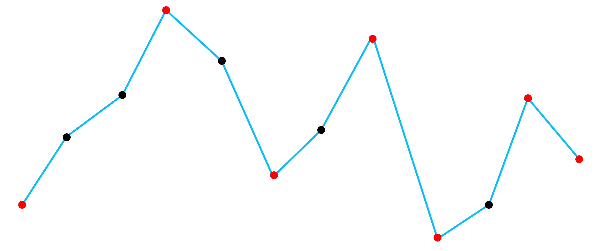
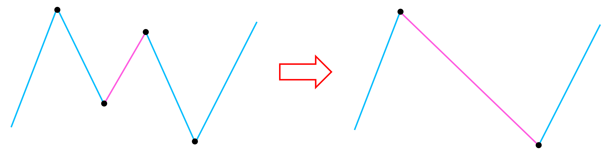

# IOI 2022 D1P3 Radio Towers

## Problem

### Problem Link
[https://www.acmicpc.net/problem/25440](https://www.acmicpc.net/problem/25440)  
[https://oj.uz/problem/view/IOI22_towers](https://oj.uz/problem/view/IOI22_towers)

### Summary
$N$개의 송신탑이 있고, 송신탑 $i$의 높이는 $H_i$이다. $(1 \le i \le N)$  
어떤 양의 정수 "간섭 수치" $D$에 대해, 두 송신탑 $i<j$이 서로 소통할 수 있다는 것은 다음 조건을 만족하는 송신탑 $k$가 존재한다는 것이다.

- $i < k < j$
- $H_i, H_j \le H_k-D$

$Q$개의 쿼리가 주어지며, $i$번 쿼리에서는 $L_i$와 $R_i$번 사이 송신탑들만 이용하여 간섭 수치가 $D_i$일 때 몇 개의 송신탑들을 선택하여 선택된 모든 송신탑들이 서로 소통 가능하도록 하고자 할 때, 선택할 수 있는 송신탑의 최대 개수를 구하여라. $(1 \le i \le Q)$

### Constraints

- $1 \le N \le 100,000$
- $1 \le Q \le 100,000$
- $1 \le H_i \le 10^9$ $(1 \le i \le N)$
- 모든 $H_i$는 서로 다르다.
- $1 \le L_i \le R_i \le N$, $1 \le D_i \le 10^9$ $(1 \le i \le Q)$


## Solution

### Subtask 2

- $Q=1$
- $N \le 2,000$

우선, 두 송신탑 $i<j$이 서로 소통할 수 있다는 조건을 단순화시키면 다음과 같다.

$$H_i, H_j \le max(H_{i+1}, H_{i+2}, ..., H_{j-1})-D$$

만약 세 송신탑 $i<j<k$를 선택했고, 송신탑 $(i, j)$, $(j, k)$만 서로 소통할 수 있다고 하자.

$$H_i, H_j \le max(H_{i+1}, H_{i+2}, ..., H_{j-1})-D$$

$$H_j, H_k \le max(H_{j+1}, H_{j+2}, ..., H_{k-1})-D$$

이 때, $max(H_{i+1}, H_{i+2}, ..., H_{k-1})$를 생각하면 다음이 성립한다.

$$H_i, H_k \le max(H_{i+1}, H_{i+2}, ..., H_{k-1})-D$$

따라서, 송신탑 $(i, j)$, $(j, k)$만 서로 소통할 수 있으면 송신탑 $(i, k)$ 또한 소통할 수 있다.
이제, 우리는 구간 내에서 선택된 모든 송신탑들이 서로 소통 가능하도록 하고자 하는 대신, 인접한 두 선택된 송신탑만 소통 가능하면 된다.

!!! observation "Observation 1"    
    송신탑 $(i, j)$, $(j, k)$만 서로 소통할 수 있으면 송신탑 $(i, k)$ 또한 소통할 수 있다.
    따라서 우리는 구간 내에서 선택된 모든 송신탑들이 서로 소통 가능하도록 하고자 하는 대신, 인접한 두 선택된 송신탑만 소통 가능하면 된다.

**Observation 1**으로 인해 하나씩 송신탑들을 선택할 때, 마지막으로 선택한 송신탑만 중요하니 DP를 통해 답을 구할 수 있다.

!!! definition "Definition 1"
    $dp[i]:=$ $i$번 송신탑을 마지막으로 선택하였을 때 선택할 수 있는 송신탑의 최대 개수  
    $dp[i]= \max_{j<i}{dp[j]+1}$ ($(j, i)$가 서로 소통할 수 있음)

**Definition 1**과 같이 DP를 정의하면 각 쿼리당 $O(N^2)$에 문제를 해결할 수 있으니, 전체 $O(QN^2)$에 문제를 해결할 수 있다.

!!! checkpoint "CheckPoint"
    **Observation 1**으로 인해 하나씩 송신탑들을 선택할 때, 마지막으로 선택한 송신탑만 중요하니 **Definition 1**과 같은 DP를 통해 각 쿼리당 $O(N^2)$, 전체 $O(QN^2)$에 답을 구할 수 있다.

!!! complexity "Complexity"
    Time Complexity : $O(QN^2)$


### Subtask 3

- $Q=1$

조건을 다시 살펴보면, 어떤 선택된 두 송신탑 $i<j$이 서로 소통할 수 있을 때, $H_i, H_j \le H_k-D$를 만족하는 $k$ $(i < k < j)$가 존재한다.
선택된 송신탑들의 사이사이에, 이 두 송신탑의 소통이 가능하게 해 주는 송신탑 $k$를 추가하면 전체 선택된 수열은 다음 조건을 만족한다.

- 선택된 송신탑들의 높이는 증가, 감소가 반복된다.
- 인접한 두 선택된 송신탑의 높이는 $D$ 이상 차이난다.

!!! observation "Observation 2"
    선택된 송신탑들의 사이사이에, 이 두 송신탑의 소통이 가능하게 해 주는 송신탑 $k$를 추가하면 전체 선택된 수열은 다음 조건을 만족한다.

    - 선택된 송신탑들의 높이는 증가, 감소가 반복된다.
    - 인접한 두 선택된 송신탑의 높이는 $D$ 이상 차이난다.

**Observation 2**와 같이 선택된 송신탑들의 사이사이에 송신탑들을 끼워 넣은 수열을 DP를 통해 구하자.

!!! definition "Definition 2"
    $dp1[i]:=$ $i$번 송신탑을 마지막으로 선택하였고, 증가하는 송신탑이었을 때 선택할 수 있는 송신탑의 최대 개수  
    $dp2[i]:=$ $i$번 송신탑을 마지막으로 선택하였고, 감소하는 송신탑이었을 때 선택할 수 있는 송신탑의 최대 개수

    $dp1[i]= \max_{j<i}{dp2[j]+1}$ ($H_j+D \le H_i$)  
    $dp2[i]= \max_{j<i}{dp1[j]+1}$ ($H_j-D \ge H_i$)

**Definition 2**과 같이 DP를 정의하면 이제 inversion을 구하는 것과 같이 Segment Tree나 Fenwick Tree를 이용하여 쿼리당 $O(N\log N)$, 전체 $O(QN\log N)$에 문제를 해결할 수 있다.

!!! checkpoint "CheckPoint"
    **Observation 2**로 인해 선택된 송신탑들의 사이사이에 송신탑들을 끼워 넣은 수열의 길이를 최대화하면 답을 구할 수 있다.
    이는 **Definition 2**의 DP를 이용하면 단순한 형태의 전이이니 Segment Tree나 Fenwick Tree를 이용하여 쿼리당 $O(N\log N)$, 전체 $O(QN\log N)$에 문제를 해결할 수 있다.

!!! complexity "Complexity"
    Time Complexity : $O(QN\log N)$


### Subtask 5

- $L=0, R=N-1$

앞으로는 전체 송신탑들 중 **Observation 2**의 선택된 송신탑들의 사이사이에 송신탑들을 끼워 넣은 수열을 구하고자 한다.
DP 풀이로는 각 쿼리에 대해 $O(N)$ 이하의 시간에 문제를 해결하기에는 어려워 보이니, 추가적인 관찰을 통해 최적해의 형태를 단순화하자.

전체 수열을 증가하는 부분과 감소하는 부분을 묶어서 나타내자.
어떤 연속한 부분수열이 증가한다면, **Observation 2**에서 선택된 연속한 $3$개의 수는 증가, 감소가 달라야 하니 이 증가하는 구간에서 $3$개 이상의 수를 선택할 수 없다.
따라서 최대 $2$개를 선택할 수 있는데, 우리는 선택한 인접한 두 수가 최대한 많은 차이가 나기를 원하니 이 $2$개의 선택된 수를 각각 증가 구간에서의 최솟값과 최댓값으로 선택하는 것이 최적임을 알 수 있다.
정리하자면, 우리는 전체 수열에서 증감이 바뀌는, 즉 $H_{i-1}<H_i>H_{i+1}$이거나 $H_{i-1}>H_i<H_{i+1}$인 수들 중에서만 선택하여도 최적해를 얻을 수 있다.

{: .center}

!!! observation "Observation 3"
    전체 수열에서 증감이 바뀌는, 즉 $H_{i-1}<H_i>H_{i+1}$이거나 $H_{i-1}>H_i<H_{i+1}$인 수들 중에서만 선택하여도 최적해를 얻을 수 있다.

만약 $D=1$이라면 $H_{i-1}<H_i>H_{i+1}$이거나 $H_{i-1}>H_i<H_{i+1}$를 만족하는 수들을 모두 고른다면 **Observation 2**의 조건을 정확히 만족하니 바로 최적해가 된다.
이 때, 왼쪽 끝과 오른쪽 끝이 각각 증가와 감소가 되도록 $1$개의 수는 제거할 수 있음에 주의하자.

이제, 이 상태에서 $D$를 증가시켜가며, 최적해가 어떻게 변하는지 생각하자.
최적해에서 인접한 두 칸의 차이 중 최솟값을 $K$라 할 때, $D \le K$에 대해서는 이 최적해가 **Observation 2**의 조건을 만족하니, 최적해를 수정할 필요가 없다.
하지만 $D$가 $K$를 넘어가는 순간, 차이가 정확히 $K$인 두 칸 $(i, j)$는 동시에 최적해에 존재할 수 없다.
그래서 하나를 제거하고 나면, 아래 그림과 같이 나머지 하나 또한 무조건 제거해야 하고, 결론적으로는 $i$와 $j$ 모두 제거해야 한다.
또한, 이 두 수를 제거한다고 해도, 애초에 $K$가 인접한 두 칸의 차이의 최솟값이었기 때문에 남은 최적해에서 인접한 두 칸의 차이 또한 $K$이상으로 유지된다.

{: .center}

따라서, 결론적으로는 $D$가 $K$를 넘어가는 순간, 차이가 정확히 $K$인 두 칸 $(i, j)$을 제거하면 새로운 최적해를 얻을 수 있다.
이 과정을 set을 이용하여 관리할 수 있고, $D$를 증가시키며 시간에 따라 삭제되는 점들을 구할 수 있다.
쿼리가 주어지면, $D$ 미만의 시간에 삭제된 점들의 개수를 세면 되니 Set과 이분탐색을 이용하여 $L=0, R=N-1$으로 고정된 상태에서는 $O((N+Q)\log N)$에 문제를 해결할 수 있다.

!!! checkpoint "CheckPoint"
    **Observation 3**에 의해 증감이 바뀌는, 즉 $H_{i-1}<H_i>H_{i+1}$이거나 $H_{i-1}>H_i<H_{i+1}$인 수들 중에서만 선택하여도 최적해를 얻을 수 있다.  
    $D=1$일 때는 이를 모두 선택하면 최적해이고, $D$를 증가시켜가며 최적해의 변화를 구한다.  
    최적해에서 인접한 두 칸의 차이 중 최솟값을 $K$라 할 때, $D$가 $K$를 넘어가는 순간, 차이가 정확히 $K$인 두 칸 $(i, j)$을 제거하면 새로운 최적해를 얻을 수 있다.  
    이 과정을 set을 이용하여 관리할 수 있고, $D$를 증가시키며 시간에 따라 삭제되는 점들을 구할 수 있다.  
    쿼리가 주어지면, $D$ 미만의 시간에 삭제된 점들의 개수를 세면 되니 Set과 이분탐색을 이용하여 $L=0, R=N-1$으로 고정된 상태에서는 $O((N+Q)\log N)$에 문제를 해결할 수 있다.

!!! complexity "Complexity"
    Time Complexity : $O((N+Q)\log N)$

### Subtask 6 (Full)

$L=0, R=N-1$이 아니라고 해도 풀이의 큰 틀은 변하지 않는다.
이제 구간 $[L, R]$에 포함되며, $D$ 미만의 시간에 삭제된 점들의 개수를 세야 한다.
각 점의 삭제 시간을 $T_i$라 하면 $L \le i \le R$, $T_i <D$인 점의 수를 세는 것은 2차원 평면에서 직사각형 영역에 있는 점의 수를 세는 문제이니 Persistent Segment Tree를 이용하여 해결할 수 있다.

하지만 또 하나 고려해야 할 것은, 구간의 가장 왼쪽과 오른쪽 점은 각각 증가, 감소해야 한다는 조건이다.
구간에 포함되고 아직 삭제되지 않은 점들의 집합을 $S$라 한다면, $S$의 왼쪽이나 오른쪽에 어떤 점을 추가하여 답이 더 커질수도 있고, 이를 검사해야 한다.
이를 검사하기 위해서는 구간에 포함되고 아직 삭제되지 않은 점들 중 가장 왼쪽 점, 가장 오른쪽 점을 구해야 한다.
이는 $T_i \ge D$, $L \le i$인 $i$ 중 최솟값을 구하는 문제이니, Segment Tree 위에서의 이분탐색을 통해 해결할 수 있다.

따라서, Persistent Segment Tree와 Segment Tree 위에서의 이분탐색을 통해 각 쿼리당 $O(\log N)$, 전체 $O((N+Q)\log N)$에 문제를 해결할 수 있다.

!!! checkpoint "CheckPoint"
    $L=0, R=N-1$이 아니면 구간 $[L, R]$에 포함되며, $D$ 미만의 시간에 삭제된 점들의 개수를 세야 한다.
    각 점의 삭제 시간을 $T_i$라 하면 $L \le i \le R$, $T_i <D$인 점의 수를 세는 것은 2차원 평면에서 직사각형 영역에 있는 점의 수를 세는 문제이니 Persistent Segment Tree를 이용하여 해결할 수 있다.

    또한, 구간의 가장 왼쪽과 오른쪽 점은 각각 증가, 감소해야 한다는 조건 때문에 구간에 포함되고 아직 삭제되지 않은 점들의 집합을 $S$라 한다면, $S$의 왼쪽이나 오른쪽에 어떤 점을 추가하여 답이 더 커질수도 있고, 이를 검사해야 한다.
    이를 검사하기 위해서는 구간에 포함되고 아직 삭제되지 않은 점들 중 가장 왼쪽 점, 가장 오른쪽 점을 구해야 한다.
    이는 $T_i \ge D$, $L \le i$인 $i$ 중 최솟값을 구하는 문제이니, Segment Tree 위에서의 이분탐색을 통해 해결할 수 있다.

    따라서, Persistent Segment Tree와 Segment Tree 위에서의 이분탐색을 통해 각 쿼리당 $O(\log N)$, 전체 $O((N+Q)\log N)$에 문제를 해결할 수 있다.

!!! complexity "Complexity"
    Time Complexity : $O((N+Q)\log N)$

## Code
``` cpp linenums="1"
#include "towers.h"
#include <bits/stdc++.h>
using namespace std;
 
typedef long long ll;
typedef pair<int, int> pii;
typedef pair<ll, ll> pll;
 
const int MAXN = 1e5;
const int INF = 1e9+7;
 
int N, A[MAXN+10], B[MAXN+10], P[MAXN+10];
vector<int> comp;
 
struct SEG
{
	int tree[MAXN*4+10];
	void init(int node, int tl, int tr)
	{
		if(tl==tr)
		{
			tree[node]=A[tl];
			return;
		}
		int mid=tl+tr>>1;
		init(node*2, tl, mid);
		init(node*2+1, mid+1, tr);
		tree[node]=min(tree[node*2], tree[node*2+1]);
	}
	int query(int node, int tl, int tr, int l, int r)
	{
		if(r<tl || tr<l) return INF;
		if(l<=tl && tr<=r) return tree[node];
		int mid=tl+tr>>1;
		return min(query(node*2, tl, mid, l, r), query(node*2+1, mid+1, tr, l, r));
	}
}seg;
 
struct SEG2
{
	int tree[MAXN*4+10];
	void init(int node, int tl, int tr)
	{
		if(tl==tr)
		{
			tree[node]=P[tl];
			return;
		}
		int mid=tl+tr>>1;
		init(node*2, tl, mid);
		init(node*2+1, mid+1, tr);
		tree[node]=max(tree[node*2], tree[node*2+1]);
	}
	int query1(int node, int tl, int tr, int l, int r, int D)
	{
		if(r<tl || tr<l) return -1;
		if(l<=tl && tr<=r && tree[node]<D) return -1;
		if(tl==tr) return tl;
		int mid=tl+tr>>1;
		int ret=query1(node*2, tl, mid, l, r, D);
		if(ret!=-1) return ret;
		ret=query1(node*2+1, mid+1, tr, l, r, D);
		return ret;
	}
	int query2(int node, int tl, int tr, int l, int r, int D)
	{
		if(r<tl || tr<l) return -1;
		if(l<=tl && tr<=r && tree[node]<D) return -1;
		if(tl==tr) return tl;
		int mid=tl+tr>>1;
		int ret=query2(node*2+1, mid+1, tr, l, r, D);
		if(ret!=-1) return ret;
		ret=query2(node*2, tl, mid, l, r, D);
		return ret;
	}
}seg2;
 
struct PST
{
	struct Node
	{
		int val, lc, rc;
		Node() : val(0), lc(-1), rc(-1) {}
	};
	vector<Node> NS;
	int tree[MAXN+10];
	
	int newNode()
	{
		NS.push_back(Node());
		return NS.size()-1;
	}
 
	int makeTree(int tl, int tr)
	{
		int node=newNode();
		if(tl==tr) return node;
		int mid=tl+tr>>1;
		NS[node].lc=makeTree(tl, mid);
		NS[node].rc=makeTree(mid+1, tr);
		return node;
	}
 
	int addTree(int node, int tl, int tr, int p)
	{
		if(p<tl || tr<p) return node;
		int now=newNode();
		if(tl==tr)
		{
			NS[now].val=NS[node].val+1;
			return now;
		}
		int mid=tl+tr>>1;
		NS[now].lc=addTree(NS[node].lc, tl, mid, p);
		NS[now].rc=addTree(NS[node].rc, mid+1, tr, p);
		NS[now].val=NS[NS[now].lc].val+NS[NS[now].rc].val;
		return now;
	}
 
	int query(int node, int tl, int tr, int l, int r)
	{
		if(l<=tl && tr<=r) return NS[node].val;
		if(r<tl || tr<l) return 0;
		int mid=tl+tr>>1;
		return query(NS[node].lc, tl, mid, l, r)+query(NS[node].rc, mid+1, tr, l, r);
	}
}pst;
 
void init(int _N, vector<int> _H)
{
	N=_N;
	for(int i=1; i<=N; i++) A[i]=_H[i-1];
	seg.init(1, 1, N);
 
	vector<int> V;
	V.push_back(1);
	for(int i=2; i<=N; i++)
	{
		if(V.size()%2)
		{
			if(A[V.back()]<A[i]) V.push_back(i);
			else V.back()=i;
		}
		else
		{
			if(A[V.back()]>A[i]) V.push_back(i);
			else V.back()=i;
		}
	}
	if(V.size()%2==0) V.pop_back();
 
	set<int> S;
	set<pii> S2;
	for(int i=0; i<V.size(); i++)
	{
		S.insert(V[i]);
		if(i%2==0) B[V[i]]=1;
		else B[V[i]]=2;
	}
	for(int i=0; i+1<V.size(); i++) S2.insert({abs(A[V[i+1]]-A[V[i]]), V[i]});
	
	while(!S2.empty())
	{
		auto [val, p] = *S2.begin(); S2.erase(S2.begin());
		auto it=S.find(p);
		int l=-1, r=-1;
 
		if(it!=S.begin())
		{
			int t1=*prev(it), t2=*it;
			S2.erase({abs(A[t1]-A[t2]), t1});
			l=t1;
		}
		if(next(next(it))!=S.end())
		{
			int t1=*next(it), t2=*next(next(it));
			S2.erase({abs(A[t1]-A[t2]), t1});
			r=t2;
		}
		if(l!=-1 && r!=-1) S2.insert({abs(A[r]-A[l]), l});
 
		P[*next(it)]=val; P[*it]=val;
		S.erase(*next(it));
		S.erase(it);
	}
 
	for(int i=1; i<=N; i++) comp.push_back(P[i]);
	sort(comp.begin(), comp.end());
	comp.erase(unique(comp.begin(), comp.end()), comp.end());
 
	pst.tree[0]=pst.makeTree(1, comp.size());
	for(int i=1; i<=N; i++) 
	{
		pst.tree[i]=pst.addTree(pst.tree[i-1], 1, comp.size(), lower_bound(comp.begin(), comp.end(), P[i])-comp.begin()+1);
	}
 
	seg2.init(1, 1, N);
}
 
int max_towers(int L, int R, int D) 
{
	L++; R++;
 
	int t=lower_bound(comp.begin(), comp.end(), D)-comp.begin()+1;
	int ans=pst.query(pst.tree[R], 1, comp.size(), t, comp.size())-pst.query(pst.tree[L-1], 1, comp.size(), t, comp.size());
	
	if(!ans) return 1;
 
	int p=seg2.query1(1, 1, N, L, R, D), q=seg2.query2(1, 1, N, L, R, D);
	if(B[p]==2)
	{
		if(seg.query(1, 1, N, L, p-1)<=A[p]-D) ans++;
		else ans--;
	}
	if(B[q]==2)
	{
		if(seg.query(1, 1, N, q+1, R)<=A[q]-D) ans++;
		else ans--;
	}
	return ans/2+1;
}
```