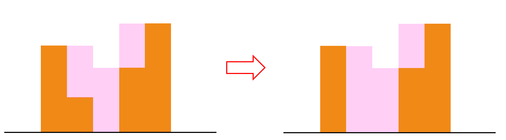

# IOI 2022 Day 1 P1 Catfish Farm

## Problem

### Problem Link
[https://www.acmicpc.net/problem/25438](https://www.acmicpc.net/problem/25438)  
[https://oj.uz/problem/view/IOI22_fish](https://oj.uz/problem/view/IOI22_fish)

### Summary
$N \times N$ 격자판이 있고, 그 중 $M$개의 칸에는 $(X_i, Y_i)$에 가중치 $W_i$가 적혀 있다. $(1 \le i \le M)$  
각 열에 대하여 $0$번 행부터 시작하여 행 번호가 증가하는 순서대로 $0$개 이상의 칸을 선택하여 히스토그램과 같이 색칠할 수 있다.  
어떤 칸 $(X_i, Y_i)$의 가중치 $W_i$를 얻기 위해서는, 다음 두 조건을 모두 만족해야 한다.

- $(X_i-1, Y_i)$, $(X_i+1, Y_i)$중 적어도 하나가 색칠되어 있다.
- $(X_i, Y_i)$는 색칠되어 있지 않다.

이 때 얻을 수 있는 가중치 합의 최대값을 구하여라.

<center>
{width=50%}
</center>

### Constraints

- $2 \le N \le 100,000$
- $1 \le M \le 300,000$
- $1 \le X_i, Y_i \le N$ $(1 \le i \le M)$
- $1 \le W_i \le 10^9$ $(1 \le i \le M)$
- 모든 $(X_i, Y_i)$의 위치는 서로 다르다.

## Solution

색칠할 히스토그램 영역을 정하면 답 또한 정해지니, 색칠할 히스토그램 영역에 대한 여러 관찰을 통하여 가능한 최적해의 형태를 생각해보자.
편의를 위하여 열 $x$의 히스토그램 높이를 $C[x]$라 하자.

<br>

우선 $C[x]>0$인 연속한 칸들을 묶어 하나의 구간으로 생각하자.  
만약 한 구간 내에서 아래 그림과 같이 $C[x]>0$, $C[x-1]>C[x]$, $C[x]<C[x+1]$를 만족하는 $x$가 존재한다면, $C[x]$를 $0$으로 만들어 전보다 많은 칸들의 가중치를 얻을 수 있다.

<center>

</center>

따라서, 최적해에서 한 연속한 구간에 대하여 $C[x-1]>C[x]$, $C[x]<C[x+1]$를 만족하는 $x$가 없어야 하며, 이는 한 연속한 구간 내에서 $C[x]$는 단조 증가하다가 단조 감소하는 형태임을 의미한다.

!!! observation "Observation 1"
    $C[x]>0$인 연속한 칸들을 묶어 하나의 구간으로 생각하자.  
    최적해에서 한 연속한 구간의 $C[x]$는 단조증가하다가, 단조감소하는 형태이다.

<br>

이제 단조증가하다가 단조감소하는 형태인 한 연속한 구간 내에서 $C[x]$의 최댓값을 생각하자.
만약 구간 내 최댓값이 $C[x] < N$이라면, 최댓값에 해당하는 값들을 모두 $N$으로 변경하여 전보다 많은 칸들의 가중치를 얻을 수 있다.
또한, 만약 최댓값이 $3$개 이상이라면 그 중 가장 왼쪽 칸과 가장 오른쪽 칸을 제외하고 모두 $0$으로 만들어 더 많은 칸들의 가중치를 얻을 수 있다.

<center>

</center>

따라서, 최적해에서 한 연속한 구간에 대해서 $C[x]=N$을 만족하는 칸이 존재하며, 그 개수는 최대 $2$개이다.

!!! observation "Observation 2"
    최적해에서 한 연속한 구간에 대해서 $C[x]=N$을 만족하는 칸이 존재하며, 그 개수는 최대 $2$개이다.

<br>

어떤 두 연속한 구간 사이의 $C[x]$는 모두 $0$이 된다.
만약 $C[x]=0$인 $x$가 연속하여 $3$개 이상 등장한다면, 아래 그림과 같이 가장 왼쪽 칸과 가장 오른쪽 칸을 제외하고 모두 $N$으로 만들어 더 많은 칸들의 가중치를 얻을 수 있다.

<center>

</center>

또한, 만약 어떤 두 연속한 구간 사이에 $C[x]=0$인 $x$가 정확히 $1$개 등장한다면, 아래 그림과 같이 왼쪽이나 오른쪽의 칸 중 하나(더 작은 칸)를 $0$으로 만들어 더 많은 칸들의 가중치를 얻을 수 있다.

<center>

</center>

위 두 변환을 생각하면, 어떤 두 연속한 구간 사이에 $C[x]=0$을 만족하는 $x$는 정확히 $2$개여야 한다.
하지만, 다음과 같은 하나의 반례가 존재한다.
만약 $C[x]=0$인 칸 $x$의 양 옆에 있는 칸이 $C[x-1]=C[x+1]=N$이라면, 위 변환을 적용할 수 없기 때문에 이 경우는 최적해에서 가능하다.

<center>
{width=50%}
</center>

따라서, 정리하면 최적해에서 연속한 두 구간 사이에 $C[x]=0$을 만족하는 $x$는 정확히 $2$개여야 한다.
단, $C[x-1]=C[x+1]=N$이라면 예외적으로 $C[x]=0$인 칸이 $1$개일 수 있다.

!!! observation "Observation 3"
    최적해에서 연속한 두 구간 사이에 $C[x]=0$을 만족하는 $x$는 정확히 $2$개여야 한다.  
    단, $C[x-1]=C[x+1]=N$이라면 예외적으로 $C[x]=0$인 칸이 $1$개일 수 있다.

<br>

이제, 최적해에 대한 관찰 **Observation 1**, **Observation 2**, **Observation 3**를 정리하면 최적해가 아래 그림과 같은 형태라는 것을 알 수 있다.

<center>

</center>

최적해의 형태를 충분히 단순화시켰으니, 이제 DP를 통해 조건을 만족하는 최적해를 탐색하면 된다.
우선, 이제 히스토그램의 영역이 아닌 가중치를 얻을 수 있는 칸들의 영역에 대한 DP를 진행하면 되는데, 최적해는 항상 다음과 같은 이동을 하며 구할 수 있다.

- 높이 $y=1$에서 시작하여 오른쪽 위쪽 칸으로 올라가면서 높이 $y=N$에 도착할 때까지 이동한다. (**Observation 1**)
- $y=N$에 도착한 후 $1$칸 혹은 $2$칸을 건너뛴다. (**Observation 2**)
- 높이 $y=N$에서 시작하여 오른쪽 아래 칸으로 내려가면서 높이 $y=1$에 도착할 때까지 이동한다. (**Observation 1**)
- 정확히 $1$칸 오른쪽으로 이동하여 위 과정을 반복한다. (**Observation 3**)
- 단, $C[x-1]=C[x+1]=N$, $C[x]=0$인 경우 예외가 존재하니 이 경우 따로 처리한다. (**Observation 3**)

!!! observation "Observation 4"
    최적해는 항상 다음과 같은 이동을 하며 구할 수 있다.

    - 높이 $y=1$에서 시작하여 오른쪽 위쪽 칸으로 올라가면서 높이 $y=N$에 도착할 때까지 이동한다. (**Observation 1**)
    - $y=N$에 도착한 후 $1$칸 혹은 $2$칸을 건너뛴다. (**Observation 2**)
    - 높이 $y=N$에서 시작하여 오른쪽 아래 칸으로 내려가면서 높이 $y=1$에 도착할 때까지 이동한다. (**Observation 1**)
    - 정확히 $1$칸 오른쪽으로 이동하여 위 과정을 반복한다. (**Observation 3**)
    - 단, $C[x-1]=C[x+1]=N$, $C[x]=0$인 경우 예외가 존재하니 이 경우 따로 처리한다. (**Observation 3**)

이 과정을 $N \times N$의 크기의 격자판에 대하여 naïve하게 해주면 $O(N^2)$개의 DP 상태가 있으니 $O(N^2)$의 시간이 걸려 **Subtask 6**까지 해결할 수 있다.

!!! checkpoint "CheckPoint"
    **Observation 4**와 같은 이동을 하며 최적해를 구할 수 있으니, $N \times N$의 크기의 격자판에 대하여 naïve하게 DP를 전이해주면 $O(N^2)$에 문제를 해결할 수 있다.


하지만, 실제로 가중치가 있는 칸은 총 $M$개이니, **Observation 4**에서 이동할 때 들러야 하는 칸도 총 $M$개이다.
이 때, 모든 $x$에 대하여 $y=1$, $y=N$인 칸들에 $0$의 가중치를 추가하여 전이가 가능하게 해준다.

<center>

</center>

!!! definition "Definition 1"
    각 칸 $v$에 대하여 $dp1[v]$, $dp2[v]$를 다음과 같이 정의하자.

    $dp1[v]:=$ $v$까지 이동하였으며, 현재 올라가는 상태일 때의 가중치 합의 최댓값  
    $dp2[v]:=$ $v$까지 이동하였으며, 현재 내려가는 상태일 때의 가중치 합의 최댓값  

**Definition 1**과 같은 DP 정의를 통하여 모든 칸들을 왼쪽에서 오른쪽으로 보며 DP값들을 구해줄 수 있다.
마지막으로, **Observation 4**에서 자기보다 왼쪽 아래, 왼쪽 위의 칸들에서 DP값을 받아와야 하는데, 이는 inversion의 수를 셀 때와 비슷하게 segment tree나 fenwick tree 등을 이용하여 전이를 $O(logN)$만에 해결할 수 있다.

따라서, 전체 칸의 수가 $O(N+M)$개이고, DP 계산에 드는 시간은 칸당 $O(logN)$이니, $O((N+M)logN)$에 문제를 해결할 수 있다.

!!! checkpoint "CheckPoint"
    **Observation 4**에서 이동할 때 들러야 하는 칸도 총 $M$개이니, 모든 $x$에 대하여 $y=1$, $y=N$인 칸들에 $0$의 가중치를 추가하면 총 $O(N+M)$개의 칸에 대하여 DP를 진행해도 된다.
    **Definition 1**과 같은 DP 정의를 통하여 모든 칸들을 왼쪽에서 오른쪽으로 보며 DP값들을 구해줄 수 있다.
    이 때, **Observation 4**에서 자기보다 왼쪽 아래, 왼쪽 위의 칸들에서 DP값을 받아와야 하는데, 이는 inversion의 수를 셀 때와 비슷하게 segment tree나 fenwick tree 등을 이용하여 전이를 $O(logN)$만에 해결할 수 있다.  
    따라서, 전체 칸의 수가 $O(N+M)$개이고, DP 계산에 드는 시간은 칸당 $O(logN)$이니, $O((N+M)logN)$에 문제를 해결할 수 있다.

!!! complexity "Complexity"
    Time Complexity : $O((N+M)logN)$

## Code
``` cpp linenums="1"
#include "fish.h"
#include <bits/stdc++.h>
using namespace std;
 
typedef long long ll;
typedef pair<int, int> pii;
typedef pair<ll, ll> pll;
 
const int MAXN = 1e5;
const ll INF = 1e18;
 
int N, M;
vector<pii> V[MAXN+10];
vector<ll> dp1[MAXN+10], dp2[MAXN+10];
 
struct BIT
{
	ll tree[MAXN+10];
	void init() { for(int i=1; i<=N; i++) tree[i]=-INF; }
	void update(int i, ll k) { for(; i<=N; i+=(i&-i)) tree[i]=max(tree[i], k); }
	ll query(int i) { ll ret=-INF; for(; i>0; i-=(i&-i)) ret=max(ret, tree[i]); return ret; }
}bit1, bit2;
 
ll max_weights(int _N, int _M, vector<int> _X, vector<int> _Y, vector<int> _W)
{
	N=_N; M=_M;
	for(int i=0; i<M; i++)
	{
		int x=_X[i]+1, y=_Y[i]+1, w=_W[i];
		V[x].push_back({y, w});
	}
	for(int i=0; i<=N+1; i++)
	{
		sort(V[i].begin(), V[i].end());
		if(V[i].empty() || V[i][0].first!=1) V[i].push_back({1, 0});
		if(V[i].back().first!=N) V[i].push_back({N, 0});
		sort(V[i].begin(), V[i].end());
 
		dp1[i]=vector<ll>(V[i].size(), -INF);
		dp2[i]=vector<ll>(V[i].size(), -INF);
	}
 
	
	bit1.init(); bit2.init();
	dp2[0][0]=0; dp1[0][dp1[0].size()-1]=0;
	ll p=-INF, q=-INF, ans=0;
	for(int i=0; i<=N+1; i++)
	{
		int t=V[i].size();
		if(i-1>=0) p=max(p, dp2[i-1][0]);
		if(i-2>=0) q=max(q, dp1[i-2].back());
 
		dp1[i][0]=max(dp1[i][0], p+V[i][0].second);
		if(i-2>=0) dp1[i][0]=max(dp1[i][0], dp1[i-2].back()+V[i][0].second);
		dp2[i][t-1]=max(dp2[i][t-1], q+V[i][t-1].second);
		for(int j=0; j<t; j++)
		{
			auto [y, w] = V[i][j];
			dp1[i][j]=max(dp1[i][j], bit1.query(y-1)+w);
			bit1.update(y, dp1[i][j]);
		}
		for(int j=t-1; j>=0; j--)
		{
			auto [y, w] = V[i][j];
			dp2[i][j]=max(dp2[i][j], bit2.query(N-y)+w);
			bit2.update(N-y+1, dp2[i][j]);
		}
 
		ans=max(ans, dp2[i][0]);
	}
	return ans;
}
```