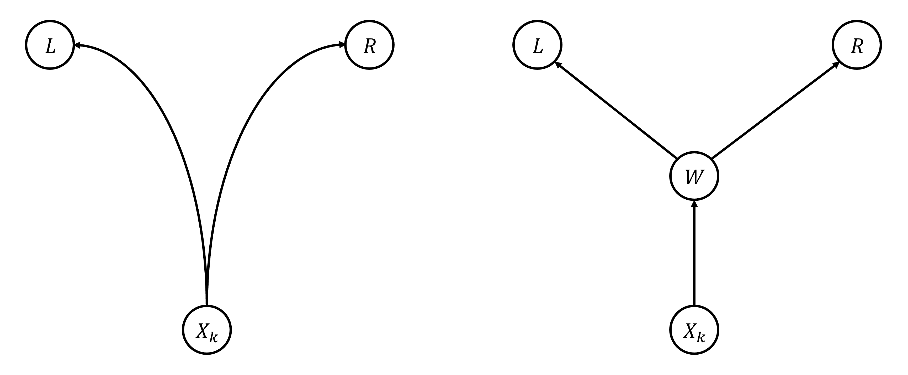

# JOISC 2023 P1.3 Passport

## 문제

### 문제 링크
[https://www.acmicpc.net/problem/27994](https://www.acmicpc.net/problem/27994)  
[https://oj.uz/problem/view/JOI23_passport](https://oj.uz/problem/view/JOI23_passport)

### 문제 요약
$1, 2, \cdots, N$번의 $N$개의 도시가 있고, 도시 $i$에서는 구간 $[L_i, R_i]$ 내의 임의의 도시로 자유롭게 이동할 수 있는 여권을 발급받을 수 있다. $(1 \leq i \leq N)$  
$Q$개의 쿼리가 주어질 때, 각 쿼리별로 $X_k$번 도시에서 출발하였을 때, 모든 도시를 방문하기 위하여 필요한 여권의 최소 개수를 구하여라. $(1 \leq k \leq Q)$

### 제한
+ $2 \leq N \leq 200,000$
+ $1 \leq L_i \leq i \leq R_i \leq N$ $(1 \leq i \leq N)$
+ $1 \leq Q \leq N$
+ $1 \leq X_k \leq N$ $(1 \leq k \leq Q)$, 모든 $X_k$는 서로 다르다.

### 입력 / 출력
!!! Quote "Input"
    $N$  
    $L_1$ $R_1$  
    $L_2$ $R_2$  
    $\vdots$  
    $L_N$ $R_N$  
    $Q$  
    $X_1$  
    $X_2$  
    $\vdots$  
    $X_Q$  

!!! Quote "Output"
    $ans_1$  
    $ans_2$  
    $\vdots$  
    $ans_Q$  

## 풀이

### Subtask 4
+ $N \leq 2500$

현재 갖고 있는 여권들만 사용해서 이동할 수 있는 도시의 범위는 항상 구간이다. $(\because L_i \leq i \leq R_i)$  
따라서, 방문 가능한 도시의 범위가 $[1, N]$임과, $L_i=1$인 여권과 $R_i=N$인 여권을 각각 발급받는것은 동치이다.

!!! note "Observation 1"    
    모든 도시를 방문하기 위하여 발급받아야 하는 여권의 최소 개수는 $X_k$번 도시에서 시작해서 $L_i=1$인 여권과 $R_i=N$인 여권을 각각 발급받기 위하여 발급받아야 하는 여권의 최소 개수와 동치이다.

어떤 도시 $x$에서 여권을 발급받아, $[L_x, R_x]$에 속하는 도시 $y$로 이동하여 여권을 발급받는 행동을 $x$번 정점에서 $y$번 정점으로 이동하는 간선으로 생각하자.
따라서, 문제는 $X_k$번 도시에서 시작하여 $L_i=1$인 도시 $L$과 $R_i=N$번 도시 $R$로 이동하는 경로를 찾는 것이다.
이 때 경로는 꼭 $X_k$에서 시작하여 $L$을 방문한 후 $R$를 방문할 필요 없이, 중간에 갈라져서 $L$로 가는 경로와 $R$로 가는 경로를 다르게 선택해도 된다.
물론, 이 때에도 사용한 정점의 총 개수는 중복하지 않고 센다.

<center>

</center>

위 그림처럼, 최적해는 $X_k$에서 시작하여 한 경로를 따라 임의의 정점 $W$까지 이동 후, $W$에서 갈라져 $L$과 $R$로 각각 이동하는 형태이다.

!!! note "Observation 2" 
    $X_k$에서 시작하여 정점 $L$과 $R$로 가는 최단경로의 형태는, 우선 임의의 정점 $W$로 이동한 후 갈라져 $L$과 $R$로 이동하는 것이다.
    이 때 $X_k \rightarrow W$, $W \rightarrow L$, $W \rightarrow R$의 각 경로에는 겹치는 정점이 없다.

이제, 문제를 빠르게 해결하기 위하여 모든 간선의 방향을 뒤집고, 조건을 만족하는 $L$ 정점들에서 다른 모든 정점들로의 최단경로 $D_L$, 조건을 만족하는 $R$ 정점들에서 다른 모든 정점들로의 최단경로 $D_R$를 구하자.
이후 각 정점 $w$에서 기본 가중치 $D_L[w]+D_R[w]$로 시작하여 다른 정점들로 가는 최단경로 $D$를 구할 수 있다면, $D$가 바로 문제에서 요구하는 답이 됨을 알 수 있다.

모든 간선의 가중치가 1이고, 정점이 $O(N)$개, 간선은 $O(N^2)$개이니 BFS를 통해 $O(N^2)$에 문제를 해결할 수 있다.

!!! example "CheckPoint"
    어떤 도시 $x$에서 여권을 발급받아, $[L_x, R_x]$에 속하는 도시 $y$로 이동하여 여권을 발급받는 행동을 $x$번 정점에서 $y$번 정점으로 이동하는 간선으로 생각할 때, **Observation 1**에 의해 이 그래프에서 $X_k$에서 시작하여 $L_i=1$인 도시 $L$과 $R_i=N$번 도시 $R$로 이동하는 경로를 찾으면 된다.
    **Observation 2**에 의해 이러한 경로는 임의의 정점 $W$를 기준으로 $X_k \rightarrow W$, $W \rightarrow L$, $W \rightarrow R$ 3개의 최단 경로의 합을 구하는 문제로 생각할 수 있으니, BFS를 통해 $O(N^2)$에 문제를 해결할 수 있다.

!!! tip "Complexity"
    <center>
    Time Complexity : $O(N^2)$
    </center>


### Subtask 5 (Full)

이제 실제로 $N^2$개의 간선을 이을 수 없는 상황인데, 간선의 형태가 구간에 있는 모든 정점에서 특정한 점을 연결하는 형태이므로, Segment Tree를 사용하여 최적화할 수 있다.
각 정점을 리프로 하는 Segment Tree를 dummy node로 만들고, Segment Tree의 루트로 방향을 부여하면 특정 구간에서 정점으로 간선을 이을 수 있다.
한 구간에서 정점으로 간선을 연결하는데 $O(logN)$개의 간선만 필요하니, 전체 그래프의 정점은 $O(N)$, 간선은 $O(NlogN)$개이다.

하지만 Segment Tree의 간선들은 가중치가 $0$이기 때문에 단순한 BFS를 사용할 수는 없다.
Segment Tree에 속하는 간선들은 가중치가 $0$, 나머지 간선들은 모두 가중치가 1로 전체 그래프의 간선들의 가중치가 $0$ 혹은 $1$이니 01-BFS를 사용하면 $O(NlogN)$에 문제를 해결할 수 있다.

!!! example "CheckPoint"
    $O(N^2)$개의 간선을 Segment Tree를 사용하여 $O(NlogN)$개의 간선들로 압축할 수 있다. 이제, 이 그래프에서 가중치가 $0$ 혹은 $1$이니 01-BFS를 사용하면 $O(NlogN)$에 문제를 해결할 수 있다.

!!! tip "Complexity"
    <center>
    Time Complexity : $O(NlogN)$
    </center>

## 코드

``` cpp linenums="1"
#include <bits/stdc++.h>
using namespace std;
 
typedef long long ll;
typedef pair<int, int> pii;
typedef pair<ll, ll> pll;
 
const int MAXN = 1e6;
 
int N, Q;
pii A[MAXN+10];
vector<int> adj[MAXN+10];
 
int init(int node, int tl, int tr)
{
	if(tl==tr) return tl;
	int mid=tl+tr>>1;
	adj[init(node*2, tl, mid)].push_back(node+N);
	adj[init(node*2+1, mid+1, tr)].push_back(node+N);
	return node+N;
}
 
void query(int node, int tl, int tr, int l, int r, int k)
{
	if(r<tl || tr<l) return;
	if(l<=tl && tr<=r)
	{
		if(tl==tr) adj[tl].push_back(k);
		else adj[node+N].push_back(k);
		return;
	}
	int mid=tl+tr>>1;
	query(node*2, tl, mid, l, r, k);
	query(node*2+1, mid+1, tr, l, r, k);
}
 
int D1[MAXN+10], D2[MAXN+10], D3[MAXN+10];
 
void bfs(int *D)
{
	deque<pii> Q;
	vector<pii> V;
	for(int i=1; i<=N; i++) if(D[i]) V.push_back({D[i], i});
	sort(V.begin(), V.end());
	for(int p=0; p<V.size();)
	{
		Q.push_back({V[p].second, V[p].first}); p++;
		while(!Q.empty())
		{
			pii t=Q.front(); Q.pop_front();
			if(D[t.first]!=t.second) continue;
 
			int now=t.first;
			for(; p<V.size() && V[p].first<=D[now]+1; p++) Q.push_back({V[p].second, V[p].first});
			for(auto nxt : adj[now])
			{
				if(D[nxt]!=0 && D[nxt]<=D[now]+1) continue;
				if(nxt<=N)
				{
					D[nxt]=D[now]+1;
					Q.push_back({nxt, D[nxt]});
				}
				else
				{
					D[nxt]=D[now];
					Q.push_front({nxt, D[nxt]});					
				}
			}
		}
	}
	for(int i=1; i<=N; i++) if(!D[i]) D[i]=N+N;
}
 
int main()
{
	scanf("%d", &N);
	for(int i=1; i<=N; i++) scanf("%d%d", &A[i].first, &A[i].second);
 
	init(1, 1, N);
	for(int i=1; i<=N; i++)
	{
		auto [l, r]=A[i];
		query(1, 1, N, l, r, i);
	}
 
	for(int i=1; i<=N; i++) if(A[i].first==1) D1[i]=1;
	bfs(D1);
	
	for(int i=1; i<=N; i++) if(A[i].second==N) D2[i]=1;
	bfs(D2);
	
	for(int i=1; i<=N; i++) D3[i]=D1[i]+D2[i]-1;
	bfs(D3);
 
	scanf("%d", &Q);
	while(Q--)
	{
		int t;
		scanf("%d", &t);
		if(D3[t]>N) D3[t]=-1;
		printf("%d\n", D3[t]);
	}
}
```