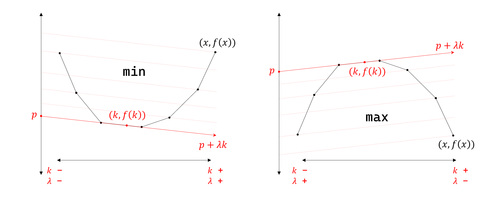

# Alien Trick

## Problem

!!! definition "Definition 1"
    $a \le b \le c \le d$ 일 때, $cost(a, c) + cost(b, d) \le cost(a, d) + cost(b, c)$ ($cost(a, c) + cost(b, d)$가 $cost(a, d) + cost(b, c)$보다 최적) 라면 $cost(j, i)$를 **monge** 하다고 한다.

$$dp[i][k] = min_{j<i} (dp[j][k-1] + cost(j, i))$$

위와 같은 형태의 점화식에서 $cost(j, i)$가 monge 하고, $K$가 주어질 때 $dp[N][K]$를 구하고, 실제 최적해를 역추적한다.

## Algorithm

- **calculate DP**

    !!! property "Property 1"
        $f(k) = dp[N][k]$라 정의하자.
        $cost(j, i)$가 **monge** 하다면 $f(k)$는 $k$에 대하여 **convex** 하다.

        - `min`일 때, $2f(k) \le f(k-1)+f(k+1)$
        - `max`일 때, $2f(k) \ge f(k-1)+f(k+1)$

    $$dp[i][k] = min_{j<i} (dp[j][k-1] + cost(j, i))$$

    $$dp2[i] = min_{j<i} (dp2[j] + cost(j, i)) - \lambda$$

    $f(k) = dp[N][k]$라 정의하자.
    적당한 $\lambda$에 대하여 $p=f(k)-\lambda k$를 최적화한다.
    $f(k)=p + \lambda k$이니, $(x, f(x))$를 선으로 이은 그래프에서 기울기 $\lambda$의 접선을 그었을 때의 $y$좌표가 최적의 $p$가 된다.
    $p=f(k)-\lambda k$는 고정된 $\lambda$에 대하여 최적의 $dp2[N]$을 의미한다.
    
    min/max에 따라 $k$가 증가/감소하면 $\lambda$가 증가/감소한다.
    정해진 $\lambda$를 이용하여 $dp2[N]$을 구하고, 이 때 사용한 transition의 개수를 주어진 $K$와 비교하여 $\lambda$를 반정수 범위에서 이분탐색한다.
    구한 $\lambda$에 대하여 $dp2[N]+\lambda K$가 답이다.

    <center>
    {width=100%}
    </center>

    !!! complexity
        $O(T(N)logX)$  
        ($T(N)$ : $dp2[N]$을 한번 구하기 위해 필요한 시간)

- **restore solution**

    !!! property "Property 2"
        $P_1$을 transition $k_1$개를 사용하는 최적해 $[ a_0=0, a_1, \cdots, a_i, a_{i+1}, \cdots, a_{k_1-1}, a_{k_1}=N ]$라 하고,  
        $P_2$을 transition $k_2$개를 사용하는 최적해 $[ b_0=0, b_1, \cdots, b_j, b_{j+1}, \cdots, b_{k_2-1}, b_{k_2}=N ]$라 하자.

        $k_1 \le k_2$라면, 임의의 $0 \le x \le k_2-k_1$에 대해 다음을 만족하는 $i$, $j$가 존재한다.

        - $(a_i, a_{i+1})$이 $(b_j, b_{j+1})$을 포함한다. $(a_i \le b_j \le b_{j+1} \le a_{i+1})$
        - $j$에서 끝나는 $P_2$의 prefix가 $i$에서 끝나는 $P_1$의 prefix보다 $x$만큼 더 길다. $(j=i+x)$

        <br/>

        이 때, 두 최적해를 **교환**하면  
        transition을 $k_1+x$개 사용하는 최적해 $[ b_0=0, b_1, \cdots, b_j, a_{i+1}, \cdots, a_{k_1-1}, a_{k_1}=N ]$ $Q_1$,  
        transition을 $k_2-x$개 사용하는 최적해 $[ a_0=0, a_1, \cdots, a_i, b_{j+1}, \cdots, b_{k_2-1}, b_{k_2}=N ]$ $Q_2$를 얻을 수 있다.

        $cost(P)$를 최적해의 가중치라고 할 때, $cost(Q_1)+cost(Q_2) \le cost(P_1)+cost(P_2)$가 성립한다. (**교환**을 수행하는 것이 이득이다.)
    
    주어진 $K$에 대해 반정수 범위에서 이분탐색을 진행한 후, 왼쪽과 오른쪽 접점에 대하여 최적해를 복구하고, transition 크기 순으로 $P_1$, $P_2$, 크기를 $k_1$, $k_2$라고 한다.
    **Property 2**에 의해 교환을 수행하여 구하고 싶은 $K$에 대한 최적해를 복구할 수 있다.

    !!! complexity
        $O(N)$  

## Code

``` cpp linenums="1" title="alien.cpp"
namespace Alien
{
    // MAXN must be defined
    const int MAXN = 5e5;
    int N;
    
    // dp[i] : optimal dp value of i
    // cnt[i] : how much transitions were used in optimal dp[i]
    // memo[i] : previous transition position from i
    // V : restored optimal solution
    ll dp[MAXN+10];
    int cnt[MAXN+10], memo[MAXN+10];
    vector<int> V;

    void init(int _N)
    {
        N=_N;
    }

    // For given lambda, calculate dp, cnt, memo, V
    // dp[i] = min(or max)_{j<i} (dp[j] + cost(j, i)*2 - lambda)
    // changes dp, cnt, memo, V 
    void solve(ll lambda)
    {
        // initialize dp, cnt, memo, V, (other data structures)
        for(int i=0; i<=N; i++) dp[i]=cnt[i]=memo[i]=0;
        V.clear();

        for(int i=1; i<=N; i++)
        {
            // get_opt(i), cost(p, q) must be implemented
            // opt = argmin(or max)_{j<i} (dp[j] + cost(j, i)*2)
            // your code goes here
            int opt = get_opt(i);
            dp[i] = dp[opt]+cost(opt, i)*2-lambda; // Don't forget *2
            cnt[i] = cnt[opt]+1;
            memo[i] = opt;
        }

        for(int i=N; i>0;)
        {
            V.push_back(i);
            i=memo[i];
        }
        V.push_back(0);
        reverse(V.begin(), V.end());
    }

    // Get optimal dp[N][K] for given K
    // Returns (answer, restored solution)
    // dp[i][k] = min(or max)_{j<i} (dp[j][k-1] + cost(j, i))
    pair<ll, vector<int>> alien(int K)
    {
        // lambda equals slope
        // minimum : K increase, lambda increase
        // maximum : k increase, lambda decrease

        ll lo=-1e18, hi=1e18; // range for lambda is [2*lo+1, 2*hi+1]
        while(lo+1<hi)
        {
            ll mid=lo+hi>>1;
            solve(2*mid+1);
            if(K <= cnt[N]) hi=mid; // min : <= , max : >=
            else lo=mid;
        }
        
        vector<int> P1, P2, ansV;
        solve(2*lo+1); P1=V;
        solve(2*hi+1); P2=V;
        if(P1.size()>P2.size()) swap(P1, P2);

        if(P1.size()-1==K) ansV=P1;
        else if(P2.size()-1==K) ansV=P2;
        else
        {
            assert(P1.size()-1<K && K<P2.size()-1);
            int x=K+1-P1.size();
            for(int i=0; i+1<P1.size() && i+x+1<P2.size(); i++)
            {
                if(P1[i]<=P2[i+x] && P2[i+x+1]<=P1[i+1])
                {
                    for(int j=0; j<=i+x; j++) ansV.push_back(P2[j]);
                    for(int j=i+1; j<P1.size(); j++) ansV.push_back(P1[j]);
                    break;
                }
            }
        }
        assert(ansV.size()==K+1);

        solve(2*hi);
        ll ans=dp[N]/2+hi*K;
        return {ans, ansV};
    }
}
```

## Details

``` cpp linenums="1" title="template"
namespace Alien
{
    // MAXN must be defined
    const int MAXN = 5e5;
    int N;
    
    // dp[i] : optimal dp value of i
    // cnt[i] : how much transitions were used in optimal dp[i]
    // memo[i] : previous transition position from i
    // V : restored optimal solution
    ll dp[MAXN+10];
    int cnt[MAXN+10], memo[MAXN+10];
    vector<int> V;

    void init(int _N) {}

    // For given lambda, calculate dp, cnt, memo, V
    // dp2[i] = min(or max)_{j<i} (dp2[j] + cost(j, i)*2 - lambda) 
    void solve(ll lambda) {}

    // Get optimal dp[N][K] for given K
    // Returns (answer, restored solution)
    // dp[i][k] = min(or max)_{j<i} (dp[j][k-1] + cost(j, i))
    pair<ll, vector<int>> alien(int K) {}
}
```

- `MAXN`이 선언되어야 함
- `void init(int _N) {}` : 초기화
- `void solve(ll lambda) {}` : 주어진 $\lambda$에 대하여 최적의 $dp2[N]$을 구함 (`dp`, `cnt`, `memo`, `V`를 채움)
    - `dp[i]` : $dp2[i]$의 값
    - `cnt[i]` : $dp2[i]$까지 사용한 transition의 개수
    - `memo[i]` : $dp2[i]$에서 사용한 마지막 transition의 위치
    - `V` : 복구한 최적해
    - $cost(p, q)$가 monge해야 함
    - 문제 상황에 따라 `get_opt(i)`, `cost(p, q)` 부분을 구현하여 사용함
    - `get_opt(i)` : $dp[j] + cost(j, i) \cdot 2$를 최적화시키는 $j<i$를 구함
    - 반정수 범위 이분탐색을 위해 `lambda`는 홀수, `cost(p, q)`에 2를 곱하여 계산
- `pair<ll, vector<int>> alien(int K) {}` : 주어진 $K$에 대해 (최적의 $dp[N][K]$, 역추적한 최적해)를 리턴함
    - `lambda`는 그을 접선의 기울기를 의미함
    - 역추적한 최적해는 $[a_0=0, a_1, \cdots, a_{K-1}, a_K=N]$의 형태임

``` cpp linenums="1" title="example"
void test_alien()
{
    // min, cost(j, i) = (i-j)*(i-j)
    Alien::init(15);
    auto [ans, ansV] = Alien::alien(4);

    assert(ans == 57 && ansV == vector<int>({0, 3, 7, 11, 15}));
}
```