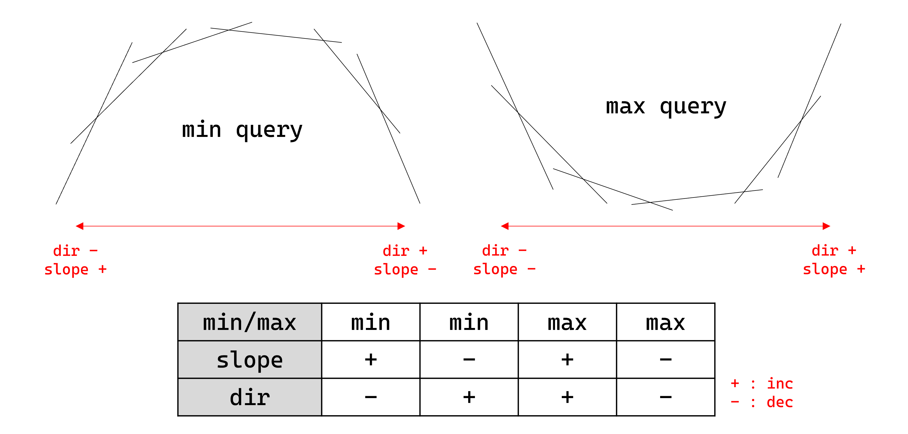

# Convex Hull Trick

## Problem

<center>
{width=100%}
</center>

위 그림과 같이 문제 상황에 따라 `min/max` (최소/최대 쿼리), `slope` (삽입되는 직선들의 기울기 증가/감소), `dir` (삽입 직선들의 교점의 x좌표 증가/감소)이 결정된다.

- **Push** : 일차함수 $y=ax+b$를 추가한다.
  단, 삽입되는 기울기 $a$는 `slope`에 따라 증가하거나 감소해야 한다.
- **Query** : 지금까지 추가된 일차함수들 중 특정 $x$에서의 함숫값들 중 `min/max`에 따라 최솟값 혹은 최댓값을 구한다.
- **Query2** : 지금까지 추가된 일차함수들 중 특정 $x$에서의 함숫값들 중 `min/max`에 따라 최솟값 혹은 최댓값을 구한다.
  단, 쿼리로 주어지는 $x$는 `dir`에 따라 증가하거나 감소해야 한다.

## Algorithm

- **Push**

    최적의 직선들 (upper / lower convex hull)을 스택으로 관리한다.
    이 때, `dir`이 증가한다면 `cross(V[i-1], V[i]) < cross(V[i], V[i+1])`, 감소한다면 `cross(V[i-1], V[i]) > cross(V[i], V[i+1])`을 강제한다.
    새로운 직선을 추가할 때, 불변식을 만족시키지 않는 직선들을 스택의 위쪽에서 하나씩 제거한 후, 새로운 직선을 스택에 추가한다.

    !!! complexity
        ammortized $O(1)$

- **Query**

    쿼리로 주어진 $x$를 이용하여 삽입된 직선들 사이의 교점들에 대한 이분탐색을 통해 최적의 직선을 찾고, 함숫값을 구한다.
    
    !!! complexity
        $O(logN)$

- **Query2**

    직선들의 교점이 삽입되는 방향 `dir`과 쿼리로 주어지는 $x$의 방향이 같으니, 한 번 최적해가 아닌 직선은 앞으로도 최적해가 될 수 없음을 이용한다.
    직선들을 deque로 관리하여, 가장 앞의 교점과 $x$를 비교하여 최적이 아닌 직선을 하나씩 앞에서 제거한 후, 최적 함숫값을 구한다.
    
    !!! complexity
        Ammortized $O(1)$

## Code

``` cpp linenums="1" title="cht.cpp"
namespace CHT
{
    typedef __int128 dll;
    struct Line { ll a, b; };
    struct Frac
    {
        ll u, d;
        Frac(ll _u, ll _d) : u(_u), d(_d) { if(d<0) u=-u, d=-d; }
        bool operator < (const Frac &ot) const { return (dll)u*ot.d < (dll)ot.u*d; }
        bool operator > (const Frac &ot) const { return (dll)u*ot.d > (dll)ot.u*d; }
    };
    ll divfloor(ll u, ll d) { return u/d - ((u^d)<0 && u%d); }
    ll divceil(ll u, ll d) { return u/d + ((u^d)>0 && u%d); }

    // min/max : ?, slope : ?, dir : ?
    struct CHT
    {
        // Get cross point of line p, q
        // If all queries are integer, change 'Frac' to 'div'
        Frac cross(const Line &p, const Line &q) { return Frac(p.b-q.b, q.a-p.a); } // dir + : divfloor, dir - : divceil
        deque<Line> V;
    
        // Insert line p = ax+b
        // b must be increasing (or decreasing) ('slope')
        // cross(V[i-1], V[i]) < (or >) cross(V[i], V[i+1]) ('dir')
        void push(Line p)
        {
            if(!V.empty() && V.back().a==p.a)
            {
                if(V.back().b <= p.b) return; // min : <= , max : >=
                V.pop_back();
            }
            while(V.size()>1 && !(cross(V[V.size()-2], V[V.size()-1]) < cross(V[V.size()-1], p))) V.pop_back(); // dir + : <, dir - : >
            V.push_back(p);
        }
    
        // Get min (or max) value at x in O(logN)
        ll query(ll x)
        {
            assert(!V.empty());
            int lo=0, hi=V.size();
            while(lo+1<hi)
            {
                int mid=lo+hi>>1;
                if(cross(V[mid-1], V[mid]) < Frac(x, 1)) lo=mid; // dir + : <, dir - : >
                else hi=mid;
            }
            return V[lo].a*x+V[lo].b;
        }
    
        // Get min (or max) value at x in ammortized O(1)
        // x must be increasing (or decreasing) ('dir')
        ll query2(ll x)
        {
            assert(!V.empty());
            while(V.size()>1 && cross(V[0], V[1]) < Frac(x, 1)) V.pop_front(); // dir + : <, dir - : >
            return V[0].a*x+V[0].b;
        }
    };
}
```

## Details

``` cpp linenums="1" title="template"
namespace CHT
{
    typedef __int128 dll;
    struct Line { ll a, b; };
    struct Frac
    {
        ll u, d;
        Frac(ll _u, ll _d) : u(_u), d(_d) { if(d<0) u=-u, d=-d; }
        bool operator < (const Frac &ot) const { return (dll)u*ot.d < (dll)ot.u*d; }
        bool operator > (const Frac &ot) const { return (dll)u*ot.d > (dll)ot.u*d; }
    };
    ll divfloor(ll u, ll d) { return u/d - ((u^d)<0 && u%d); }
    ll divceil(ll u, ll d) { return u/d + ((u^d)>0 && u%d); }

    // min/max : ?, slope : ?, dir : ?
    struct CHT
    {
        // Get cross point of line p, q
        // If all queries are integer, change 'Frac' to 'div'
        Frac cross(const Line &p, const Line &q) { return Frac(p.b-q.b, q.a-p.a); } // dir + : divfloor, dir - : divceil
        deque<Line> V;
    
        // Insert line p = ax+b
        // b must be increasing (or decreasing) ('slope')
        // cross(V[i-1], V[i]) < (or >) cross(V[i], V[i+1]) ('dir')
        void push(Line p) {}
    
        // Get min (or max) value at x in O(logN)
        ll query(ll x) {}
    
        // Get min (or max) value at x in ammortized O(1)
        // x must be increasing (or decreasing) ('dir')
        ll query2(ll x) {}
    };
}
```

- 문제 상황에 따라 `min/max` (최소/최대 쿼리), `slope` (삽입되는 직선들의 기울기 증가/감소), `dir` (삽입 직선들의 교점의 x좌표 증가/감소)이 결정된다.
- `Frac cross(const Line &p, const Line &q) {}` : 두 직선의 교점의 x좌표를 `Frac` 자료형으로 리턴함
    - 모든 쿼리들이 정수라면, `Frac` 대신 `dir`이 증가한다면 `divfloor`, `dir`이 감소한다면 `divceil`으로 대체할 수 있음
- `void push(Line p) {}` : 일차함수 $y=ax+b$를 추가함
    - 삽입되는 기울기 $a$는 `slope`에 따라 증가하거나 감소해야함
    - `dir`이 증가한다면 `cross(V[i-1], V[i]) < cross(V[i], V[i+1])`, 감소한다면 `cross(V[i-1], V[i]) > cross(V[i], V[i+1])`를 만족함
- `ll query(ll x) {}` : 특정 $x$에서의 함숫값들 중 `min/max`에 따라 최솟값 혹은 최댓값을 리턴함
- `ll query2(ll x) {}` : 특정 $x$에서의 함숫값들 중 `min/max`에 따라 최솟값 혹은 최댓값을 리턴함
    - 쿼리로 주어지는 $x$는 `dir`에 따라 증가하거나 감소해야 함

``` cpp linenums="1" title="example"
void test_cht()
{
    // min/max : min, slope : -, dir : +
    CHT::CHT cht;
    
    cht.push({0, 1});
    cht.push({-1, -1});
    cht.push({-2, -1});

    assert(cht.query(-2) == 1);
    assert(cht.query(-1) == 0);
    assert(cht.query(0) == -1);
    assert(cht.query(1) == -3);
    
    assert(cht.query2(-2) == 1);
    assert(cht.query2(-1) == 0);
    assert(cht.query2(0) == -1);
    assert(cht.query2(1) == -3);
}
```