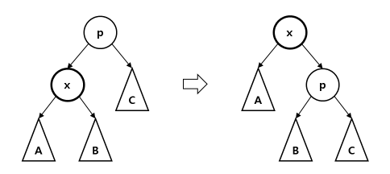
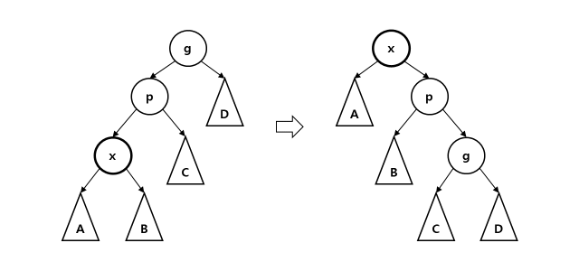
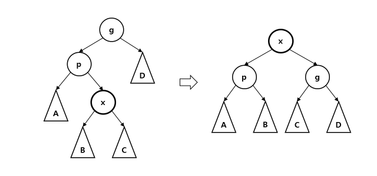

# Splay Tree

## Problem

다음 연산들을 online으로 지원할 수 있는 dynamic array를 구현하여라.

- **Find_kth** : $k$번째 원소를 구한다.
- **Insert** : $k$번째 원소 바로 뒤에 원소 $x$를 삽입한다.
- **Erase** : $k$번째 원소를 삭제한다.
- **Update** : 구간 $[l, r]$에 업데이트를 적용한다. (lazy propagation이 가능한 연산)
- **Query** : 구간 $[l, r]$에 쿼리를 날린다.

## Algorithm

배열의 원소들을 이진트리의 형태로 관리한다.
각 노드에는 **(서브트리의 크기, 부모 노드, 왼쪽 자식, 오른쪽 자식, 원소의 값, 서브트리에 대한 쿼리의 답, lazy 값)**을 저장한다.

노드 $x$의 lazy 값의 정의는 $x$를 제외한 $x$의 서브트리에 적용해야 할 누적된 업데이트들을 의미한다.
즉, 노드 $x$의 값들에는 이미 업데이트가 적용이 되어 있어야 한다.

---

균형된 이진트리를 유지하기 위하여 Splay 연산을 이용한다.

- **Rotate**

    노드 $x$를 $x$의 부모 노드 $p$의 위치로 올린다.  
    ($x$의 $p$ 방향 자식을 노드 $q$라 했을 때, $x$의 부모, $p$의 부모, $q$의 부모, $x$의 $p$ 방향 자식, $p$의 $x$ 방향 자식, $p$의 부모 노드의 자식 이 변한다.)

    <center>
    {width=70%}
    </center>

- **Splay**

    노드 $x$를 루트로 만든다.
    다음 과정을 반복한다.

    - $x$가 루트이면, 종료한다.
    - $x$의 부모가 루트이면, Rotate($x$) 한다. (Zig step)
    - $x$의 부모 $p$의 방향과, $p$의 부모 $g$의 방향이 같다면 Rotate($p$), Rotate($x$) 한다. (Zig-Zig step)
    <center>
    {width=70%}
    </center>
    - $x$의 부모 $p$의 방향과, $p$의 부모 $g$의 방향이 다르다면 Rotate($x$), Rotate($x$) 한다. (Zig-Zag step)
    <center>
    {width=70%}
    </center>
    
    Splay 연산은 ammortized $O(\log N)$의 시간복잡도를 갖고 있기 때문에, 트리 내부의 노드를 접근할 때에는 시간을 소모한 후 splay 연산을 실행하여야 한다.

    !!! complexity
        Ammortized $O(\log N)$

---

Splay 연산을 이용하여 나머지 기능들을 다음과 같이 구현한다.

- **Find_Kth**

    루트에서 시작하여 $k$번째 노드가 어느 쪽 서브트리에 속하는지 판별하고 재귀적으로 내려간다.
    $k$번째 루트를 찾으면, 이 노드를 Splay하여 루트로 만든다.

- **Insert**

    루트에서 시작하여 새로 삽입할 $k$번째 다음 위치의 노드가 어느 쪽 서브트리에 속하는지 판별하고 재귀적으로 내려간다.
    더 이상 내려갈 수 없을 때, 새로운 노드를 자식으로 삽입한 후, 삽입한 노드를 Splay한다.

- **Erase**

    Find_Kth 연산을 이용하여 삭제할 $k$번째 원소를 루트로 만든다.
    루트를 삭제하기 위하여, Find_Kth 연산을 이용하여 루트의 왼쪽 서브트리 $l$의 가장 오른쪽 노드 $p$를 루트로 만들고, $p$의 오른쪽 자식으로 루트의 오른쪽 서브트리 $r$을 삽입한다. 

- **Interval (Update / Query)**

    구간 $[l, r]$의 노드들을 한 서브트리로 모은다.
    우선 Find_Kth 연산을 이용하여 $r+1$번째 노드를 루트로 만든다.
    루트의 왼쪽 서브트리에서 Find_Kth 연산을 이용하여 $l-1$번째 노드를 루트의 왼쪽 자식으로 만든다.
    루트의 왼쪽 자식의 오른쪽 자식의 서브트리가 구간 $[l, r]$을 모아놓은 서브트리이다.
    이 노드에 대하여 Update / Query를 실행한다.

!!! complexity
    Ammortized $O(\log N)$

## Code

``` cpp linenums="1" title="splay_tree.cpp"
namespace SplayTree
{
    struct Node
    {
        int sz;
        int par, lc, rc;

        // val : value stored in node, sum : query value stored in node
        // lazy : lazy value to be applied to subtree of node (already applied to val, sum)
        ll val, sum;
        ll lazy;

        Node(ll x)
        {
            sz=1;
            par=lc=rc=0;

            // your code goes here
            val=sum=x;
            lazy=0;
        }
        Node()
        {
            sz=par=lc=rc=0;
            val=sum=0;
            lazy=0;
        }
    };

    struct SplayTree
    {
        SplayTree() { NS=vector<Node>(1); root=0; }
        int newNode(ll x) { NS.push_back(Node(x)); return NS.size()-1; }

        // NS[0] : NIL node
        int root;
        vector<Node> NS;

        // Recalculate value of node from lc, rc
        // lazy must be empty
        // changes sz, sum
        void recalc(int node)
        {
            if(node==0) return;
            int l=NS[node].lc, r=NS[node].rc;
            NS[node].sz=NS[l].sz+NS[r].sz+1;

            // your code goes here
            NS[node].sum=NS[node].val+NS[l].sum+NS[r].sum;
        }

        // Apply update value upd to subtree of node
        // update to node itself (val, sum), and to lazy value (lazy)
        // changes lazy, val, sum
        void apply(int node, ll upd)
        {
            if(node==0) return;

            // your code goes here
            NS[node].lazy+=upd;
            NS[node].val+=upd;
            NS[node].sum+=upd*NS[node].sz;
        }

        // Propagate lazy value to lc, rc, and initialize lazy
        // should be called before going down to children
        // changes lazy
        void prop(int node)
        {
            if(node==0) return;
            if(NS[node].lazy==0) return;
            apply(NS[node].lc, NS[node].lazy);
            apply(NS[node].rc, NS[node].lazy);
            
            // your code goes here
            NS[node].lazy=0;
        }

        // Propagates all ancestors of x
        void prop_anc(int x)
        {
            if(NS[x].par!=0) prop_anc(NS[x].par);
            prop(x);
        }
        
        // Rotate x with its parent
        void rotate(int x)
        {
            assert(x!=0 && NS[x].par!=0);
            int p=NS[x].par, q;
            if(NS[p].lc==x)
            {
                NS[p].lc=q=NS[x].rc;
                NS[x].rc=p;
            }
            else
            {
                NS[p].rc=q=NS[x].lc;
                NS[x].lc=p;
            }
            NS[x].par=NS[p].par;
            NS[p].par=x;
            if(q) NS[q].par=p;
            if(NS[x].par!=0)
            {
                if(NS[NS[x].par].lc==p) NS[NS[x].par].lc=x;
                else if(NS[NS[x].par].rc==p) NS[NS[x].par].rc=x;
            }

            recalc(p);
            recalc(x);
        }

        // Make x the root of tree
        // ammortized O(\log N), should be called after consuming time to visit any internal node
        void splay(int x)
        {
            root=x;
            if(x==0) return;
            prop_anc(x);
            while(NS[x].par)
            {
                int p=NS[x].par, q=NS[p].par;
                if(q) rotate((NS[p].lc==x)==(NS[q].lc==p) ? p : x);
                rotate(x);
            }
        }

        // Find kth node in subtree of node
        int find_kth(int node, int k)
        {
            assert(1<=k && k<=NS[node].sz);
            prop(node);
            if(k<=NS[NS[node].lc].sz) return find_kth(NS[node].lc, k);
            if(k==NS[NS[node].lc].sz+1) return node;
            return find_kth(NS[node].rc, k-NS[NS[node].lc].sz-1);
        }
        // Find kth node of the tree, and make it root
        void find_kth(int k) { splay(find_kth(root, k)); }

        // Insert node x after the kth node in subtree of node
        void insert(int node, int k, int x)
        {
            if(node==0) return;
            assert(0<=k && k<=NS[node].sz);
            prop(node);

            if(k<=NS[NS[node].lc].sz)
            {
                if(NS[node].lc==0)
                {
                    NS[node].lc=x;
                    NS[x].par=node;
                }
                else insert(NS[node].lc, k, x);
            }
            else
            {
                if(NS[node].rc==0)
                {
                    NS[node].rc=x;
                    NS[x].par=node;
                }
                else insert(NS[node].rc, k-NS[NS[node].lc].sz-1, x);
            }
            recalc(node);
        }
        // Insert node x after the kth node of tree, and make it root
        void insert(int k, int x) { insert(root, k, x); splay(x); }

        // Erase root of tree
        void erase()
        {
            assert(root!=0);
            prop(root);

            int p=NS[root].lc, q=NS[root].rc;
            if(p==0 || q==0)
            {
                root=p+q;
                NS[root].par=0;
                return;
            }
            root=p;
            NS[root].par=0;
            find_kth(NS[p].sz);
            NS[root].rc=q;
            NS[q].par=root;
            recalc(root);
        }

        // Merge [l, r]th nodes into subtree of NS[NS[root].lc].rc, and return it
        int interval(int l, int r)
        {
            assert(1<=l && r<=NS[root].sz);
            int sz=NS[root].sz, ret, x;

            if(r<sz)
            {
                find_kth(r+1);
                x=root;
                root=NS[x].lc;
                NS[root].par=0;
            }

            if(l>1)
            {
                find_kth(l-1);
                ret=NS[root].rc;
            }
            else ret=root;

            if(r<sz)
            {
                NS[root].par=x;
                NS[x].lc=root;
                root=x;
            }
            return ret;
        }

        // Update val to range [l, r]
        void update(int l, int r, ll lazy)
        {
            assert(1<=l && r<=NS[root].sz);
            int p=interval(l, r);
            apply(p, lazy);
            recalc(NS[p].par);
            recalc(NS[NS[p].par].par);
        }
        
        // Query range [l, r]
        Node query(int l, int r)
        {
            assert(1<=l && r<=NS[root].sz);
            int p=interval(l, r);
            return NS[p];
        }
    };
}
```

## Details

``` cpp linenums="1" title="template"
namespace SplayTree
{
    struct Node
    {
        int sz;
        int par, lc, rc;

        // val : value stored in node, sum : query value stored in node
        // lazy : lazy value to be applied to subtree of node (already applied to val, sum)
        ll val, sum;
        ll lazy;

        Node(ll x) {}
        Node() {}
    };

    struct SplayTree
    {
        SplayTree() { NS=vector<Node>(1); root=0; }
        int newNode(ll x) { NS.push_back(Node(x)); return NS.size()-1; }

        // NS[0] : NIL node
        int root;
        vector<Node> NS;

        // Recalculate value of node from lc, rc
        // lazy must be empty
        // changes sz, sum
        void recalc(int node) {}

        // Apply update value upd to subtree of node
        // update to node itself (val, sum), and to lazy value (lazy)
        // changes lazy, val, sum
        void apply(int node, ll upd) {}

        // Propagate lazy value to lc, rc, and initialize lazy
        // should be called before going down to children
        // changes lazy
        void prop(int node) {}

        // Propagates all ancestors of x
        void prop_anc(int x)
        
        // Rotate x with its parent
        void rotate(int x) {}

        // Make x the root of tree
        // ammortized O(\log N), should be called after consuming time to visit any internal node
        void splay(int x) {}

        // Find kth node in subtree of node
        int find_kth(int node, int k) {}
        // Find kth node of the tree, and make it root
        void find_kth(int k) {}

        // Insert node x after the kth node in subtree of node
        void insert(int node, int k, int x) {}
        // Insert node x after the kth node of tree, and make it root
        void insert(int k, int x) {}

        // Erase root of tree
        void erase() {}

        // Merge [l, r]th nodes into subtree of NS[NS[root].lc].rc, and return it
        int interval(int l, int r) {}

        // Update val to range [l, r]
        void update(int l, int r, ll val) {}
        
        // Query range [l, r]
        Node query(int l, int r) {}
    };
}
```

- `Node`
    - `val` : 현재 노드에 적혀 있는 원소의 값
    - `sum` : 현재 노드의 서브트리에 대한 쿼리의 값 (저장해야 할 값에 따라 바꾸어 사용)
    - `lazy` : 현재 노드를 제외하고, 현재 노드의 서브트리에 적용해야 할 누적된 lazy 값 (현재 노드에는 이미 업데이트가 적용되어 있음)
    - `Node(ll x) {}` : 원소 $x$를 의미하는 새로운 노드를 생성함
- `SplayTree`
    - `NS[0]`은 `NIL` 노드를 의미함
    - 전체 트리들이 꼭 하나로 연결되어 있을 필요는 없으며, 현재 작업 중인 트리의 루트가 `root`에 담겨 있어야 함
    - 문제 상황의 연산에 따라 `recalc`, `apply`, `prop`을 구현하여 사용
    - `void recalc(int node) {}` : 왼쪽 자식, 오른쪽 자식의 값을 이용하여 현재 노드 `node`의 값을 다시 계산함
        - `node`의 `lazy`값이 비어 있어야 함
        - `node`의 `sz`, `sum`을 바꿈
    - `void apply(int node, ll upd) {}` : 현재 노드 `node`의 서브트리에 `upd`를 업데이트함
        - 현재 노드에 직접 (`sum`, `val`) 업데이트를 하고, `lazy`에도 따로 업데이트를 해야 함
        - `node`의 `lazy`, `sum`, `val`을 바꿈
    - `void prop(int node) {}` : 현재 노드 `node`의 `lazy`에 쌓여 있는 업데이트를 자식 노드로 전파함
        - 자식 노드로 내려가기 전에 호출되어야 함
        - `lazy`값을 초기화함
    - `void prop_anc(int x)` : 노드 $x$의 조상 노드들에 대해 모두 순서대로 `prop`을 호출함
    - `void rotate(int x) {}` : 노드 $x$를 $x$의 부모 노드 $p$의 위치로 올림
        - $x$는 루트가 아니여야 함
    - `void splay(int x) {}` : 노드 $x$를 `root`로 만듬
        - 트리 내부의 노드를 접근할 때에는 시간을 소모한 후 splay 연산을 실행해야 함
    - `int find_kth(int node, int k) {}` : 노드 `node`의 서브트리의 $k$번째 노드 번호를 리턴함
    - `int find_kth(int k) {}` : 전체 트리의 $k$번째 노드 번호를 리턴함
    - `void insert(int node, int k, int x) {}` :노드 `node`의 $k$번째 노드 바로 뒤에 $x$번째 노드를 삽입함
    - `void insert(int k, int x) {}` : 전체 트리의 $k$번째 노드 바로 뒤에 $x$번째 노드를 삽입함
    - `void erase() {}` : 루트 노드를 삭제함
    - `void update(int l, int r, ll val) {}` : 전체 트리의 구간 $[l, r]$에 $val$을 업데이트함
    - `Node query(int l, int r) {}` : 전체 트리의 구간 $[l, r]$에 해당하는 노드를 리턴함

``` cpp linenums="1" title="example"
void test_splay_tree()
{
    vector<int> A={0, 1, 10, 100, 1000, 10000};
    SplayTree::SplayTree T;

    for(int i=1; i<=5; i++) T.insert(i-1, T.newNode(A[i]));

    assert(T.query(2, 4).sum == 1110);
    T.insert(2, T.newNode(100000)); // A = [1, 10, 100000, 100, 1000, 10000]
    assert(T.query(1, 3).sum == 100011);
    T.find_kth(5); T.erase(); // A = [1, 10, 100000, 100, 10000]
    assert(T.query(4, 5).sum == 10100);
    T.update(2, 4, 2); // A = [1, 12, 100002, 102, 10000]
    assert(T.query(1, 3).sum == 100015);
}
```