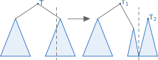
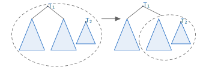

# Treap

## Problem

다음 연산들을 online으로 지원할 수 있는 dynamic array를 구현하여라.

- **Insert** : $k$번째 원소 바로 뒤에 원소 $x$를 삽입한다.
- **Erase** : $k$번째 원소를 삭제한다.
- **Find_kth** : $k$번째 원소를 구한다.
- **Update** : 구간 $[l, r]$에 업데이트를 적용한다. (lazy propagation이 가능한 연산)
- **Query** : 구간 $[l, r]$에 쿼리를 날린다.

## Algorithm

각 원소가 생성될 때 랜덤한 priority를 부여한 후, 원소들을 priority에 대한 heap(부모 노드의 priority가 자식 노드의 priority보다 큰 이진트리)의 형태로 관리한다.
각 노드에는 **(priority, 서브트리의 크기, 부모 노드, 왼쪽 자식, 오른쪽 자식, 원소의 값, 서브트리에 대한 쿼리의 답, lazy 값)**을 저장한다.

노드 $x$의 lazy 값의 정의는 $x$를 제외한 $x$의 서브트리에 적용해야 할 누적된 업데이트들을 의미한다.
즉, 노드 $x$의 값들에는 이미 업데이트가 적용이 되어 있어야 한다.

---

다음 두 연산으로 모든 기능들을 구현한다.

- **Split**

    현재 트리가 $sz$개의 노드를 갖고 있다면, 트리를 왼쪽 $k$개의 노드와 오른쪽 $sz-k$개의 노드로 구성된 2개의 트리로 쪼갠다.
    
    <center>
    {width=70%}
    </center>

    먼저, 루트 노드가 왼쪽과 오른쪽 트리 중 어느 쪽에 속할지 결정한다.
    루트 노드가 속한 방향의 자식 서브트리는 더 이상 쪼갤 필요가 없으니, 반대쪽 자식으로 내려가 재귀적으로 Split 한다.
    마지막으로, 쪼개진 자식 노드의 서브트리 중 루트 노드와 같은 쪽에 속하는 서브트리를 루트 노드의 자식으로 넣어 준다.

    !!! complexity
        Expected $O(logN)$

- **Merge**

    연속한 두 트리를 하나의 트리로 합친다.

    <center>
    {width=80%}
    </center>

    두 트리의 루트 노드 중 priority가 더 큰 노드를 전체 트리의 루트로 설정한다.
    이후, 루트가 된 트리의 자식 서브트리 중 나머지 트리의 방향에 있는 서브트리를 재귀적으로 Merge 한다.

    !!! complexity
        Expected $O(logN)$

---

Merge와 Split 연산을 이용하여 나머지 기능들을 다음과 같이 구현한다.

- **Insert**

    트리를 $k, sz-k$개의 노드로 구성된 트리로 Split한 후, 사이에 새로운 노드 $x$를 끼워 넣어 모두 Merge한다.

- **Erase**

    트리를 $k-1, 1, sz-k$개의 노드로 구성된 트리로 Split한 후, 가운데 삭제할 노드를 삭제한 후 나머지를 Merge한다.

- **Find_Kth**

    루트에서 시작하여 $k$번째 노드가 어느 쪽 서브트리에 속하는지 판별하고 재귀적으로 내려간다.

- **Update / Query**

    트리를 $l-1, r-l+1, sz-r$개의 노드로 구성된 트리로 Split한 후, 가운데 노드에 대한 Update / Query를 실행한 후 다시 Merge한다.

!!! complexity
    Expected $O(logN)$

## Code

``` cpp linenums="1" title="treap.cpp"
namespace Treap
{
    mt19937 rng(1557);
    int rnd() { return uniform_int_distribution<int>()(rng); }

    struct Node
    {
        int pr, sz;
        int par, lc, rc;

        // val : value stored in node, sum : query value of subtree
        // lazy : lazy value to be applied to subtree of node (already applied to val, sum)
        ll val, sum;
        ll lazy;

        Node(ll x)
        {
            pr=rnd();
            sz=1;
            par=lc=rc=0;

            // your code goes here
            val=sum=x;
            lazy=0;
        }

        Node()
        {
            pr=sz=par=lc=rc=0;
            val=sum=0;
            lazy=0;
        }
    };

    struct Treap
    {
        Treap() { NS=vector<Node>(1); root=0; }
        int newNode(ll x) { NS.push_back(Node(x)); return NS.size()-1; }

        // NS[0] : NIL node
        int root;
        vector<Node> NS;

        // Recalculate value of node from lc, rc
        // lazy must be empty
        // changes sz, sum
        void recalc(int node)
        {
            if(node==0) return;
            int l=NS[node].lc, r=NS[node].rc;
            NS[node].sz=NS[l].sz+NS[r].sz+1;

            // your code goes here
            NS[node].sum=NS[node].val+NS[l].sum+NS[r].sum;
        }

        // Apply update value upd to subtree of node
        // update to node itself (val, sum), and to lazy value (lazy)
        // changes lazy, val, sum
        void apply(int node, ll upd)
        {
            if(node==0) return;

            // your code goes here
            NS[node].lazy+=upd;
            NS[node].val+=upd;
            NS[node].sum+=upd*NS[node].sz;
        }

        // Propagate lazy value to lc, rc, and initialize lazy
        // should be called before going down to children
        // changes lazy
        void prop(int node)
        {
            if(node==0) return;
            if(NS[node].lazy==0) return;
            apply(NS[node].lc, NS[node].lazy);
            apply(NS[node].rc, NS[node].lazy);
            
            // your code goes here
            NS[node].lazy=0;
        }

        // Merge two consecutive trees rooted at l, r
        int merge(int l, int r)
        {
            if(l==0 || r==0) return l+r;
            if(NS[l].pr>NS[r].pr)
            {
                prop(l);
                int t=merge(NS[l].rc, r);
                NS[t].par=l;
                NS[l].rc=t;
                recalc(l);
                return l;
            }
            else
            {
                prop(r);
                int t=merge(l, NS[r].lc);
                NS[t].par=r;
                NS[r].lc=t;
                recalc(r);
                return r;
            }
        }

        // Split tree rooted at node into two trees of size k, sz-k
        pii split(int node, int k)
        {
            if(node==0) return {0, 0};
            assert(0<=k && k<=NS[node].sz);
            prop(node);

            if(k<=NS[NS[node].lc].sz)
            {
                auto [l, r]=split(NS[node].lc, k);
                NS[node].lc=r;
                NS[r].par=node;
                NS[l].par=0;
                recalc(node);
                return {l, node};
            }
            else
            {
                auto [l, r]=split(NS[node].rc, k-NS[NS[node].lc].sz-1);
                NS[node].rc=l;
                NS[l].par=node;
                NS[r].par=0;
                recalc(node);
                return {node, r};
            }
        }

        // ================================ Essential functions ENDS here ================================

        // Find kth node in subtree of node
        int find_kth(int node, int k)
        {
            prop(node);
            if(NS[NS[node].lc].sz>=k) return find_kth(NS[node].lc, k);
            if(k==NS[NS[node].lc].sz+1) return node;
            return find_kth(NS[node].rc, k-NS[NS[node].lc].sz-1);
        }
        // Find kth node of the tree
        int find_kth(int k) { return find_kth(root, k); }

        // Insert node x after the kth node of tree
        void insert(int k, int x)
        {
            assert(0<=k && k<=NS[root].sz);
            auto [a, b] = split(root, k);
            root = merge(a, x);
            root = merge(root, b);
        }

        // Erase kth node of tree
        void erase(int k)
        {
            assert(1<=k && k<=NS[root].sz);
            auto [a, d] = split(root, k-1);
            auto [b, c] = split(d, 1);
            root = merge(a, c);
        }

        // Update val to range [l, r]
        void update(int l, int r, ll val)
        {
            auto [d, c] = split(root, r);
            auto [a, b] = split(d, l-1);
            apply(b, val);
            root = merge(a, b);
            root = merge(root, c);
        }

        // Query range [l, r]
        Node query(int l, int r)
        {
            auto [d, c] = split(root, r);
            auto [a, b] = split(d, l-1);
            Node ret = NS[b];
            root = merge(a, b);
            root = merge(root, c);
            return ret;
        }
    };
}
```

## Details

``` cpp linenums="1" title="template"
namespace Treap
{
    mt19937 rng(1557);
    int rnd() { return uniform_int_distribution<int>()(rng); }

    struct Node
    {
        int pr, sz;
        int par, lc, rc;

        // val : value stored in node, sum : query value stored in node
        // lazy : lazy value to be applied to subtree of node (already applied to val, sum)
        ll val, sum;
        ll lazy;

        Node(ll x) {}
        Node() {}
    };

    struct Treap
    {
        Treap() { NS=vector<Node>(1); root=0; }
        int newNode(ll x) { NS.push_back(Node(x)); return NS.size()-1; }

        // NS[0] : NIL node
        int root;
        vector<Node> NS;

        // Recalculate value of node from lc, rc
        // lazy must be empty
        // changes sz, sum
        void recalc(int node) {}

        // Apply update value upd to subtree of node
        // update to node itself (val, sum), and to lazy value (lazy)
        // changes lazy, val, sum
        void apply(int node, ll upd) {}

        // Propagate lazy value to lc, rc, and initialize lazy
        // should be called before going down to children
        // changes lazy
        void prop(int node) {}

        // Merge two consecutive trees rooted at l, r
        int merge(int l, int r) {}

        // Split tree rooted at node into two trees of size k, sz-k
        pii split(int node, int k) {}

        // ================================ Essential functions ENDS here ================================

        // Find kth node in subtree of node
        int find_kth(int node, int k) {}
        // Find kth node of the tree
        int find_kth(int k) {}

        // Insert node x after the kth node of tree
        void insert(int k, int x) {}

        // Erase kth node of tree
        void erase(int k) {}

        // Update val to range [l, r]
        void update(int l, int r, ll val) {}

        // Query range [l, r]
        Node query(int l, int r) {}
    };
}
```

- `Node`
    - `val` : 현재 노드에 적혀 있는 원소의 값
    - `sum` : 현재 노드의 서브트리에 대한 쿼리의 값 (저장해야 할 값에 따라 바꾸어 사용)
    - `lazy` : 현재 노드를 제외하고, 현재 노드의 서브트리에 적용해야 할 누적된 lazy 값 (현재 노드에는 이미 업데이트가 적용되어 있음)
    - `Node(ll x) {}` : 원소 $x$를 의미하는 새로운 노드를 생성함 (랜덤한 priority도 배정함)
- `Treap`
    - `NS[0]`은 `NIL` 노드를 의미함
    - 전체 트리들이 꼭 하나로 연결되어 있을 필요는 없으며, 현재 작업 중인 트리의 루트가 `root`에 담겨 있어야 함
    - 문제 상황의 연산에 따라 `recalc`, `apply`, `prop`을 구현하여 사용
    - `void recalc(int node) {}` : 왼쪽 자식, 오른쪽 자식의 값을 이용하여 현재 노드 `node`의 값을 다시 계산함
        - `node`의 `lazy`값이 비어 있어야 함
        - `node`의 `sz`, `sum`을 바꿈
    - `void apply(int node, ll upd) {}` : 현재 노드 `node`의 서브트리에 `upd`를 업데이트함
        - 현재 노드에 직접 (`sum`, `val`) 업데이트를 하고, `lazy`에도 따로 업데이트를 해야 함
        - `node`의 `lazy`, `sum`, `val`을 바꿈
    - `void prop(int node) {}` : 현재 노드 `node`의 `lazy`에 쌓여 있는 업데이트를 자식 노드로 전파함
        - 자식 노드로 내려가기 전에 호출되어야 함
        - `lazy`값을 초기화함
    - `int merge(int l, int r) {}` : 노드 $l$, $r$의 서브트리를 하나로 합치고, 루트 노드를 리턴함
        - 노드 $l$의 서브트리가 왼쪽에, 노드 $r$의 서브트리가 오른쪽에 위치하며 연속해야 함
    - `pii split(int node, int k) {}` : 노드 `node`의 서브트리를 왼쪽 $k$개의 노드와 오른쪽 $sz-k$개의 노드로 구성된 2개의 트리로 쪼개고, 각 트리의 루트 번호를 리턴함
    - `int find_kth(int node, int k) {}` : 노드 `node`의 서브트리의 $k$번째 노드 번호를 리턴함
    - `int find_kth(int k) {}` : 전체 트리의 $k$번째 노드 번호를 리턴함
    - `void insert(int k, int x) {}` : 전체 트리의 $k$번째 노드 바로 뒤에 $x$번째 노드를 삽입함
    - `void erase(int k) {}` : 전체 트리의 $k$번째 노드를 삭제함
    - `void update(int l, int r, ll val) {}` : 전체 트리의 구간 $[l, r]$에 $val$을 업데이트함
    - `Node query(int l, int r) {}` : 전체 트리의 구간 $[l, r]$에 해당하는 노드를 리턴함

``` cpp linenums="1" title="example"
void test_treap()
{
    vector<int> A={0, 1, 10, 100, 1000, 10000};
    Treap::Treap T;
    
    for(int i=1; i<=5; i++) T.root=T.merge(T.root, T.newNode(A[i]));

    assert(T.query(2, 4).sum == 1110);
    T.insert(2, T.newNode(100000)); // A = [1, 10, 100000, 100, 1000, 10000]
    assert(T.query(1, 3).sum == 100011);
    T.erase(5); // A = [1, 10, 100000, 100, 10000]
    assert(T.query(4, 5).sum == 10100);
    T.update(2, 4, 2); // A = [1, 12, 100002, 102, 10000]
    assert(T.query(1, 3).sum == 100015);
}
```