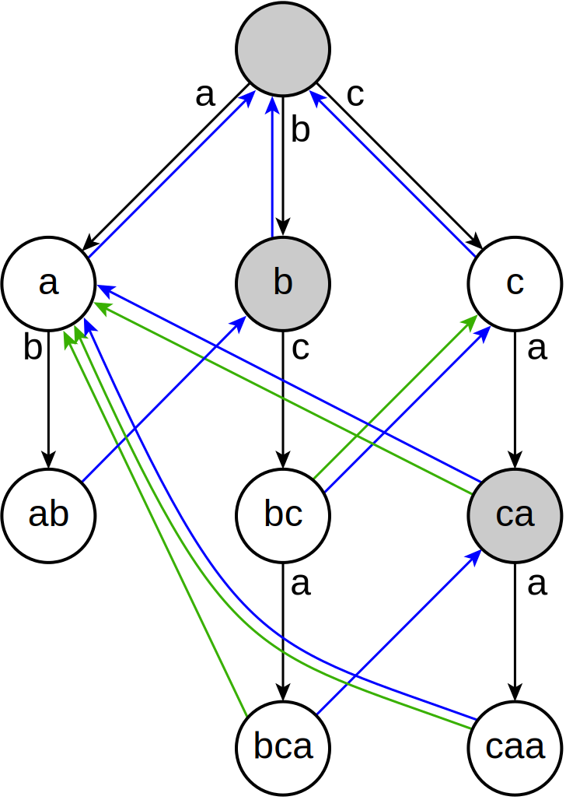

# Aho-Corasick

## Problem

!!! definition
    문자열 사전 $TV$의 Trie를 만든 후, 각 노드에 대하여 $par[v]$, $fail[v]$, $suf[v]$를 정의한다.  

    - $par[v]:=$ Trie에서 노드 $v$의 부모  
    - $fail[v]:=$ $v$의 노드가 의미하는 prefix의 proper suffix 중, Trie에 존재하는 prefix와 동일한 것 중 최대 길이의 prefix로의 링크 **(failure link)**  
    - $suf[v]:=$ 노드 $v$에서 failure link를 타고 올라가면서 만나는 첫 번째 terminal node로의 링크 **(suffix link)**

    Trie의 루트 노드와 루트 노드의 자식 노드들의 fail 링크는 루트 노드로 정의한다.
    $par[root]=fail[root]=suf[root]=root$로 정의한다.

문자열 $S$와 문자열 사전 $TV$가 주어졌을 때, $TV$의 trie를 만들고 이를 이용하여 $S$에서 $TV$의 모든 등장 위치를 탐색한다.

<center>
{width=40%}

“a”, “ab”, “bc”, “bca”, “c”, “caa”가 문자열 $TV[0], TV[1], \cdots$일 때 Trie를 나타낸 그림이다.  
파란색 간선이 failure Link, 초록색 간선이 suffix Link를 의미한다.
</center>

## Algorithm

문자열 $TV[0], TV[1], \cdots$ 들을 하나씩 Trie에 삽입한다.
이후, BFS를 하며 루트에서 가까운 노드부터 보며 $fail[v]$를 결정한다.
$fail[v]$를 구하기 위하여, $fail[par[v]], fail[fail[par[v]]], \cdots$ 의 자식 간선에 $v$가 의미하는 prefix의 마지막 문자 $c$가 존재하는지 확인하고, 자식 문자 $c$가 존재하는 첫 번째 노드의 $c$에 해당하는 자식 노드를 $fail[v]$로 결정한다.

완성된 Trie와 Suffix Link (Failure Link)를 바탕으로, 비교하려고 하는 문자열 $S$의 각 문자를 하나씩 보며 탐색한다.
시작 노드는 루트에서 시작하며, $S$의 문자를 하나씩 보며, 현재 노드의 자식 문자 간선이 존재하면, 그 노드로 이동하고, 존재하지 않으면, 존재할 때까지 Suffix Link를 타고 이동하며 비교를 반복한다.

!!! complexity
    $N = |S|$, $M = \sum |TV[i]|$, $\sum$ = 알파벳 개수  
    Time Complexity : $O(N+M)$  
    Space Complexity : $O(M\sum)$

## Code

``` cpp linenums="1" title="aho_corasick.cpp"
namespace AhoCorasick
{
    // par[v] = parent of node v
    // fail[v] = failure link of node v
    // suf[v] = suffix link of node v
    // chd[v] = children of node v in trie
    struct Node
    {
        int par, fail, suf;
        vector<int> chd;
        Node()
        {
            par=fail=suf=-1;
            chd=vector<int>(26, -1);
        }
    };

    int root;
    vector<Node> NS;

    // Maximum size of NS is |SV[0]|+|SV[1]|+...
    int newNode()
    {
        NS.push_back(Node());
        return NS.size()-1;
    }

    // Make trie of dictionary SV, and determine par[v], fail[v], suf[v] for all nodes
    // SV[0], SV[1], ... is 0-based
    void makeTrie(vector<string> SV)
    {
        root=newNode();
        NS[root].par=root; NS[root].fail=root; NS[root].suf=root;

        for(auto &S : SV)
        {
            int now=root;
            for(auto c : S)
            {
                if(NS[now].chd[c-'a']==-1)
                {
                    int nxt=NS[now].chd[c-'a']=newNode();
                    NS[nxt].par=now;
                }
                now=NS[now].chd[c-'a'];
            }
            NS[now].suf=now;
        }

        queue<int> Q;
        Q.push(root);
        while(!Q.empty())
        {
            int now=Q.front(); Q.pop();
            for(int i=0; i<26; i++) if(NS[now].chd[i]!=-1)
            {
                int nxt=NS[now].chd[i];
                if(now==root) NS[nxt].fail=root;
                else
                {
                    int p;
                    for(p=NS[now].fail; p!=root; p=NS[p].fail) if(NS[p].chd[i]!=-1) break;
                    if(NS[p].chd[i]==-1) NS[nxt].fail=root;
                    else NS[nxt].fail=NS[p].chd[i];
                }

                if(NS[nxt].suf==-1) NS[nxt].suf=NS[NS[nxt].fail].suf;
                Q.push(nxt);
            }
        }
    }

    // Find occurences of TV[0], TV[1], ... in S (ending position)
    // S, TV[0], TV[1], ... is 0-based
    // AhoCorasick(S = "mississippi", TV = ["ss", "sis", "ippi", "pp"]) = [3, 5, 6, 9, 10]
    vector<int> AhoCorasick(string S, vector<string> TV)
    {
        vector<int> ans;
        makeTrie(TV);

        int now=root;
        for(int i=0; i<S.size(); i++)
        {
            for(; now!=root && NS[now].chd[S[i]-'a']==-1; now=NS[now].fail);
            if(NS[now].chd[S[i]-'a']!=-1) now=NS[now].chd[S[i]-'a'];

            // now is matching node in trie with S[0...i]
            // your code goes here

            if(NS[now].suf!=root) ans.push_back(i);
        }
        return ans;
    }
}
```

## Details

``` cpp linenums="1" title="template"
namespace AhoCorasick
{
    // par[v] = parent of node v
    // fail[v] = failure link of node v
    // suf[v] = suffix link of node v
    // chd[v] = children of node v in trie
    struct Node
    {
        int par, fail, suf;
        vector<int> chd;
    };

    int root;
    vector<Node> NS;
    int newNode() {}

    // Make trie of dictionary SV, and determine par[v], fail[v], suf[v] for all nodes
    // SV[0], SV[1], ... is 0-based
    void makeTrie(vector<string> SV) {}

    // Find occurences of TV[0], TV[1], ... in S (ending position)
    // S, TV[0], TV[1], ... is 0-based
    vector<int> AhoCorasick(string S, vector<string> TV) {}
}
```

- `void makeTrie(vector<string> SV)` : 문자열 사전 $SV$의 Trie를 만들고, 모든 노드의 $par[v]$, $fail[v]$, $suf[v]$를 결정
- `vector<int> AhoCorasick(string S, vector<string> TV)` : $S$에서 문자열 사전 $TV$의 등장 위치(끝 인덱스)를 구함
- $S, TV[0], TV[1], \cdots$는 0-based

``` cpp linenums="1" title="example"
void test_aho_corasick()
{
    vector<int> V;
    
    V = AhoCorasick::AhoCorasick("mississippi", {"ss", "sis", "ippi", "pp"});
    assert(V == vector<int>({3, 5, 6, 9, 10}));
}
```