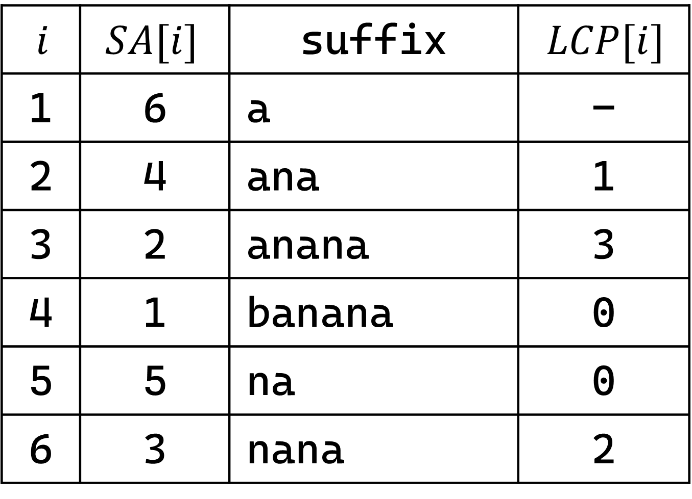
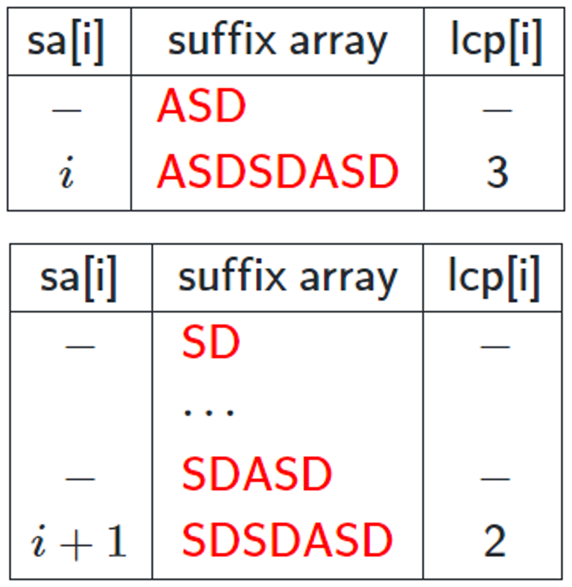

# Suffix Array, LCP Array

## Problem

!!! definition "Definition 1" 
    - $SA[i] := S$의 suffix들을 사전순으로 정렬했을 때, $i$번째 등장하는 suffix의 시작 인덱스
    - $R[i] := i$에서 시작하는 suffix의 사전순 비교 순서, $R[SA[i]]=i$
    - $LCP[i] :=$ $SA[i]$에서 시작하는 suffix와 $SA[i-1]$에서 시작하는 suffix의 **longest common prefix**의 길이  
      $LCP[i] = LCP(S[SA[i-1]...], S[SA[i]...])$ $(2 \le i)$

- **Suffix Array, LCP Array** : 문자열 $S$가 주어질 때, $S$의 suffix array, LCP array를 구한다.
- **Compare Substring** : 문자열 $S$의 substring $S[l_1 \cdots r_1]$, $S[l_2 \cdots r_2]$를 사전순으로 비교한다.

<center>
{width=40%}
</center>

## Algorithm

- **Suffix Array**

    각 suffix들의 앞의 $1, 2, 4, 8, \cdots$ 개의 문자들만을 생각했을 때의 정렬 순서를 순차적으로 구하며 $SA[i], R[i]$ 배열을 관리한다.
    가장 먼저 각 suffix들의 앞의 $1$개의 문자에 대한 정렬 순서, 즉 알파벳 순으로 정렬하여 $SA[i], R[i]$를 구하고 시작한다.
    각 suffix들의 앞의 $d$ 개의 문자들에 대한 정렬 순서를 알고 있다 하였을 때 길이 $2d$에 대한 순서를 구하기 위하여, $i$에서 시작하는 suffix의 순서는 순서쌍 $(R[i], R[i+d])$의 순서와 같음을 이용한다.
    먼저 $R[i+d]$의 순서대로, 그 후 $R[i]$의 순서대로 counting sort를 하여 새로운 $SA[i]$를 구하고, 이를 이용하여 새로운 $R[i]$를 구한다.

    !!! complexity
        $O(|S|log|S|)$

- **LCP Array**

    !!! property "Property 1"
        $$LCP[R[i]]-1 \le LCP[R[i+1]]$$

        <center>
        {width=30%}
        </center>
    
    suffix의 길이가 감소하는 순서, 즉 $i$가 증가하는 순서대로 $LCP[R[i]]$를 채운다.
    **Property 1**에 의해 $LCP[R[i]]=LCP[R[i-1]]-1$부터 시작하여 늘릴 수 있을 때까지 naive하게 늘려본다.

    !!! complexity
        $O(|S|)$

- **Compare Substring**
    
    Suffix array를 구하는 과정에서, 각 길이 $d$에 대한 $R[i]$를 $R2[i][d]$에 기록한다.
    $R2[i][d]$를 sparse table과 같이 사용하여, $O(1)$ RMQ 알고리즘과 같이 두 substring을 비교한다.

    !!! complexity
        Time Complexity : $O(1)$  
        Space Complexity : $O(|S|log|S|)$

## Code

``` cpp linenums="1" title="sa_lcp.cpp"
namespace SA_LCP
{
    // uncomment code to use cmp
    
    // MAXN must be defined
    const int MAXN = 5e5;

    // SA[i] : starting position of i-th suffix when sorted
    // R[i] : lexicographic order of i-th suffix, R[SA[i]]=i
    // LCP[i] : LCP(S[SA[i-1]...], S[SA[i]...])
    int SA[MAXN+10], R[MAXN+10], LCP[MAXN+10];
    
    // R2[i][j] : R[i] when d = 1<<j
    // int R2[MAXN+10][21];

    // Get Suffix array, LCP array of S
    // Fill SA[i], R[i], LCP[i]
    // S is 1-based (leading "?")
    // getSA("?banana") =>
    //  SA = [-, 6, 4, 2, 1, 5, 3]
    //   R = [-, 4, 3, 6, 2, 5, 1]
    // LCP = [-, -, 1, 3, 0, 0, 2]
    void SA_LCP(string S)
    {
        int N=S.size()-1, t=1;
        vector<int> F(N+1), T(N+1);

        for(int i=1; i<=N; i++) SA[i]=i;
        sort(SA+1, SA+N+1, [&](const int &p, const int &q) { return S[p]<S[q]; });
        for(int i=1; i<=N; i++) R[SA[i]]=R[SA[i-1]]+(i==1 || S[SA[i]]!=S[SA[i-1]]);
        // for(int i=1; i<=N; i++) R2[i][0]=R[i];

        for(int d=1; d<=N; d<<=1, t++)
        {
            if(R[SA[N]]==N) break;

            F[0]=d;
            for(int i=d+1; i<=N; i++) F[R[i]]++; 
            for(int i=1; i<=N; i++) F[i]+=F[i-1];
            for(int i=1; i<=N; i++) SA[F[(i+d>N ? 0 : R[i+d])]--]=i;
            for(int i=0; i<=N; i++) F[i]=0;

            for(int i=1; i<=N; i++) F[R[i]]++; 
            for(int i=1; i<=N; i++) F[i]+=F[i-1];
            for(int i=1; i<=N; i++) T[i]=SA[i];
            for(int i=N; i>=1; i--) SA[F[R[T[i]]]--]=T[i];
            for(int i=0; i<=N; i++) F[i]=0;

            for(int i=1; i<=N; i++) T[i]=R[i];
            for(int i=1; i<=N; i++)
            {
                R[SA[i]]=R[SA[i-1]];
                if(i==1 || T[SA[i]]!=T[SA[i-1]]) R[SA[i]]++;
                else
                {
                    int p=(SA[i-1]+d>N ? 0 : T[SA[i-1]+d]);
                    int q=(SA[i]+d>N ? 0 : T[SA[i]+d]);
                    if(p!=q) R[SA[i]]++;
                }
            }
            // for(int i=1; i<=N; i++) R2[i][t]=R[i];
        }
        // for(; t<=20; t++) for(int i=1; i<=N; i++) R2[i][t]=R[i];
        
        for(int i=1, k=0; i<=N; i++)
        {
            if(R[i]>1)
            {
                for(; i+k<=N && SA[R[i]-1]+k<=N && S[i+k]==S[SA[R[i]-1]+k]; k++);
                LCP[R[i]]=k;
            }
            if(k) k--;
        }
    }

    // Compare two substrings, return true if S[l1 ... r1] < S[l2 ... r2]
    bool cmp(int l1, int r1, int l2, int r2)
    {
        if(l2>r2) return false;
        if(l1>r1) return true;
        int len=min(r1-l1+1, r2-l2+1), t=__lg(len);
        if(R2[l1][t]!=R2[l2][t]) return R2[l1][t] < R2[l2][t];
        if(R2[l1+len-(1<<t)][t]!=R2[l2+len-(1<<t)][t]) return R2[l1+len-(1<<t)][t] < R2[l2+len-(1<<t)][t];
        return (r1-l1) < (r2-l2);
    }
}
```

## Details

``` cpp linenums="1" title="template"
namespace SA_LCP
{
    const int MAXN;

    // SA[i] : starting position of i-th suffix when sorted
    // R[i] : lexicographic order of i-th suffix, R[SA[i]]=i
    // LCP[i] : LCP(S[SA[i-1] ...], S[SA[i] ...])
    int SA[MAXN+10], R[MAXN+10], LCP[MAXN+10];

    // R2[i][j] : R[i] when d = 1<<j
    int R2[MAXN+10][21];

    // Get Suffix array, LCP array of S
    // Fill SA[i], R[i], LCP[i]
    // S is 1-based (leading "?")
    void SA_LCP(string S) {}

    // Compare substring, return true if S[l1 ... r1] < S[l2 ... r2]
    bool cmp(int l1, int r1, int l2, int r2) {}
}
```

- `MAXN`이 선언되어야 함
- `void SA_LCP(string S)` : $S$의 suffix array, LCP array를 구함 (`SA`, `R`, `LCP` 배열을 채움)
    - $S$는 1-based (leading "?")
- `bool cmp(int l1, int r1, int l2, int r2)` : $S[l_1 \cdots r_1]$, $S[l_2 \cdots r_2]$를 사전순으로 비교하여 $S[l_1 \cdots r_1] < S[l_2 \cdots r_2]$를 리턴함
    - 사용하기 위해서 `void SA_LCP(string S)`의 코드 내 주석을 제거하고 호출했어야 함

``` cpp linenums="1" title="example"
void test_sa_lcp()
{
    SA_LCP::SA_LCP("?banana");

    assert(vector<int>(SA_LCP::SA+1, SA_LCP::SA+7) == vector<int>({6, 4, 2, 1, 5, 3}));
    assert(vector<int>(SA_LCP::R+1, SA_LCP::R+7) == vector<int>({4, 3, 6, 2, 5, 1}));
    assert(vector<int>(SA_LCP::LCP+2, SA_LCP::LCP+7) == vector<int>({1, 3, 0, 0, 2}));

    assert(SA_LCP::cmp(2, 3, 4, 6) == true); // "an" < "ana"
    assert(SA_LCP::cmp(2, 4, 3, 5) == true); // "ana" < "nan"
    assert(SA_LCP::cmp(1, 6, 2, 4) == false); // "banana" >= "ana"
    assert(SA_LCP::cmp(2, 4, 4, 6) == false); // "ana" >= "ana"
}
```