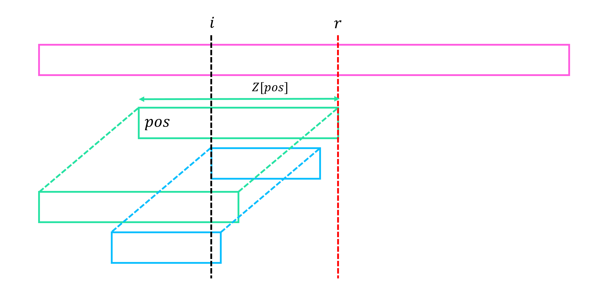

# Z Function

## Problem

!!! definition
    $Z[i] := i$에서 시작하는 $S$의 suffix와 전체 문자열 $S$의 **longest common prefix**의 길이   
    $Z[i] := LCP(S[1 \cdots ], S[i \cdots])$, $i \ge 2$부터 정의되고, $Z[1]=0$이라 한다.

- Z function : 문자열 $S$가 주어질 때 $S$의 Z function을 구한다. $(Z[i] = LCP(S[i \cdots], S))$
- match Z : 문자열 $S$, $T$가 주어질 때, $T$의 Z function을 이용하여 $S$의 각 suffix와 $T$ 전체의 LCP를 구한다. $(F[i] = LCP(S[i \cdots], T))$

## Algorithm

- Z function

    Z function을 앞에서부터 한 칸씩 계산한다.
    계산 과정에서 지금까지 계산한 $Z$ 값들 중 가장 뒤쪽 위치에 해당하는 값을 $r=pos+Z[pos]-1$이라 하자.
    현재 위치 $i$가 $r$보다 작거나 같은 상황이면, $i$에서부터 $r$까지의 문자열이 이미 $S$의 앞쪽에 위치하고 있으니 이미 구했던 $Z$값을 이용하여 새로운 $Z$값을 구한다.
    이 때 만약 이 값이 $i$의 위치에서 시작하였을 때 $r$을 넘어간다면 $r$을 넘지 못하도록 해준다.
    이후 $r$을 넘어서 새롭게 스캔하였을 때 추가로 일치하는 문자들이 있을 수 있음으로 방금 구한 재활용값에서 시작하여 탐색을 이어 나가고, 작업 후 $pos$를 갱신한다.

    <center>
    {width=80%}
    </center>

    !!! complexity
        $O(|S|)$

- match Z
    
    $T$에 대한 Z function을 먼저 구하고, 이를 이용하여 $S$의 $F$ 값을 하나씩 앞에서부터 구한다.
    지금까지 계산한 $F$ 값들 중 가장 뒤쪽 위치에 해당하는 값을 $r=pos+F[pos]-1$에 저장하고, Z function과 같이 이미 구했던 $F$값을 최대한 재활용하여 새로운 $F$ 값을 구한다.
    이 때 구했던 $T$의 Z function을 사용한다.
    이후 $r$을 넘어서 새롭게 스캔하였을 때 추가로 일치하는 문자들이 있을 수 있음으로 방금 구한 재활용값에서 시작하여 탐색을 이어 나가고, 작업 후 $pos$를 갱신한다.
    
    !!! complexity
        $O(|S|+|T|)$

## Code

``` cpp linenums="1" title="z.cpp"
namespace Z
{
    // Get Z function of S
    // Z[i] = LCP(S[i...], S)
    // S is 1-based (leading "?")
    // getZ(S = "?abacaba") = [-, 0, 0, 1, 0, 3, 0, 1]
    vector<int> getZ(string S)
    {
        int N=S.size()-1;
        vector<int> Z(N+1);

        int pos=1;
        for(int i=2; i<=N; i++)
        {
            if(i<=pos+Z[pos]-1) Z[i]=min(pos+Z[pos]-i, Z[i-pos+1]);
            while(i+Z[i]<=N && S[i+Z[i]]==S[Z[i]+1]) Z[i]++;
            if(Z[pos]+pos<Z[i]+i) pos=i;
        }
        return Z;
    }

    // Get LCP of all suffixes in S with T
    // F[i] = LCP(S[i...], T)
    // S, T is 1-based (leading "?")
    // matchZ(S = "?abacabacaba", T = "?abacaba") = [-, 7, 0, 1, 0, 7, 0, 1, 0, 3, 0, 1]
    vector<int> matchZ(string S, string T)
    {
        int N=S.size()-1, M=T.size()-1;
        vector<int> Z = getZ(T);
        vector<int> F(N+1);

        int pos=0;
        for(int i=1; i<=N; i++)
        {
            if(i<=pos+F[pos]-1) F[i]=min(pos+F[pos]-i, Z[i-pos+1]);
            while(i+F[i]<=N && F[i]+1<=M && S[i+F[i]]==T[F[i]+1]) F[i]++;
            if(pos+F[pos]<i+F[i]) pos=i;
        }
        return F;
    }
}
```

## Details

``` cpp linenums="1" title="template"
namespace Z
{
    // Get Z function of S
    // Z[i] = LCP(S[i...], S)
    // S is 1-based (leading "?")
    vector<int> getZ(string S) {}

    // Get LCP of all suffixes in S with T
    // F[i] = LCP(S[i...], T)
    // S, T is 1-based (leading "?")
    vector<int> matchZ(string S, string T) {}
}
```

- `vector<int> getZ(string S)` : $S$의 Z function을 리턴함
- $Z[i] = LCP(S[i \cdots], S)$
- $S$는 1-based (leading "?")

- `vector<int> matchZ(string S, string T)` : $S$의 모든 suffix들과 $T$ 전체의 LCP를 리턴함
- $F[i] = LCP(S[i \cdots], T)$
- $S$, $T$는 1-based (leading "?")

``` cpp linenums="1" title="example"
void test_z()
{
    vector<int> V;

    V = Z::getZ("?abacaba");
    assert(V == vector<int>({0, 0, 0, 1, 0, 3, 0, 1}));
    
    V = Z::matchZ("?abacabacaba", "?abacaba");
    assert(V == vector<int>({0, 7, 0, 1, 0, 7, 0, 1, 0, 3, 0, 1}));
}
```