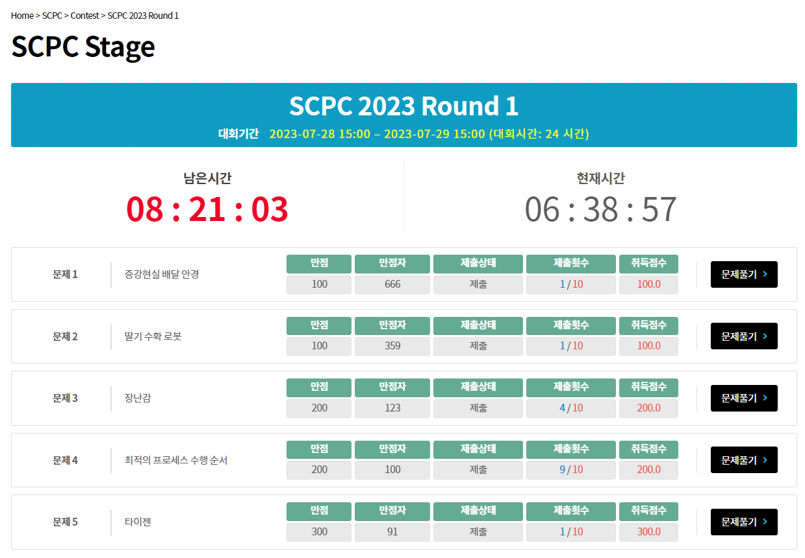

# SCPC 2023 Round 1

[https://www.codeground.org/practice](https://www.codeground.org/practice)

## Review

{: .center}

과외 등 바쁜 일이 있어서 새벽부터 풀기 시작해서 2~3시간 정도에 다 풀었다.
1, 2번은 매우 쉬운 문제여서 보자마자 풀었는데, 3, 4번에서 문자열, 5번에서 CHT가 나오는 것을 보고 개인적으로는 Round 1 치고는 어려웠다고 생각한다.
5번은 보자마자 CHT만 짜면 풀리는 스타일의 문제였지만 3번, 4번은 적당히 생각해야 되는 문제였다.

## A. 증강현실 배달 안경

$N=Ax+By$꼴로 나타내야 하는데 $N$이 작으니, 그냥 Naive하게 $O(N)$ 안에 다 돌아보며 풀면 된다.
확장유클리드 알고리즘으로도 풀 수 있다.

## B. 딸기 수확 로봇

최적해가 왼쪽으로 이동하다가 꺾은 후 오른쪽으로만 이동 / 오른쪽으로 이동하다가 꺾은 후 왼쪽으로만 이동 의 형태이니, 두 경우 모두 처음에 왼쪽으로 이동하는 구간의 길이를 다 해보며 도착하는 오른쪽 점의 위치를 투포인터 / 이분탐색 하면된다.

## C. 딸기 수확 로봇

개인적으로 대회에서 가장 어려웠던 문제.

우선 입력이 모두 0 / 1로 구성되어 있는 경우부터 해결한다.
이 경우 한 번의 이동으로 배열이 한 칸 cyclic shift되니, 문제는 배열이 자기 자신과 같아지는 최소 cyclic shift의 크기를 구하는 것이다.
이는 Prefix function을 이용하여 할 수 있다.

만약 전체 칸의 합이 $N$보다 크거나 같다면, 어느 순간부터는 배열에 0이 없어지게 되고, 이 순간부터 배열은 더이상 변하지 않고, 답은 $1$이다.
이게 아닐 경우, 무조건 0 / 1로 구성된 수열로 변환할 수 있다.
한 번 이동을 시작한 구슬은 영원히 이동한다는 사실을 생각하면, 시계 방향 회전하고 있는 원판 위에, 초당 $1$개의 구슬을 떨어뜨릴 수 있고 각 칸에 $A[i]$개의 구슬이 담겨 있는 디스펜서가 있다고 생각할 수 있다.
디스펜서 입장에서 생각하면 원래 배열을 시계 반대 방향으로 순회하며 왼쪽으로 넘치는 구슬들을 하나씩 바닥에 깔아주는 형식으로 생각하면 $O(N)$에 0 / 1로 구성된 수열로 변환할 수 있다.
이후 과정은 위와 동일하게 풀어주면 된다.

## D. 최적의 프로세스 수행 순서

문제를 잘 해석해보면, 결국 문자열 $S$를 $T$의 prefix의 조각들로 쪼개는 최소 횟수를 구하는 문제이다.
이를 dp로 풀건데, 구해야 하는 값은 $S$를 $i$번째부터 봤을 때 $T$랑 어디까지 일치하는지를 확인해야 하는데, 이는 **Z algorithm**으로 $O(N+M)$에 구할 수 있다.
남은건 구해놓은 구간들을 이용하여 $dp[i]=min_{i \le j \le F[i]} dp[j+1]$과 같은 점화식을 풀어주는 것이니 minimum segment tree를 이용하여 풀 수 있다.

KMP를 활용하면 dp에 단조성이 생겨 segment tree 없이 $O(N+M)$에 문제를 해결할 수 있다고 한다.

## E. 타이젠

문제를 해석하면 그냥 정확히 $f(x)=ax+b$ 꼴의 일차함수들 중 최솟값 쿼리로 변환할 수 있고, $O(N)$ CHT를 짜주면 된다.
개인적으로는 3, 4번보다 훨씬 쉬운 문제라고 생각한다.