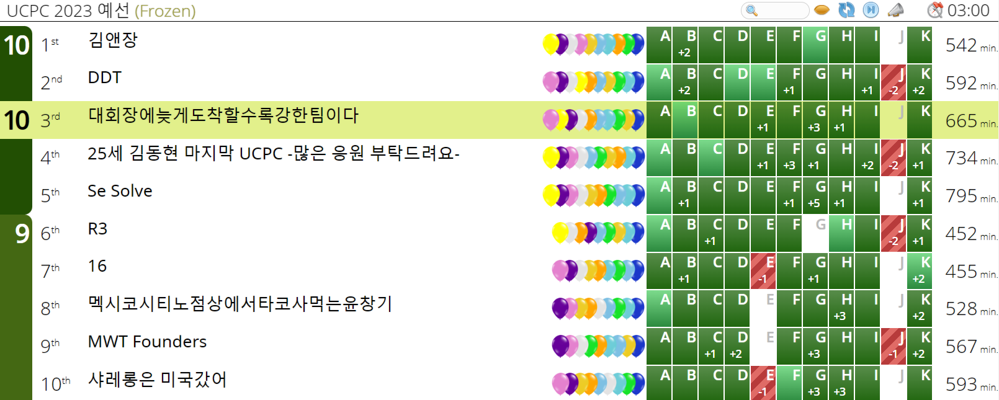

# UCPC 2023 예선

[https://www.acmicpc.net/category/detail/3613](https://www.acmicpc.net/category/detail/3613)

UCPC 2023 예선 대회는 2023/07/01에, 업솔빙은 2023/07/02에 진행하였다.

## Review

{: .center}

결과는 전체 3등으로, 팀 성적으로는 11문제 중 10문제를 해결하였고 상당히 만족스러운 성적이었다.
하지만 개인적으로는 최근에 친 대회 중에서 최악의 퍼포먼스를 보인 것 같아 너무 아쉽다.
팀 성적이 잘 나온 것은 이번 대회는 팀원들의 활약이 가장 컸다고 생각한다.

나는 처음에 E, F, G, H를 잡고 대회를 시작했고, 처음에 E가 적당히 쉬운 확률 문제라 생각하고 가장 먼저 E를 잡았다.
사실 내가 잡은 4개의 문제들이 대회에서 상대적으로 어려운 문제들이 몰려 있는 부분이었고, 처음에 쉬운 문제를 제대로 파악하지 못한 점에서 첫 단추를 잘못 끼웠다.

E에서 특정 확률변수들 사이의 독립성이 성립한다고 가정하였고, 기댓값의 선형성과 독립성을 이용하여 식을 전개하여 구현하였다.
하지만 실제로는 독립이 아닌 확률변수들이 존재하였으며, 풀이의 방향이 완전히 틀렸다.
여기서 E에 무의미한 제출을 1회 소비한 사이 팀원들이 앞뒤로 쉬운 문제들을 빠르게 AC를 맞았고, 이에 계속 상위권 성적을 유지할 수 있었다.

독립성에 대한 반례를 찾은 후 풀이가 틀렸음을 인정하고 G로 넘어갔으며, 문제를 읽고 5~10분 정도 안에 풀이의 대략적인 방향은 찾을 수 있었다.
투 포인터를 통해 해집합의 크기를 줄이고 기울기가 1, 0인 직선들을 스위핑 해야한다는 것을 깨닫고 바로 구현에 들어갔으나, 구현해야할 것들이 매우 많아 거의 30분 가까이 소비한 것 같다.
하지만 계속해서 WA를 받았고, 대회 종료 30분쯤 전까지 계속 오류를 찾고 있었다.
팀원한테 풀이 검증도 받았고, 구현 실수라고 판단하여 세명이 동시에 내 코드를 디버깅하고 있던 순간도 있었다.
더이상 눈으로 찾긴 힘들 것 같아 DM을 돌렸고, 특정 입력에 대하여 애초에 음수를 출력하는 예제가 있음을 알게 되었고, 결론적으로는 단순히 두 줄의 위치를 바꿔서 AC를 받을 수 있었다.

10솔브를 달성한 후 10분정도 남았는데, 이때는 다른 문제 리뷰하며 시간을 보냈던 것 같다.
UCPC 예선 대회라 한명이 이렇게 말렸는데도 순위권 성적이 나왔지만, ICPC 리저널 대회였으면 절대 쉽지 않았을 것이라고 생각한다.
비록 예선이었지만 여러모로 반성할 점이 많은 대회였다.


## A. 체육은 코딩과목 입니다

입력으로 주어진 수들을 모두 더하여 4로 나눈 나머지를 구하고, 이에 따라 NESW 중 하나를 출력하면 된다.

## B. 물류창고

두 정점 사이의 거리 함수가 두 정점을 잇는 임의의 경로의 가중치 최솟값으로 가능한 최댓값으로 정의되어 있으니, 간선들의 가중치가 큰 것부터 보며 간선들을 그래프에 삽입할 때 두 정점이 연결되는 최초 가중치가 바로 두 정점 사이의 거리이다.

문제에서 요구하는 번호가 같은 정점들 사이의 거리의 합을 구하기 위해서, 두 집합을 Union 할 때, 각 집합에 포함된 번호들의 집합을 따로 고려하자.
작은 집합에 대하여 큰 집합에 같은 번호의 수가 몇개 포함되어 있는지를 세서, 가중치를 곱하여 답에 더하면 된다.
이를 하기 위하여 각 번호의 수의 개수를 관리하는 map을 관리하고, small to large를 사용하여 합쳐 주면 된다.
시간 복잡도는 $O(M+N\log^2N)$에 해결할 수 있다.

## C. 차량 모듈 제작

문제에서 요구하는 것은 것은 결국 원들을 하나로 연결하기 위한 MST의 값이다.
$N^2$개의 모든 순서쌍에 대하여 가중치를 계산할 수 있다면 MST의 값 또한 구할 수 있으니, 두 원 사이의 가중치를 구하는데에만 집중하자.
두 원이 겹친다면 가중치는 0이고, 겹치지 않는다면 두 원을 포함하는 최소 크기 도형의 둘레의 길이를 구해야 하는데, 이는 두 원의 공통외접선을 구한 후 피타고라스 정리와 acos 함수를 이용하여 구할 수 있다.

## D. 더 흔한 타일 색칠 문제

주어진 격자를 $K \times K$의 정사각형으로 쪼개어 놓고 생각하면, 각 정사각형의 같은 위치에 해당하는 칸들은 모두 같은 문자로 바뀌어야 한다.
따라서, 전체 문자들 중 최빈값으로 바꾸어 주는 것이 이득이며, 답은 각 칸에 대하여 $\frac{NM}{K^2}$에서 각 위치 문자들의 최빈값의 크기를 뺀 것의 합이다.

## E. 반전수

확률변수 $X_{i, j}$ $(i<j)$를 $i$번째 값이 $j$번째 값보다 크면 $1$, 아니면 $0$으로 정의하자.
Inversion의 정의에 의해, inversion의 개수는 $\displaystyle \sum_{i<j} X_{i, j}$이다.
구하고 싶은 값은 $\displaystyle E((\sum_{i<j} X_{i, j})^2)$이다.

$$\displaystyle E((\sum_{i<j} X_{i, j})^2) = \sum_{i<j} E(X_{i, j}^2) + 2\sum_{(i, j)<(p, q)}E(X_{i, j}X_{p, q})$$

위 식에서 $\displaystyle \sum_{i<j} E(X_{i, j}^2) = \sum_{i<j} E(X_{i, j})$이고, 이는 $\displaystyle \sum_{i<j} P(B_i > B_j)$으로 생각할 수 있다. ($B_i$는 실제 배열한 수열)
이를 $1$부터 $N$까지 중 서로 다른 두 수를 골라 $i$와 $j$에 배치한 것이라고 생각하여 식을 계산하면, $A_1, A_2, \cdots, A_N$ 중 $2$개의 값을 골라 곱한 값의 합에 어떤 상수를 곱한 형식이라는 것을 알 수 있다.

이와 비슷한 논리로 $\displaystyle \sum_{(i, j)<(p, q)}E(X_{i, j}X_{p, q})$를 생각하자.
$i, j, p, q$의 대소관계는 $(1, 2, 3, 4)$, $(1, 2, 2, 3)$, $(1, 3, 2, 3)$, $(1, 2, 1, 3)$와 같은 4가지가 가능하다.
각 경우에 대하여 $\displaystyle \sum_{(i, j)<(p, q)}P(B_i > B_j, B_p > B_q)$의 조건을 만족시키면서 $1$부터 $N$까지의 수들을 배치하는 경우의 수를 구해야 한다.
위와 같은 논리로 식을 세워 보면 이는 $A_1, A_2, \cdots, A_N$ 에서 $4$개의 수를 중복을 허용하여 뽑는 경우의 수 등으로 정리할 수 있으며, $1$개짜리 묶음과 $2$개짜리 묶음의 크기에 따라 붙는 상수가 달라진다.

따라서 가장 깔끔하게 구현하기 위해서는 앞의 $i$개 수들에서 $1$개짜리 묶음을 $j$개, $2$개짜리 묶음을 $k$개 추출하는 경우의 수를 $dp[i][j][k]$에 저장하는 dp를 계산하고, 손으로 계산해 놓은 상수를 이용하여 답을 계산해주면 된다.

구체적인 상수는 다음과 같다.

```cpp linenums="1"
// f(x, y) = x / y
ans=0;
(ans+=dp[N][2][0]*f(1, 2))%=MOD;
(ans+=dp[N][4][0]*f(3, 2))%=MOD;
(ans+=dp[N][2][1]*f(1, 2))%=MOD;
(ans+=dp[N][0][2]*f(1, 4))%=MOD;
(ans+=dp[N][3][0]*f(5, 3))%=MOD;
(ans+=dp[N][1][1]*f(1, 3))%=MOD;
```

## F. 응원단

우선, swap이 없는 경우를 먼저 해결하자.
모든 칸들을 $y$좌표와 $x$좌표의 홀짝성에 따라 $4$가지 집합으로 분류하자.
임의의 행/열 이동 연산을 시행하였을 때, $4$가지 집합들이 서로 홀짝성이 교환되는 경우는 있을 수 있어도, 각 집합의 내용물이 섞이는 일은 없음을 알 수 있다.
따라서, 처음에 $(0, 0), (0, 1), (1, 0), (1, 1)$ $4$개의 칸의 위치를 전체 연산들이 진행되는 동안 알 수만 있다면, 다른 모든 칸들은 자기와 홀짝성이 같은 칸의 위치에 대한 상대좌표로 표현이 가능하다.

이제 swap이 발생하였다고 가정하자.
만약 swap이 칸에 대한 swap이 아닌, 적힌 번호에 대한 swap이라면 모든 연산을 시행하기 전에 한번 swap하고 시작하면 되었을 것이다.
하지만 우리는 임의의 시점에서 임의의 칸의 위치를 대표 $(0, 0), (0, 1), (1, 0), (1, 1)$ $4$개의 점의 위치와 홀짝성을 비교하여 $O(1)$ 만에 알아낼 수 있기 때문에 임의의 시점에서 주어진 swap 연산이 어떤 두 수를 교환하고 싶어하는지 알아낼 수 있다.
이 값을 구한 후, 원본 배열에서 두 수의 위치를 교환해주고 시작하면 된다.

## G. 은하 온라인 마케팅 프로젝트

우선, 각 국가에 대하여 도시를 다 선정했다고 생각하자.
$N$개의 수들이 있을 때, 이 중 한 수를 골라 $X$만큼 키울 수 있을 때, 최댓값과 최솟값의 차를 최소화하기 위해서는 어떤 수를 키워야 할까?
임의의 도시 선택과 $X$에 대하여, 무조건 최솟값을 증가시키는 것이 이득임을 알 수 있다.
구체적으로는 최솟값 $min$과 두번째 최솟값 $min2$, 최댓값 $max$에 대하여 최솟값에 더하는 양 $X$를 증가시켜가며 최댓값과 최솟값의 차를 관찰하자.
최솟값이 $min2$와 같아질 때까지는 불균형도가 감소하다가, $max$와 같아질 때까지 일정하게 유지되고, 그 이후로는 증가하는 함수의 형태를 띄게 된다.

또한, 선택된 도시들의 최댓값 $X$를 고정하였다고 하면, 각 국가마다 $X$ 이하의 최대의 도시를 선택하는 것이 최댓값과 최솟값의 차를 최소화하는 방법임을 알 수 있다.
즉, 최적해로 가능한 도시들의 순서쌍이 $NM$개의 최댓값 각각에 대하여 정확히 한개씩 존재하니, 총 $NM$개 존재한다는 의미이다.

위 두가지 관찰을 정리하면, 최댓값을 고정한 $NM$개의 도시 순서쌍에 대해 합 $sum$과, 최솟값 $min$, 두번째 최솟값 $min2$, 최댓값 $max$를 구할 수 있다.
전체 비용 $X$에 대한 불균형도는 $[sum+, sum+min2-min]$ 구간에서는 감소, $[sum+min2-min, sum+max-min]$ 구간에서는 일정, $[sum+max-min, \infty]$ 에서는 증가하는 형태로 나타나고, 이런 직선 조각들을 관리하여 큰 값부터 sweeping을 통해 문제를 해결할 수 있다.

## H. 팔찌

팔찌 문자열의 동치류를 찾아 canonical form으로 변환하자.

$$
\cdots RG \cdots \rightarrow \cdots B \cdots
$$

이 변환을 통해 서로 다른 두 문자가 붙어 있다면, 전체 문자열의 길이를 $1$ 감소시킬 수 있다.
이제, 이 변환을 반복적으로 적용하여 전체 문자열이 같은 문자로 구성되어 있다고 가정하자.

$$
RRR \rightarrow RGBR \rightarrow BG \rightarrow R
$$

같은 문자가 $3$개 붙어있다면 $3$번의 연산을 통하여 하나의 문자로 변환할 수 있다.

$$
RR \rightarrow RGB \rightarrow BB
$$

이 변환을 통해 $RR$, $GG$, $BB$는 모두 서로 변환 가능하다.

위 두가지 변환을 통해 최종 문자열은 $R$, $G$, $B$, $RR=GG=BB$의 $4$가지 형태만 가능하다.
또한, $R=1$, $G=B=0$을 부여하고 전체 합의 홀짝성을 생각하면 위 $4$가지 형태는 서로 변환 불가능함을 증명할 수 있다.

입력으로 주어진 두 문자열을 위 변환들을 이용하여 canonical form으로 변환하고 같은지 확인하여 출력하면 된다.

## I. 자석

왼쪽 값을 더하고, 오른쪽 값을 빼는 경우와 오른쪽 값을 더하고, 왼쪽 값을 빼는 경우를 분리하여 생각한다.

$$A_i - B_j - K(i-j) = (A_i - Ki) + (-B_j + Kj)$$

위와 같이 두 경우 모두 변수 분리가능하니 앞쪽부터 누적 최댓값을 계산하면 $O(N)$만에 해결할 수 있다.

## J. 다섯 용사의 검
[Solution](../../../solutions/BOJ/28304/solution.md)

## K. 세미나 배정

문제가 세미나가 가장 많은 날의 수의 최솟값이니, "최댓값을 최소화"의 형태이니 parametric search로 모든 날의 세미나 수를 $X$ 이하라고 가정할 때, 세미나의 배치가 가능한지 판별하자.
$A_i$가 증가하는 순서대로 세미나를 앞쪽 날짜에 배정하는 것이 이득이니, $i$번째 세미나는 $i-K$번째 세미나가 끝난 후 시작해야 한다.
위 조건을 모든 $i$에 대하여 확인해주면 전체 시간복잡도 $O(N\log X)$에 문제를 해결할 수 있다.