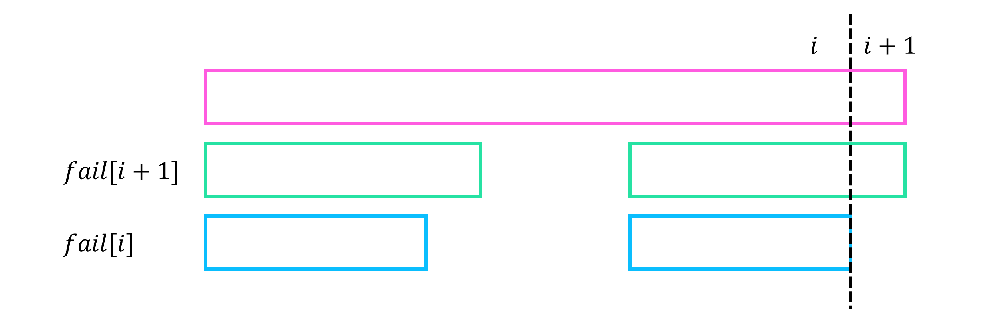
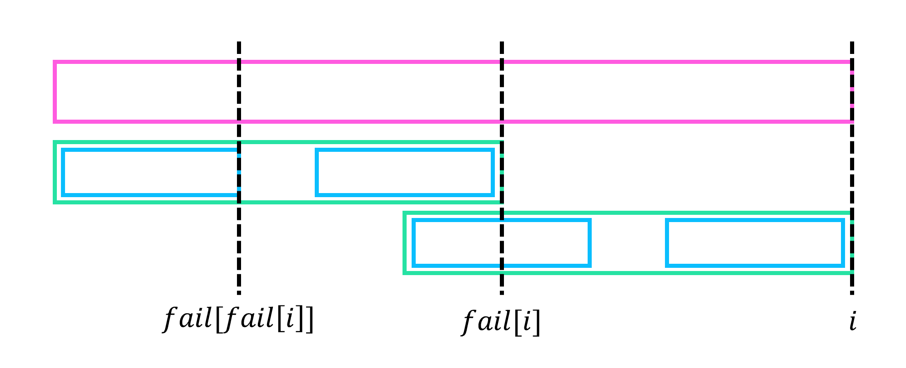

# KMP (Prefix Function)

## Problem

!!! definition "Definition 1"
    $S$의 failure function $fail[i] := S[1 \cdots i]$의 **prefix** 와 **suffix** 가 동일한 **proper prefix**의 최대 길이  
    조건을 만족하는 **proper prefix**가 없으면 $fail[i]=0$, $fail[0]=-1$

- **Failure Function** : 문자열 $S$가 주어질 때, $S$의 failure function을 구한다.
- **KMP** : 문자열 $S$, $T$가 주어질 때, $T$의 failure function을 이용하여 $S$에서 $T$의 모든 등장 위치를 탐색한다.

## Algorithm

!!! property "Property 1"
    $$fail[i]+1≥fail[i+1]$$

    <center>
    {width=70%}
    </center>

!!! property "Property 2"
    $fail$의 정의에서 “최대” 조건을 무시한, 즉 $S[1 \cdots i]$의 **prefix** 와 **suffix** 가 동일한 **proper prefix**의 길이들의 집합을 $F[i]$라 하자.
    $F[i]$는 $fail[i], fail[fail[i]], fail[fail[fail[i]]], \cdots$ 의 형태로 구성된다.
    
    <center>
    {width=70%}
    </center>

- **Failure Function**  
  
    문자열 $S$에서 $i$를 증가시켜가며 $fail[i]$를 구한다.
    $j=fail[i-1], fail[fail[i-1]], \cdots$를 하나씩 확인하며, $S[j+1]=S[i]$인 $j$가 등장하는 순간 $fail[i]=j+1$이다.
    만약 만족하는 $j$가 없다면 $fail[i]=0$이다.

    !!! complexity
        $$O(|S|)$$

- **KMP**  
    
    우선, 문자열 $T$의 failure function을 구한다.
    문자열 $S$를 앞에서부터 보며, $i$번째 문자까지 추가하였을 때, 뒤쪽부터 $T$와 최대한 매칭시킨 길이를 관리한다.
    $i$번째 문자를 추가하였을 때, 이전 매칭 길이부터 시작하여 failure function을 구할 때와 같이 $fail[j]$를 따라가며 새로 추가한 문자와 일치하는 새로운 길이를 찾는다.
    
    <center>
    {width=100%}
    </center>

    !!! complexity
        $$O(|S|+|T|)$$

## Code

``` cpp linenums="1" title="kmp.cpp"
namespace KMP
{
    // Get failure function of S
    // S is 1-based (leading "?")
    // getFail(S = "?ababca") = [-1, 0, 0, 1, 2, 0, 1]
    vector<int> getFail(string S)
    {
        int N=S.size()-1;
        vector<int> fail(N+1);

        fail[0]=-1;
        for(int i=1; i<=N; i++)
        {
            int j=fail[i-1];
            while(j>=0 && S[j+1]!=S[i]) j=fail[j];
            fail[i]=j+1;
        }
        return fail;
    }

    // Find occurences of T in S (ending position)
    // S, T is 1-based (leading "?")
    // KMP(S = "?aabcbabaaa", T = "?aa") = [2, 9, 10]
    vector<int> KMP(string S, string T)
    {
        int N=S.size()-1, M=T.size()-1;
        vector<int> fail = getFail(T);
        vector<int> ans;

        for(int i=1, j=0; i<=N; i++)
        {
            while(j>=0 && T[j+1]!=S[i]) j=fail[j];
            j++;
            if(j==M) ans.push_back(i), j=fail[j];
        }
        return ans;
    }
}
```

## Details

``` cpp linenums="1" title="template"
namespace KMP
{
    // Get failure function of S
    // S is 1-based (leading "?")
    vector<int> getFail(string S) {}

    // Find occurences of T in S (ending position)
    // S, T is 1-based (leading "?")
    vector<int> KMP(string S, string T) {}
}
```

- `vector<int> getFail(string S)` : $S$의 failure function을 구해서 리턴함
    - $S$는 1-based (leading "?")
- `vector<int> KMP(string S, string T)` : $S$에서 $T$의 모든 등장 위치 (끝 인덱스)를 구해서 리턴함
    - $S$, $T$는 1-based (leading "?")

``` cpp linenums="1" title="example"
void test_kmp()
{
    vector<int> V;
    V = KMP::getFail("?ababca");
    assert(V == vector<int>({-1, 0, 0, 1, 2, 0, 1}));

    V = KMP::KMP("?aabcbabaaa", "?aa");
    assert(V == vector<int>({1, 8, 9}));
}
```