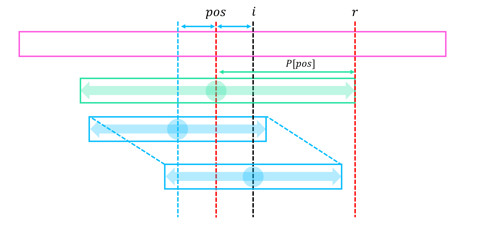

# Manacher

## Problem

!!! definition "Definition 1"
    $P[i] :=$ $S$에서 $i$를 중심으로 하는 palindrome의 최대 반지름의 길이  
    $S[i-P[i] \ \cdots \ i+P[i]]$가 palindrome인 최대 $P[i]$

문자열 $S$가 주어질 때, 모든 $i$에 대해 $S$에서 $i$를 중심으로 하는 palindrome의 최대 반지름의 길이를 구한다.

## Algorithm

$P[i]$를 앞에서부터 한 칸씩 계산하며, 계산 과정에서 지금까지 계산한 $P$ 값들 중 가장 뒤쪽 위치에 해당하는 값을 $r=pos+P[pos]$이라 하자.
현재 위치 $i$가 $r$보다 작거나 같은 상황이면, $i$에서부터 $r$까지의 문자열을 뒤집은 부분이 이미 $S$의 앞쪽에 위치하고 있으니 이미 구했던 $P$값을 이용하여 새로운 $P$값을 구한다.
이 때 만약 이 값이 $i$의 위치에서 시작하였을 때 $r$을 넘어간다면 $r$을 넘지 못하도록 해준다.
이후 $r$을 넘어서 새롭게 스캔하였을 때 추가로 일치하는 문자들이 있을 수 있음으로 방금 구한 재활용값에서 시작하여 탐색을 이어 나가고, 작업 후 $pos$를 갱신한다.

{: .center}

!!! complexity
    $O(|S|)$

## Code

``` cpp linenums="1" title="manacher.cpp"
namespace Manacher
{
    // Get maximum radius of palindrome at each center
    // S[i-P[i] ... i+P[i]] is palindrome
    // S is 1-based (leading "?")
    // manacher(S = "?abcbab") = [-, 0, 0, 2, 0, 1, 0]
    vector<int> manacher(string S)
    {
        int N=S.size()-1;
        vector<int> P(N+1);

        int pos=0;
        for(int i=1; i<=N; i++)
        {
            if(i<=pos+P[pos]) P[i]=min(pos+P[pos]-i, P[pos+pos-i]);
            while(i+P[i]+1<=N && i-P[i]-1>=1 && S[i-P[i]-1]==S[i+P[i]+1]) P[i]++;
            if(P[pos]+pos<P[i]+i) pos=i;
        }
        return P;
    }
}
```

## Details

``` cpp linenums="1" title="template"
namespace Manacher
{
    // Get maximum radius of palindrome at each center
    // S[i-P[i] ... i+P[i]] is palindrome
    // S is 1-based (leading "?")
    vector<int> manacher(string S) {}
}
```

- `vector<int> manacher(string S)` : $S$의 모든 $i$에 대해 $i$를 중심으로 하는 palindrome의 최대 반지름의 길이를 리턴함
    - $P[i] = S[i-P[i] \ \cdots \ i+P[i]]$가 palindrome인 최대 $P[i]$
    - $S$는 1-based (leading "?")

``` cpp linenums="1" title="example"
void test_manacher()
{
    vector<int> V;

    V = Manacher::manacher("?abcbab");
    assert(V == vector<int>({0, 0, 0, 2, 0, 1, 0}));
}
```